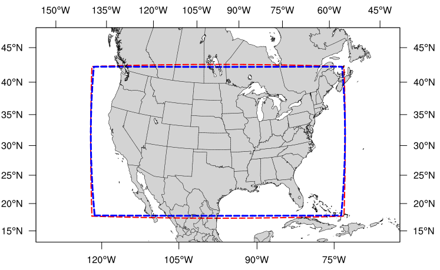
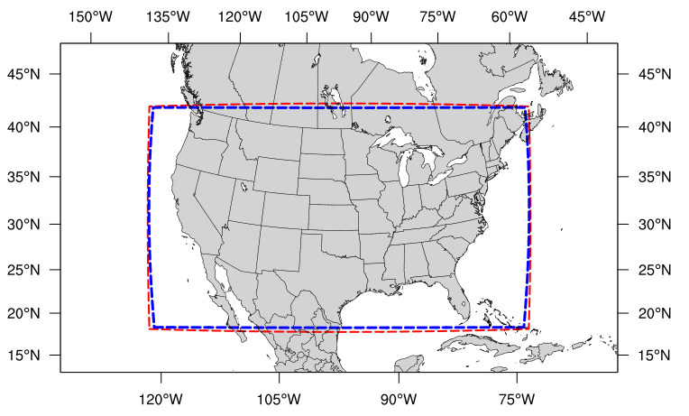
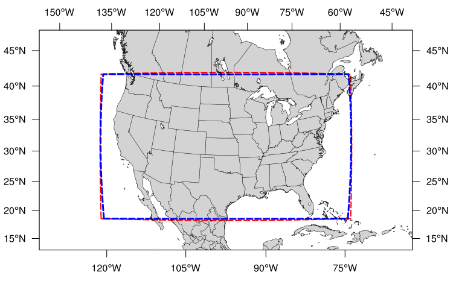

.. _LAMGrids:

=================================================================================
Limited Area Model (:term:`LAM`) Grids:  Predefined and User-Generated Options
=================================================================================
In order to set up the workflow and generate an experiment with the SRW Application, the user
must choose between various predefined :term:`FV3`-:term:`LAM` grids or generate a user-defined grid.
At this time, full support is only provided to those using one of the four predefined
grids supported in the v2.1.0 release, but other predefined grids are available (see :numref:`Section %s <PredefGrid>` for more detail). Preliminary information is also provided at the end of this chapter describing how users can leverage the SRW App workflow scripts to generate their own user-defined grid. Currently, this feature is not fully supported and is "use at your own risk."

Predefined Grids
=================
The SRW App v2.1.0 release includes four predefined limited area model (:term:`LAM`) grids. To select a supported predefined grid, the ``PREDEF_GRID_NAME`` variable within the ``task_run_fcst:`` section of the ``config.yaml`` script must be set to one of the following four options:

* ``RRFS_CONUS_3km``
* ``RRFS_CONUS_13km``
* ``RRFS_CONUS_25km``
* ``SUBCONUS_Ind_3km``

These four options are provided for flexibility related to compute resources and supported physics options. Other predefined grids are listed :ref:`here <PredefGrid>`. The high-resolution 3-km :term:`CONUS` grid generally requires more compute power and works well with three of the four supported physics suites (see :numref:`Table %s <GridPhysicsCombos>`). Low-resolution grids (i.e., 13-km and 25-km domains) require less compute power and should generally be used with the fourth supported physics suite: ``FV3_GFS_v16``. 

.. _GridPhysicsCombos:

.. table:: Preferred grid and physics combinations for supported domains & physics suites

   +-------------------+------------------+
   | Grid              | Physics Suite(s) |
   +===================+==================+
   | RRFS_CONUS_3km    | FV3_RRFS_v1beta  |
   |                   |                  |
   |                   | FV3_HRRR         |
   |                   |                  |
   |                   | FV3_WoFS         |
   +-------------------+------------------+
   | SUBCONUS_Ind_3km  | FV3_RRFS_v1beta  |
   |                   |                  |
   |                   | FV3_HRRR         |
   |                   |                  |
   |                   | FV3_WoFS         |
   +-------------------+------------------+
   | RRFS_CONUS_13km   | FV3_GFS_v16      |
   +-------------------+------------------+
   | RRFS_CONUS_25km   | FV3_GFS_v16      |
   +-------------------+------------------+

In theory, it is possible to run any of the supported physics suites with any of the predefined grids, but the results will be more accurate and meaningful with appropriate grid/physics pairings. 

The predefined :term:`CONUS` grids follow the naming convention (e.g., RRFS_CONUS_*km) of the prototype 3-km continental United States (CONUS) grid being tested for the Rapid Refresh Forecast System (:term:`RRFS`). The RRFS will be a convection-allowing, hourly-cycled, :term:`FV3`-:term:`LAM`-based ensemble planned for operational implementation in 2024. All four supported grids were created to fit completely within the High Resolution Rapid Refresh (`HRRR <https://rapidrefresh.noaa.gov/hrrr/>`_) domain to allow for use of HRRR data to initialize the SRW App. 

Predefined 3-km CONUS Grid
-----------------------------

The 3-km CONUS domain is ideal for running the ``FV3_RRFS_v1beta`` physics suite, since this suite definition file (:term:`SDF`) was specifically created for convection-allowing scales and is the precursor to the operational physics suite that will be used in the RRFS. The 3-km domain can also be used with the ``FV3_HRRR`` and ``FV3_WoFS`` physics suites, which likewise do not include convective parameterizations. In fact, the ``FV3_WoFS`` physics suite is configured to run at 3-km *or less* and could therefore run with even higher-resolution user-defined domains if desired. However, the ``FV3_GFS_v16`` suite generally should *not* be used with the 3-km domain because the cumulus physics used in that physics suite is not configured to run at the 3-km resolution. 

.. _RRFS_CONUS_3km:

   *The boundary of the RRFS_CONUS_3km computational grid (red) and corresponding write-component grid (blue).*

The boundary of the ``RRFS_CONUS_3km`` domain is shown in :numref:`Figure %s <RRFS_CONUS_3km>` (in red), and the boundary of the :ref:`write-component grid <WriteComp>` sits just inside the computational domain (in blue). This extra grid is required because the post-processing utility (:term:`UPP`) is unable to process data on the native FV3 gnomonic grid (in red). Therefore, model data are interpolated to a Lambert conformal grid (the write component grid) in order for the UPP to read in and correctly process the data.

.. note::
   While it is possible to initialize the FV3-LAM with coarser external model data when using the ``RRFS_CONUS_3km`` domain, it is generally advised to use external model data (such as HRRR or RAP data) that has a resolution similar to that of the native FV3-LAM (predefined) grid.

Predefined SUBCONUS Grid Over Indianapolis
--------------------------------------------

.. _SUBCONUS_Ind_3km:

.. figure:: _static/SUBCONUS_Ind_3km.png
   :alt: Map of Indiana and portions of the surrounding states. The map shows the boundaries of the continental United States sub-grid centered over Indianapolis. The computational grid boundaries appear in red and the write-component grid appears just inside the computational grid boundaries in blue. 

   *The boundary of the SUBCONUS_Ind_3km computational grid (red) and corresponding write-component grid (blue).*

The ``SUBCONUS_Ind_3km`` grid covers only a small section of the :term:`CONUS` centered over Indianapolis. Like the ``RRFS_CONUS_3km`` grid, it is ideally paired with the ``FV3_RRFS_v1beta``, ``FV3_HRRR``, or ``FV3_WoFS`` physics suites, since these are all convection-allowing physics suites designed to work well on high-resolution grids. 

Predefined 13-km Grid
------------------------

.. _RRFS_CONUS_13km:

   *The boundary of the RRFS_CONUS_13km computational grid (red) and corresponding write-component grid (blue).*

The ``RRFS_CONUS_13km`` grid (:numref:`Fig. %s <RRFS_CONUS_13km>`) covers the full :term:`CONUS`. This grid is meant to be run with the ``FV3_GFS_v16`` physics suite. The ``FV3_GFS_v16`` physics suite uses convective :term:`parameterizations`, whereas the other supported suites do not. Convective parameterizations are necessary for low-resolution grids because convection occurs on scales smaller than 25-km and 13-km. 

Predefined 25-km Grid
------------------------

.. _RRFS_CONUS_25km:

   *The boundary of the RRFS_CONUS_25km computational grid (red) and corresponding write-component grid (blue).*

The final predefined :term:`CONUS` grid (:numref:`Fig. %s <RRFS_CONUS_25km>`) uses a 25-km resolution and
is meant mostly for quick testing to ensure functionality prior to using a higher-resolution domain.
However, for users who would like to use the 25-km domain for research, the ``FV3_GFS_v16`` :term:`SDF` is recommended for the reasons mentioned :ref:`above <RRFS_CONUS_13km>`. 

Ultimately, the choice of grid is experiment-dependent and resource-dependent. For example, a user may wish to use the ``FV3_GFS_v16`` physics suite, which uses cumulus physics that are not configured to run at the 3-km resolution. In this case, the 13-km or 25-km domain options are better suited to the experiment. Users will also have fewer computational constraints when running with the 13-km and 25-km domains, so depending on the resources available, certain grids may be better options than others. 

.. _UserDefinedGrid:

Creating User-Generated Grids
===============================
While the four predefined grids available in this release are ideal for users just starting
out with the SRW App, more advanced users may wish to create their own predefined grid for testing over
a different region and/or with a different resolution. Creating a user-defined grid requires
knowledge of how the SRW App workflow functions. In particular, it is important to understand the set of
scripts that handle the workflow and experiment generation (see :numref:`Figure %s <WorkflowGeneration>` and :numref:`Figure %s <WorkflowTasksFig>`). It is also important to note that user-defined grids are not a supported feature of the current release; however, information is being provided for the benefit of the FV3-LAM community.

With those caveats in mind, this section provides instructions for adding a new predefined grid to the FV3-LAM
workflow that will be generated using the "ESGgrid" method (i.e., using the ``regional_esg_grid`` code
in the `UFS_UTILS <https://github.com/ufs-community/UFS_UTILS>`__ repository, where ESG stands for "Extended Schmidt Gnomonic"). We assume here that the grid to be generated covers a domain that (1) does not contain either of the poles and (2) does not cross the -180 deg --> +180 deg discontinuity in longitude near the international date line. Instructions for domains that do not have these restrictions will be provided in a future release.

The steps to add such a grid to the workflow are as follows:

#. Choose the name of the grid. For the purposes of this documentation, the grid will be called "NEW_GRID".

#. Add NEW_GRID to the array ``valid_vals_PREDEF_GRID_NAME`` in the ``ufs-srweather-app/ush/valid_param_vals.yaml`` file.

#. In ``ufs-srweather-app/ush/predef_grid_params.yaml``, add a stanza describing the parameters for NEW_GRID. An example of such a stanza is given :ref:`below <NewGridExample>`. For descriptions of the variables that need to be set, see Sections :numref:`%s <ESGgrid>` and :numref:`%s <FcstConfigParams>`.

To run a forecast experiment on NEW_GRID, start with a workflow configuration file for a successful experiment (e.g., ``config.community.yaml``, located in the ``ufs-srweather-app/ush`` subdirectory), and change the line for ``PREDEF_GRID_NAME`` in the ``task_run_fcst:`` section to ``NEW_GRID``:

.. code-block:: console

   PREDEF_GRID_NAME: "NEW_GRID"

Then, load the regional workflow python environment, specify the other experiment parameters in ``config.community.yaml``, and generate a new experiment/workflow using the ``generate_FV3LAM_wflow.py`` script (see :numref:`Chapter %s <RunSRW>` for details).

Code Example
---------------

The following is an example of a code stanza for "NEW_GRID" to be added to ``predef_grid_params.yaml``:

.. _NewGridExample:

.. code-block:: console

   #
   #---------------------------------------------------------------------
   #
   #  Stanza for NEW_GRID. This grid covers [description of the
   #  domain] with ~[size]-km cells.
   #
   #---------------------------------------------------------------------
   
   "NEW_GRID":
   
   #  The method used to generate the grid. This example is specifically for the "ESGgrid" method.

      GRID_GEN_METHOD: "ESGgrid"
   
   #  ESGgrid parameters:

      ESGgrid_LON_CTR: -97.5
      ESGgrid_LAT_CTR: 38.5
      ESGgrid_DELX: 25000.0
      ESGgrid_DELY: 25000.0
      ESGgrid_NX: 200
      ESGgrid_NY: 112
      ESGgrid_PAZI: 0.0
      ESGgrid_WIDE_HALO_WIDTH: 6

   #  Forecast configuration parameters:

      DT_ATMOS: 40
      LAYOUT_X: 5
      LAYOUT_Y: 2
      BLOCKSIZE: 40

   #  Parameters for the write-component (aka "quilting") grid. 

      QUILTING:
         WRTCMP_write_groups: 1
         WRTCMP_write_tasks_per_group: 2
         WRTCMP_output_grid: "lambert_conformal"
         WRTCMP_cen_lon: -97.5
         WRTCMP_cen_lat: 38.5
         WRTCMP_lon_lwr_left: -121.12455072
         WRTCMP_lat_lwr_left: 23.89394570

   #  Parameters required for the Lambert conformal grid mapping.

         WRTCMP_stdlat1: 38.5
         WRTCMP_stdlat2: 38.5
         WRTCMP_nx: 197
         WRTCMP_ny: 107
         WRTCMP_dx: 25000.0
         WRTCMP_dy: 25000.0

.. note:: 
   The process above explains how to create a new *predefined* grid, which can be used more than once. If a user prefers to create a custom grid for one-time use, the variables above can instead be specified in ``config.yaml``, and ``PREDEF_GRID_NAME`` can be set to a null string. In this case, it is not necessary to modify ``valid_param_vals.yaml`` or ``predef_grid_params.yaml``. Users can view an example configuration file for a custom grid `here <https://github.com/ufs-community/ufs-srweather-app/blob/develop/tests/WE2E/test_configs/wflow_features/config.custom_ESGgrid.yaml>`__.