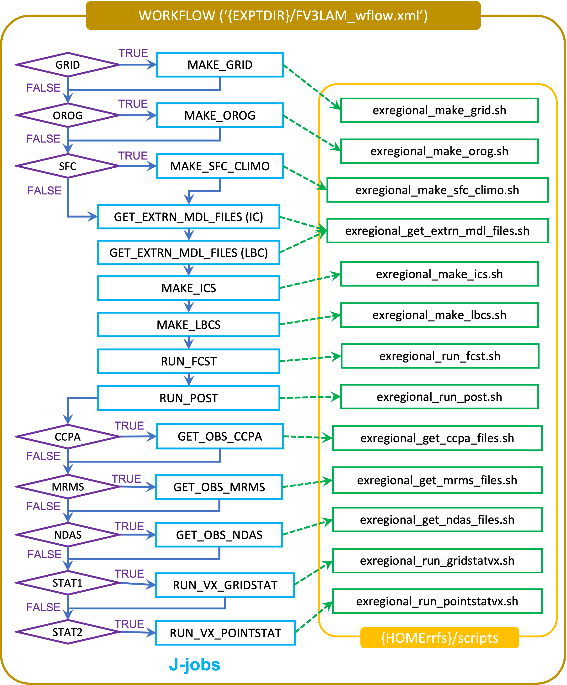

.. _BuildRunSRW:

=====================================
Building and Running the SRW App
===================================== 

The Unified Forecast System (:term:`UFS`) Short-Range Weather (SRW) Application is an :term:`umbrella repository` consisting of a number of different :ref:`components <Components>` housed in external repositories. Once the SRW App is configured and built, users can generate predictions of atmospheric behavior over a limited spatial area and on time scales ranging from minutes out to several days. 

This chapter walks users through how to build and run the "out-of-the-box" case for the SRW App. However, the steps are relevant to any SRW Application experiment and can be modified to suit user goals. The "out-of-the-box" SRW App case builds a weather forecast for June 15-16, 2019. Multiple convective weather events during these two days produced over 200 filtered storm reports. Severe weather was clustered in two areas: the Upper Midwest through the Ohio Valley and the Southern Great Plains. This forecast uses a predefined 25-km Continental United States (:term:`CONUS`) domain (RRFS_CONUS_25km), the Global Forecast System (:term:`GFS`) version 15.2 physics suite (FV3_GFS_v16 :term:`CCPP`), and :term:`FV3`-based GFS raw external model data for initialization.

.. attention::

   All UFS applications support `four platform levels <https://github.com/ufs-community/ufs-srweather-app/wiki/Supported-Platforms-and-Compilers>`_. The steps described in this chapter will work most smoothly on preconfigured (Level 1) systems. On Level 1 systems, all of the required libraries for building community releases of UFS models and applications are available in a central location. This guide can serve as a starting point for running the SRW App on other systems, too, but the user may need to perform additional troubleshooting. 

.. note::
   The :ref:`container approach <QuickstartC>` is recommended for a smoother build and run experience. Building without a container allows for the use of the Rocoto workflow manager and may allow for more customization. However, the non-container approach requires more in-depth system-based knowledge, especially on Level 3 and 4 systems; it is less appropriate for beginners. 

The overall procedure for generating an experiment is shown in :numref:`Figure %s <AppOverallProc>`, with the scripts to generate and run the workflow shown in red. The steps are as follows:

   * :ref:`Install prerequisites <HPCstackInfo>`
   * :ref:`Clone the SRW App from GitHub <DownloadSRWApp>`
   * :ref:`Check out the external repositories <CheckoutExternals>`
   * :ref:`Set up the build environment and build the executables <BuildExecutables>`
   * :ref:`Download and stage data <Data>`
   * :ref:`Optional: Configure a new grid <GridSpecificConfig>`
   * :ref:`Generate a regional workflow experiment <GenerateForecast>`
      * :ref:`Configure the experiment parameters <UserSpecificConfig>`
      * :ref:`Load the python environment for the regional workflow <SetUpPythonEnv>`
   * :ref:`Run the regional workflow <RocotoRun>` 
   * :ref:`Optional: Plot the output <PlotOutput>`

.. _AppOverallProc:

.. figure:: _static/FV3LAM_wflow_overall.png

    *Overall layout of the SRW App Workflow*

.. _HPCstackInfo:

Install the HPC-Stack
========================

.. Attention::
   Skip the HPC-Stack installation if working on a `Level 1 system <https://github.com/ufs-community/ufs-srweather-app/wiki/Supported-Platforms-and-Compilers>`_ (e.g., Cheyenne, Hera, Orion, NOAA Cloud).

**Definition:** :term:`HPC-Stack` is a repository that provides a unified, shell script-based build system and builds the software stack required for `UFS <https://ufscommunity.org/>`_ applications such as the SRW App. 

Background
----------------

The UFS Weather Model draws on over 50 code libraries to run its applications. These libraries range from libraries developed in-house at NOAA (e.g., NCEPLIBS, FMS) to libraries developed by NOAA's partners (e.g., PIO, ESMF) to truly third party libraries (e.g., NETCDF). Individual installation of these libraries is not practical, so the `HPC-Stack <https://github.com/NOAA-EMC/hpc-stack>`__ was developed as a central installation system to ensure that the infrastructure environment across multiple platforms is as similar as possible. Installation of the HPC-Stack is required to run the SRW App.

Instructions
-------------------------
Users working on systems that fall under `Support Levels 2-4 <https://github.com/ufs-community/ufs-srweather-app/wiki/Supported-Platforms-and-Compilers>`_ will need to install the HPC-Stack the first time they try to build applications (such as the SRW App) or models that depend on it. Users can either build the HPC-Stack on their local system or use the centrally maintained stacks on each HPC platform if they are working on a Level 1 system. Before installing the HPC-Stack, users on both Linux and MacOS systems should set the stack size to "unlimited" (if allowed) or to the largest possible value:

.. code-block:: console

   # Linux, if allowed
   ulimit -s unlimited

   # MacOS, this corresponds to 65MB
   ulimit -S -s unlimited

For a detailed description of installation options, see :ref:`Installing the HPC-Stack <InstallBuildHPCstack>`. 

After completing installation, continue to the next section.

.. _DownloadSRWApp:

Download the UFS SRW Application Code
======================================
The SRW Application source code is publicly available on GitHub. To download the SRW App, clone the ``develop`` branch of the repository:

.. code-block:: console

   git clone -b develop https://github.com/ufs-community/ufs-srweather-app.git

..
   COMMENT: This will need to be changed to the updated release branch of the SRW repo once it exists. 

The cloned repository contains the configuration files and sub-directories shown in
:numref:`Table %s <FilesAndSubDirs>`.

.. _FilesAndSubDirs:

.. table::  Files and sub-directories of the ufs-srweather-app repository

   +--------------------------------+--------------------------------------------------------+
   | **File/Directory Name**        | **Description**                                        |
   +================================+========================================================+
   | CMakeLists.txt                 | Main cmake file for SRW App                            |
   +--------------------------------+--------------------------------------------------------+
   | Externals.cfg                  | Includes tags pointing to the correct version of the   |
   |                                | external GitHub repositories/branches used in the SRW  |
   |                                | App.                                                   |
   +--------------------------------+--------------------------------------------------------+
   | LICENSE.md                     | CC0 license information                                |
   +--------------------------------+--------------------------------------------------------+
   | README.md                      | Getting Started Guide                                  |
   +--------------------------------+--------------------------------------------------------+
   | ufs_srweather_app_meta.h.in    | Meta information for SRW App which can be used by      |
   |                                | other packages                                         |
   +--------------------------------+--------------------------------------------------------+
   | ufs_srweather_app.settings.in  | SRW App configuration summary                          |
   +--------------------------------+--------------------------------------------------------+
   | modulefiles                    | Contains build and workflow module files               |
   +--------------------------------+--------------------------------------------------------+
   | etc                            | Contains Lmod startup scripts                          |
   +--------------------------------+--------------------------------------------------------+
   | docs                           | Contains release notes, documentation, and User's Guide|
   +--------------------------------+--------------------------------------------------------+
   | manage_externals               | Utility for checking out external repositories         |
   +--------------------------------+--------------------------------------------------------+
   | src                            | Contains CMakeLists.txt; external repositories         |
   |                                | will be cloned in this directory.                      |
   +--------------------------------+--------------------------------------------------------+

.. _CheckoutExternals:

Check Out External Components
================================

The SRW App relies on a variety of components (e.g., regional_workflow, UFS_UTILS, ufs-weather-model, and UPP) detailed in :numref:`Chapter %s <Components>` of this User's Guide. Each component has its own :term:`repository`. Users must run the ``checkout_externals`` script to collect the individual components of the SRW App from their respective git repositories. The ``checkout_externals`` script uses the configuration file ``Externals.cfg`` in the top level directory of the SRW App to clone the correct tags (code versions) of the external repositories listed in :numref:`Section %s <HierarchicalRepoStr>` into the appropriate directories under the ``regional_workflow`` and ``src`` directories. 

Run the executable that pulls in SRW App components from external repositories:

.. code-block:: console

   cd ufs-srweather-app
   ./manage_externals/checkout_externals

The script should output dialogue indicating that it is retrieving different code repositories. It may take several minutes to download these repositories.

.. _BuildExecutables:

Set Up the Environment and Build the Executables
===================================================

.. _DevBuild:

``devbuild.sh`` Approach
-----------------------------

On Level 1 systems for which a modulefile is provided under the ``modulefiles`` directory, we can build the SRW App binaries with:

.. code-block:: console

   ./devbuild.sh --platform=<machine_name>

where ``<machine_name>`` is replaced with the name of the platform the user is working on. Valid values are: ``cheyenne`` | ``gaea`` | ``hera`` | ``jet`` | ``macos`` | ``odin`` | ``orion`` | ``singularity`` | ``wcoss_dell_p3``

If compiler auto-detection fails for some reason, specify it using the ``--compiler`` argument. FOr example:

.. code-block:: console

   ./devbuild.sh --platform=hera --compiler=intel

where valid values are ``intel`` or ``gnu``.

The last line of the console output should be ``[100%] Built target ufs-weather-model``, indicating that the UFS Weather Model executable has been built successfully. 

The executables listed in :numref:`Table %s <ExecDescription>` should appear in the ``ufs-srweather-app/bin`` directory. If this build method doesn't work, or it users are not on a supported machine, they will have to manually setup the environment and build the SRW App binaries with CMake as described in :numref:`Section %s <CMakeApproach>`.

.. _ExecDescription:

.. table::  Names and descriptions of the executables produced by the build step and used by the SRW App

   +------------------------+---------------------------------------------------------------------------------+
   | **Executable Name**    | **Description**                                                                 |
   +========================+=================================================================================+
   | chgres_cube            | Reads in raw external model (global or regional) and surface climatology data   |
   |                        | to create initial and lateral boundary conditions                               |
   +------------------------+---------------------------------------------------------------------------------+
   | filter_topo            | Filters topography based on resolution                                          |
   +------------------------+---------------------------------------------------------------------------------+
   | global_equiv_resol     | Calculates a global, uniform, cubed-sphere equivalent resolution for the        |
   |                        | regional Extended Schmidt Gnomonic (ESG) grid                                   |
   +------------------------+---------------------------------------------------------------------------------+
   | make_solo_mosaic       | Creates mosaic files with halos                                                 |
   +------------------------+---------------------------------------------------------------------------------+
   | upp.x                  | Post-processor for the model output                                             |
   +------------------------+---------------------------------------------------------------------------------+
   | ufs_model              | UFS Weather Model executable                                                    |
   +------------------------+---------------------------------------------------------------------------------+
   | orog                   | Generates orography, land mask, and gravity wave drag files from fixed files    |
   +------------------------+---------------------------------------------------------------------------------+
   | regional_esg_grid      | Generates an ESG regional grid based on a user-defined namelist                 |
   +------------------------+---------------------------------------------------------------------------------+
   | sfc_climo_gen          | Creates surface climatology fields from fixed files for use in ``chgres_cube``  |
   +------------------------+---------------------------------------------------------------------------------+
   | shave                  | Shaves the excess halo rows down to what is required for the lateral boundary   |
   |                        | conditions (LBC's) in the orography and grid files                              |
   +------------------------+---------------------------------------------------------------------------------+
   | vcoord_gen             | Generates hybrid coordinate interface profiles                                  |
   +------------------------+---------------------------------------------------------------------------------+
   | fvcom_to_FV3           | Determines lake surface conditions for the Great Lakes                          |
   +------------------------+---------------------------------------------------------------------------------+
   | make_hgrid             | Computes geo-referencing parameters (e.g., latitude, longitude, grid cell area) |
   |                        | for global uniform grids                                                        |
   +------------------------+---------------------------------------------------------------------------------+
   | emcsfc_ice_blend       | Blends National Ice Center sea ice cover and EMC sea ice concentration data to  |
   |                        | create a global sea ice analysis used to update the GFS once per day            |
   +------------------------+---------------------------------------------------------------------------------+
   | emcsfc_snow2mdl        | Blends National Ice Center snow cover and Air Force snow depth data to create a |
   |                        | global depth analysis used to update the GFS snow field once per day            | 
   +------------------------+---------------------------------------------------------------------------------+
   | global_cycle           | Updates the GFS surface conditions using external snow and sea ice analyses     |
   +------------------------+---------------------------------------------------------------------------------+
   | inland                 | Creates an inland land mask by determining in-land (i.e. non-coastal) points    |
   |                        | and assigning a value of 1. Default value is 0.                                 |
   +------------------------+---------------------------------------------------------------------------------+
   | orog_gsl               | Ceates orographic statistics fields required for the orographic drag suite      |
   |                        | developed by NOAA's Global Systems Laboratory (GSL)                             |
   +------------------------+---------------------------------------------------------------------------------+
   | fregrid                | Remaps data from the input mosaic grid to the output mosaic grid                |
   +------------------------+---------------------------------------------------------------------------------+
   | lakefrac               | Calculates the ratio of the lake area to the grid cell area at each atmospheric |
   |                        | grid point.                                                                     |
   +------------------------+---------------------------------------------------------------------------------+

.. _CMakeApproach:

CMake Approach
-----------------

Set Up the Workflow Environment
^^^^^^^^^^^^^^^^^^^^^^^^^^^^^^^^^^^

.. attention::
   If users successfully built the executables in :numref:`Step %s <DevBuild>`, they should skip to step :numref:`Step %s <Data>`.

If the ``devbuild.sh`` approach failed, users need to set up their environment to run a workflow on their specific platform. First, users should make sure ``Lmod`` is the app used for loading modulefiles. This is the case on most Level 1 systems; however, on systems such as Gaea/Odin, the default modulefile loader is from Cray and must be switched to Lmod. For example, on Gaea, assuming a ``bash`` login shell, run:

.. code-block:: console

   source etc/lmod-setup.sh gaea

or if the login shell is ``csh`` or ``tcsh``, run ``source etc/lmod-setup.csh`` instead. If users execute the above command on systems that don't need it, it will not cause any problems (it will simply do a ``module purge``). From here on, ``Lmod`` is ready to load the modulefiles needed by the SRW App. These modulefiles are located in ``modulefiles`` directory. To load the necessary modulefile for a specific ``<platform>`` using ``<compiler>``, run:

.. code-block:: console

   module use <path/to/modulefiles/directory>
   module load build_<platform>_<compiler>

where ``<path/to/modulefiles/directory>`` is the full path to the ``modulefiles`` directory. This will work on Level 1 systems, where a modulefile is available in the ``modulefiles`` directory.

On Level 2-4 systems, users will need to modify certain environment variables, such as the path to HPC-Stack, so that the SRW App can find and load the appropriate modules. For systems with Lmod installed, one of the current ``build_<platform>_<compiler>`` modulefiles can be copied and used as a template. To check whether Lmod is installed, run ``echo $LMOD_PKG``, and see if it outputs a path to the Lmod package. On systems without Lmod, users can modify or set the required environment variables with the ``export`` or ``setenv`` commands despending on whether they are using a bash or csh/tcsh shell, respectively: 

.. code-block::

   export <VARIABLE_NAME>=<PATH_TO_MODULE>
   setenv <VARIABLE_NAME> <PATH_TO_MODULE>

..
   COMMENT: Might be good to list an example here...

.. _BuildCMake:

Build the Executables Using CMake
^^^^^^^^^^^^^^^^^^^^^^^^^^^^^^^^^^^^

.. attention::
   If users successfully built the executables in :numref:`Step %s <DevBuild>`, they should skip to step :numref:`Step %s <Data>`.

In the ``ufs-srweather-app`` directory, create a subdirectory to hold the build's executables: 

.. code-block:: console

   mkdir build
   cd build

From the build directory, run the following commands to build the pre-processing utilities, forecast model, and post-processor:

.. code-block:: console

   cmake .. -DCMAKE_INSTALL_PREFIX=..
   make -j 4  >& build.out &

``-DCMAKE_INSTALL_PREFIX`` specifies the location in which the ``bin``, ``include``, ``lib``, and ``share`` directories will be created. These directories will contain various components of the SRW App. Its recommended value ``..`` denotes one directory up from the build directory. In the next line, the ``make`` call argument ``-j 4`` indicates that the build will run in parallel with 4 threads. Although users can specify a larger or smaller number of threads (e.g., ``-j8``, ``-j2``), it is highly recommended to use at least 4 parallel threads to prevent overly long installation times. 

The build will take a few minutes to complete. When it starts, a random number is printed to the console, and when it is done, a ``[1]+  Done`` message is printed to the console. ``[1]+  Exit`` indicates an error. Output from the build will be in the ``ufs-srweather-app/build/build.out`` file. When the build completes, users should see the forecast model executable ``ufs_model`` and several pre- and post-processing executables in the ``ufs-srweather-app/bin`` directory. These executables are described in :numref:`Table %s <ExecDescription>`. 

.. hint::

   If you see the build.out file, but there is no ``ufs-srweather-app/bin`` directory, wait a few more minutes for the build to complete.

.. _Data:

Download and Stage the Data
============================

The SRW App requires input files to run. These include static datasets, initial and boundary conditions files, and model configuration files. On Level 1 and 2 systems, the data required to run SRW App tests are already available. For Level 3 and 4 systems, the data must be added. Detailed instructions on how to add the data can be found in :numref:`Section %s Downloading and Staging Input Data <DownloadingStagingInput>`. :numref:`Sections %s <Input>` and :numref:`%s <OutputFiles>` contain useful background information on the input and output files used in the SRW App. 

.. _GridSpecificConfig:

Grid Configuration
=======================

The SRW App officially supports four different predefined grids as shown in :numref:`Table %s <PredefinedGrids>`. The "out-of-the-box" SRW App case uses the ``RRFS_CONUS_25km`` predefined grid option. More information on the predefined and user-generated grid options can be found in :numref:`Chapter %s <LAMGrids>` for those who are curious. Users who plan to utilize one of the four predefined domain (grid) options may continue to :numref:`Step %s <GenerateForecast>`. Users who plan to create a new domain should refer to :numref:`Chapter %s <LAMGrids>` for details on how to do so. At a minimum, these users will need to add the new grid name to the ``valid_param_vals`` script and add the corresponding grid-specific parameters in the ``set_predef_grid_params`` script. 

.. _PredefinedGrids:

.. table::  Predefined grids in the SRW App

   +----------------------+-------------------+--------------------------------+
   | **Grid Name**        | **Grid Type**     | **Quilting (write component)** |
   +======================+===================+================================+
   | RRFS_CONUS_25km      | ESG grid          | lambert_conformal              |
   +----------------------+-------------------+--------------------------------+
   | RRFS_CONUS_13km      | ESG grid          | lambert_conformal              |
   +----------------------+-------------------+--------------------------------+
   | RRFS_CONUS_3km       | ESG grid          | lambert_conformal              |
   +----------------------+-------------------+--------------------------------+
   | SUBCONUS_Ind_3km     | ESG grid          | lambert_conformal              |
   +----------------------+-------------------+--------------------------------+

.. _GenerateForecast:

Generate the Forecast Experiment 
=================================
Generating the forecast experiment requires three steps:

* :ref:`Set experiment parameters <ExptConfig>`
* :ref:`Set Python and other environment parameters <SetUpPythonEnv>`
* :ref:`Run a script to generate the experiment workflow <GenerateWorkflow>`

The first two steps depend on the platform being used and are described here for each Level 1 platform. Users will need to adjust the instructions to their machine if they are working on a Level 2-4 platform. Information in :numref:`Chapter %s: Configuring the Workflow <ConfigWorkflow>` can help with this. 

.. _ExptConfig:

Set Experiment Parameters
---------------------------- 

Each experiment requires certain basic information to run (e.g., date, grid, physics suite). This information is specified in ``config_defaults.sh`` and in the user-specific ``config.sh`` file. When generating a new experiment, the SRW App first reads and assigns default values from the ``config_defaults.sh`` file. Then, it reads and (re)assigns variables from the user's custom ``config.sh`` file. For background info on ``config_defaults.sh``, read :numref:`Section %s <DefaultConfigSection>`, or jump to :numref:`Section %s <UserSpecificConfig>` to continue configuring the experiment. 

.. _DefaultConfigSection:

Default configuration: ``config_defaults.sh``
------------------------------------------------

.. note::
   This section provides background information on how the SRW App uses the ``config_defaults.sh`` file. This information is informative, but users do not need to modify ``config_defaults.sh`` to run the out-of-the-box case for the SRW App. Users may skip to :numref:`Step %s <UserSpecificConfig>` to continue configuring their experiment. 

Important configuration variables in the ``config_defaults.sh`` file appear in 
:numref:`Table %s <ConfigVarsDefault>`. Some of these default values are intentionally invalid in order to ensure that the user assigns valid values in the user-specified ``config.sh`` file. Any settings provided in ``config.sh`` will override the default ``config_defaults.sh`` 
settings. There is usually no need for a user to modify the default configuration file. Additional information on the default settings can be found in the file itself and in :numref:`Chapter %s <ConfigWorkflow>`. 

.. _ConfigVarsDefault:

.. table::  Configuration variables specified in the config_defaults.sh script.

   +----------------------+------------------------------------------------------------+
   | **Group Name**       | **Configuration variables**                                |
   +======================+============================================================+
   | Experiment mode      | RUN_ENVIR                                                  | 
   +----------------------+------------------------------------------------------------+
   | Machine and queue    | MACHINE, ACCOUNT, SCHED, PARTITION_DEFAULT, QUEUE_DEFAULT, |
   |                      | PARTITION_HPSS, QUEUE_HPSS, PARTITION_FCST, QUEUE_FCST     |
   +----------------------+------------------------------------------------------------+
   | Cron                 | USE_CRON_TO_RELAUNCH, CRON_RELAUNCH_INTVL_MNTS             |
   +----------------------+------------------------------------------------------------+
   | Experiment Dir.      | EXPT_BASEDIR, EXPT_SUBDIR                                  |
   +----------------------+------------------------------------------------------------+
   | NCO mode             | COMINgfs, STMP, NET, envir, RUN, PTMP                      |
   +----------------------+------------------------------------------------------------+
   | Separator            | DOT_OR_USCORE                                              |
   +----------------------+------------------------------------------------------------+
   | File name            | EXPT_CONFIG_FN, RGNL_GRID_NML_FN, DATA_TABLE_FN,           |
   |                      | DIAG_TABLE_FN, FIELD_TABLE_FN, FV3_NML_BASE_SUITE_FN,      |
   |                      | FV3_NML_YALM_CONFIG_FN, FV3_NML_BASE_ENS_FN,               |
   |                      | MODEL_CONFIG_FN, NEMS_CONFIG_FN, FV3_EXEC_FN,              |
   |                      | WFLOW_XML_FN, GLOBAL_VAR_DEFNS_FN,                         |
   |                      | EXTRN_MDL_ICS_VAR_DEFNS_FN, EXTRN_MDL_LBCS_VAR_DEFNS_FN,   |
   |                      | WFLOW_LAUNCH_SCRIPT_FN, WFLOW_LAUNCH_LOG_FN                |
   +----------------------+------------------------------------------------------------+
   | Forecast             | DATE_FIRST_CYCL, DATE_LAST_CYCL, CYCL_HRS, FCST_LEN_HRS    |
   +----------------------+------------------------------------------------------------+
   | IC/LBC               | EXTRN_MDL_NAME_ICS, EXTRN_MDL_NAME_LBCS,                   |
   |                      | LBC_SPEC_INTVL_HRS, FV3GFS_FILE_FMT_ICS,                   |
   |                      | FV3GFS_FILE_FMT_LBCS                                       |
   +----------------------+------------------------------------------------------------+
   | NOMADS               | NOMADS, NOMADS_file_type                                   |
   +----------------------+------------------------------------------------------------+
   | External model       | USE_USER_STAGED_EXTRN_FILES, EXTRN_MDL_SOURCE_BASEDRI_ICS, |
   |                      | EXTRN_MDL_FILES_ICS, EXTRN_MDL_SOURCE_BASEDIR_LBCS,        |
   |                      | EXTRN_MDL_FILES_LBCS                                       |
   +----------------------+------------------------------------------------------------+
   | CCPP                 | CCPP_PHYS_SUITE                                            |
   +----------------------+------------------------------------------------------------+
   | GRID                 | GRID_GEN_METHOD                                            |
   +----------------------+------------------------------------------------------------+
   | ESG grid             | ESGgrid_LON_CTR, ESGgrid_LAT_CTR, ESGgrid_DELX,            |
   |                      | ESGgrid_DELY, ESGgrid_NX, ESGgrid_NY,                      |
   |                      | ESGgrid_WIDE_HALO_WIDTH                                    |
   +----------------------+------------------------------------------------------------+
   | Input configuration  | DT_ATMOS, LAYOUT_X, LAYOUT_Y, BLOCKSIZE, QUILTING,         |
   |                      | PRINT_ESMF, WRTCMP_write_groups,                           |
   |                      | WRTCMP_write_tasks_per_group, WRTCMP_output_grid,          |
   |                      | WRTCMP_cen_lon, WRTCMP_cen_lat, WRTCMP_lon_lwr_left,       |
   |                      | WRTCMP_lat_lwr_left, WRTCMP_lon_upr_rght,                  |
   |                      | WRTCMP_lat_upr_rght, WRTCMP_dlon, WRTCMP_dlat,             |
   |                      | WRTCMP_stdlat1, WRTCMP_stdlat2, WRTCMP_nx, WRTCMP_ny,      |
   |                      | WRTCMP_dx, WRTCMP_dy                                       |
   +----------------------+------------------------------------------------------------+
   | Pre-existing grid    | PREDEF_GRID_NAME, PREEXISTING_DIR_METHOD, VERBOSE          |
   +----------------------+------------------------------------------------------------+
   | Cycle-independent    | RUN_TASK_MAKE_GRID, GRID_DIR, RUN_TASK_MAKE_OROG,          |
   |                      | OROG_DIR, RUN_TASK_MAKE_SFC_CLIMO, SFC_CLIMO_DIR           |
   +----------------------+------------------------------------------------------------+
   | Surface climatology  | SFC_CLIMO_FIELDS, FIXgsm, TOPO_DIR, SFC_CLIMO_INPUT_DIR,   |
   |                      | FNGLAC, FNMXIC, FNTSFC, FNSNOC, FNZORC, FNAISC, FNSMCC,    |
   |                      | FNMSKH, FIXgsm_FILES_TO_COPY_TO_FIXam,                     |
   |                      | FV3_NML_VARNAME_TO_FIXam_FILES_MAPPING,                    |
   |                      | FV3_NML_VARNAME_TO_SFC_CLIMO_FIELD_MAPPING,                |
   |                      | CYCLEDIR_LINKS_TO_FIXam_FILES_MAPPING                      |
   +----------------------+------------------------------------------------------------+
   | Workflow task        | MAKE_GRID_TN, MAKE_OROG_TN, MAKE_SFC_CLIMO_TN,             |
   |                      | GET_EXTRN_ICS_TN, GET_EXTRN_LBCS_TN, MAKE_ICS_TN,          |
   |                      | MAKE_LBCS_TN, RUN_FCST_TN, RUN_POST_TN                     |
   +----------------------+------------------------------------------------------------+
   | NODE                 | NNODES_MAKE_GRID, NNODES_MAKE_OROG, NNODES_MAKE_SFC_CLIMO, |
   |                      | NNODES_GET_EXTRN_ICS, NNODES_GET_EXTRN_LBCS,               |
   |                      | NNODES_MAKE_ICS, NNODES_MAKE_LBCS, NNODES_RUN_FCST,        |
   |                      | NNODES_RUN_POST                                            |
   +----------------------+------------------------------------------------------------+
   | MPI processes        | PPN_MAKE_GRID, PPN_MAKE_OROG, PPN_MAKE_SFC_CLIMO,          |
   |                      | PPN_GET_EXTRN_ICS, PPN_GET_EXTRN_LBCS, PPN_MAKE_ICS,       |
   |                      | PPN_MAKE_LBCS, PPN_RUN_FCST, PPN_RUN_POST                  |
   +----------------------+------------------------------------------------------------+
   | Walltime             | WTIME_MAKE_GRID, WTIME_MAKE_OROG, WTIME_MAKE_SFC_CLIMO,    |
   |                      | WTIME_GET_EXTRN_ICS, WTIME_GET_EXTRN_LBCS, WTIME_MAKE_ICS, |
   |                      | WTIME_MAKE_LBCS, WTIME_RUN_FCST, WTIME_RUN_POST            |
   +----------------------+------------------------------------------------------------+
   | Maximum attempt      | MAXTRIES_MAKE_GRID, MAXTRIES_MAKE_OROG,                    |
   |                      | MAXTRIES_MAKE_SFC_CLIMO, MAXTRIES_GET_EXTRN_ICS,           |
   |                      | MAXTRIES_GET_EXTRN_LBCS, MAXTRIES_MAKE_ICS,                |
   |                      | MAXTRIES_MAKE_LBCS, MAXTRIES_RUN_FCST, MAXTRIES_RUN_POST   |
   +----------------------+------------------------------------------------------------+
   | Post configuration   | USE_CUSTOM_POST_CONFIG_FILE, CUSTOM_POST_CONFIG_FP         |
   +----------------------+------------------------------------------------------------+
   | Running ensembles    | DO_ENSEMBLE, NUM_ENS_MEMBERS                               |
   +----------------------+------------------------------------------------------------+
   | Stochastic physics   | DO_SHUM, DO_SPPT, DO_SKEB, SHUM_MAG, SHUM_LSCALE,          |
   |                      | SHUM_TSCALE, SHUM_INT, SPPT_MAG, SPPT_LSCALE, SPPT_TSCALE, |
   |                      | SPPT_INT, SKEB_MAG, SKEB_LSCALE, SKEP_TSCALE, SKEB_INT,    |
   |                      | SKEB_VDOF, USE_ZMTNBLCK                                    |
   +----------------------+------------------------------------------------------------+
   | Boundary blending    | HALO_BLEND                                                 |
   +----------------------+------------------------------------------------------------+
   | FVCOM                | USE_FVCOM, FVCOM_DIR, FVCOM_FILE                           |
   +----------------------+------------------------------------------------------------+
   | Compiler             | COMPILER                                                   |
   +----------------------+------------------------------------------------------------+
   | METplus              | MODEL, MET_INSTALL_DIR, MET_BIN_EXEC, METPLUS_PATH,        |
   |                      | CCPA_OBS_DIR, MRMS_OBS_DIR, NDAS_OBS_DIR                   |
   +----------------------+------------------------------------------------------------+

.. _UserSpecificConfig:

User-specific configuration: ``config.sh``
--------------------------------------------

The user must specify certain basic information about the experiment in a ``config.sh`` file located in the ``ufs-srweather-app/regional_workflow/ush`` directory. Two example templates are provided in that directory: ``config.community.sh`` and ``config.nco.sh``. The first file is a minimal example for creating and running an experiment in the *community* mode (with ``RUN_ENVIR`` set to ``community``). The second is an example for creating and running an experiment in the *NCO* (operational) mode (with ``RUN_ENVIR`` set to ``nco``).  The *community* mode is recommended in most cases and will be fully supported for this release. The operational/NCO mode will typically be used by those at the NOAA/NCEP/Environmental Modeling Center (EMC) and the NOAA/Global Systems Laboratory (GSL) working on pre-implementation testing for the Rapid Refresh Forecast System (RRFS). :numref:`Table %s <ConfigCommunity>` shows the configuration variables, along with their default values in ``config_default.sh`` and the values defined in ``config.community.sh``.

.. _ConfigCommunity:

.. table::   Configuration variables specified in the config.community.sh script

   +--------------------------------+-------------------+--------------------------------------------------------+
   | **Parameter**                  | **Default Value** | **config.community.sh Value**                          |
   +================================+===================+========================================================+
   | MACHINE                        | "BIG_COMPUTER"    | "hera"                                                 |
   +--------------------------------+-------------------+--------------------------------------------------------+
   | ACCOUNT                        | "project_name"    | "an_account"                                           |
   +--------------------------------+-------------------+--------------------------------------------------------+
   | EXPT_SUBDIR                    | ""                | "test_CONUS_25km_GFSv16"                               |
   +--------------------------------+-------------------+--------------------------------------------------------+
   | VERBOSE                        | "TRUE"            | "TRUE"                                                 |
   +--------------------------------+-------------------+--------------------------------------------------------+
   | RUN_ENVIR                      | "nco"             | "community"                                            |
   +--------------------------------+-------------------+--------------------------------------------------------+
   | PREEXISTING_DIR_METHOD         | "delete"          | "rename"                                               |
   +--------------------------------+-------------------+--------------------------------------------------------+
   | PREDEF_GRID_NAME               | ""                | "RRFS_CONUS_25km"                                      |
   +--------------------------------+-------------------+--------------------------------------------------------+
   | GRID_GEN_METHOD                | "ESGgrid"         | "ESGgrid"                                              |
   +--------------------------------+-------------------+--------------------------------------------------------+
   | QUILTING                       | "TRUE"            | "TRUE"                                                 |
   +--------------------------------+-------------------+--------------------------------------------------------+
   | CCPP_PHYS_SUITE                | "FV3_GSD_V0"      | "FV3_GFS_v16"                                          |
   +--------------------------------+-------------------+--------------------------------------------------------+
   | FCST_LEN_HRS                   | "24"              | "48"                                                   |
   +--------------------------------+-------------------+--------------------------------------------------------+
   | LBC_SPEC_INTVL_HRS             | "6"               | "6"                                                    |
   +--------------------------------+-------------------+--------------------------------------------------------+
   | DATE_FIRST_CYCL                | "YYYYMMDD"        | "20190615"                                             |
   +--------------------------------+-------------------+--------------------------------------------------------+
   | DATE_LAST_CYCL                 | "YYYYMMDD"        | "20190615"                                             |
   +--------------------------------+-------------------+--------------------------------------------------------+
   | CYCL_HRS                       | ("HH1" "HH2")     | "00"                                                   |
   +--------------------------------+-------------------+--------------------------------------------------------+
   | EXTRN_MDL_NAME_ICS             | "FV3GFS"          | "FV3GFS"                                               |
   +--------------------------------+-------------------+--------------------------------------------------------+
   | EXTRN_MDL_NAME_LBCS            | "FV3GFS"          | "FV3GFS"                                               |
   +--------------------------------+-------------------+--------------------------------------------------------+
   | FV3GFS_FILE_FMT_ICS            | "nemsio"          | "grib2"                                                |
   +--------------------------------+-------------------+--------------------------------------------------------+
   | FV3GFS_FILE_FMT_LBCS           | "nemsio"          | "grib2"                                                |
   +--------------------------------+-------------------+--------------------------------------------------------+
   | WTIME_RUN_FCST                 | "04:30:00"        | "01:00:00"                                             |
   +--------------------------------+-------------------+--------------------------------------------------------+
   | USE_USER_STAGED_EXTRN_FILES    | "FALSE"           | "TRUE"                                                 |
   +--------------------------------+-------------------+--------------------------------------------------------+
   | EXTRN_MDL_SOURCE_BASE_DIR_ICS  | ""                | "/scratch2/BMC/det/UFS_SRW_app/v1p0/model_data/FV3GFS" |
   +--------------------------------+-------------------+--------------------------------------------------------+
   | EXTRN_MDL_FILES_ICS            | ""                | "gfs.pgrb2.0p25.f000"                                  |
   +--------------------------------+-------------------+--------------------------------------------------------+
   | EXTRN_MDL_SOURCE_BASEDIR_LBCS  | ""                | "/scratch2/BMC/det/UFS_SRW_app/v1p0/model_data/FV3GFS" |
   +--------------------------------+-------------------+--------------------------------------------------------+
   | EXTRN_MDL_FILES_LBCS           | ""                | "gfs.pgrb2.0p25.f006"                                  |
   +--------------------------------+-------------------+--------------------------------------------------------+
   | MODEL                          | ""                | FV3_GFS_v16_CONUS_25km"                                |
   +--------------------------------+-------------------+--------------------------------------------------------+
   | METPLUS_PATH                   | ""                | "/path/to/METPlus"                                     |
   +--------------------------------+-------------------+--------------------------------------------------------+
   | MET_INSTALL_DIR                | ""                | "/path/to/MET"                                         |
   +--------------------------------+-------------------+--------------------------------------------------------+
   | CCPA_OBS_DIR                   | ""                | "/path/to/processed/CCPA/data"                         |
   +--------------------------------+-------------------+--------------------------------------------------------+
   | MRMS_OBS_DIR                   | ""                | "/path/to/processed/MRMS/data"                         |
   +--------------------------------+-------------------+--------------------------------------------------------+
   | NDAS_OBS_DIR                   | ""                | "/path/to/processed/NDAS/data"                         |
   +--------------------------------+-------------------+--------------------------------------------------------+
   | RUN_TASK_GET_OBS_CCPA          | "FALSE"           | "FALSE"                                                |
   +--------------------------------+-------------------+--------------------------------------------------------+
   | RUN_TASK_GET_OBS_MRMS          | "FALSE"           | "FALSE"                                                |
   +--------------------------------+-------------------+--------------------------------------------------------+
   | RUN_TASK_GET_OBS_NDAS          | "FALSE"           | "FALSE"                                                |
   +--------------------------------+-------------------+--------------------------------------------------------+
   | RUN_TASK_VX_GRIDSTAT           | "FALSE"           | "FALSE"                                                |
   +--------------------------------+-------------------+--------------------------------------------------------+
   | RUN_TASK_VX_POINTSTAT          | "FALSE"           | "FALSE"                                                |
   +--------------------------------+-------------------+--------------------------------------------------------+
   | RUN_TASK_VX_ENSGRID            | "FALSE"           | "FALSE"                                                |
   +--------------------------------+-------------------+--------------------------------------------------------+
   | RUN_TASK_VX_ENSPOINT           | "FALSE"           | "FALSE"                                                |
   +--------------------------------+-------------------+--------------------------------------------------------+

To get started, make a copy of ``config.community.sh``. From the ``ufs-srweather-app`` directory, run:

.. code-block:: console

   cd regional_workflow/ush
   cp config.community.sh config.sh

The default settings in this file include a predefined 25-km :term:`CONUS` grid (RRFS_CONUS_25km), the :term:`GFS` v16 physics suite (FV3_GFS_v16 :term:`CCPP`), and :term:`FV3`-based GFS raw external model data for initialization.

Next, edit the new ``config.sh`` file to customize it for your machine. At a minimum, change the ``MACHINE`` and ``ACCOUNT`` variables; then choose a name for the experiment directory by setting ``EXPT_SUBDIR``. If you have pre-staged the initialization data for the experiment, set ``USE_USER_STAGED_EXTRN_FILES="TRUE"``, and set the paths to the data for ``EXTRN_MDL_SOURCE_BASEDIR_ICS`` and ``EXTRN_MDL_SOURCE_BASEDIR_LBCS``. 

Sample settings are indicated below for Level 1 platforms. Detailed guidance applicable to all systems can be found in :numref:`Chapter %s: Configuring the Workflow <ConfigWorkflow>`, which discusses each variable and the options available. Additionally, information about the four predefined Limited Area Model (LAM) Grid options can be found in :numref:`Chapter %s: Limited Area Model (LAM) Grids <LAMGrids>`.

.. important::

   If your modulefile uses a GNU compiler to set up the build environment in :numref:`Section %s <BuildExecutables>`, you will have to check that the line ``COMPILER="gnu"`` appears in the ``config.sh`` file.

.. hint::

   To determine an appropriate ACCOUNT field for Level 1 systems, run ``groups``, and it will return a list of projects you have permissions for. Not all of the listed projects/groups have an HPC allocation, but those that do are potentially valid account names. 

Minimum parameter settings for running the out-of-the-box SRW App case on Level 1 machines:

**Cheyenne:**

.. code-block:: console

   MACHINE="cheyenne"
   ACCOUNT="<my_account>"
   EXPT_SUBDIR="<my_expt_name>"
   USE_USER_STAGED_EXTRN_FILES="TRUE"
   EXTRN_MDL_SOURCE_BASEDIR_ICS="/glade/p/ral/jntp/UFS_SRW_App/develop/input_model_data/<model_type>/<data_type>/<YYYYMMDDHH>"
   EXTRN_MDL_SOURCE_BASEDIR_LBCS="/glade/p/ral/jntp/UFS_SRW_App/develop/input_model_data/<model_type>/<data_type>/<YYYYMMDDHH>"

where: 
* <model_type> refers to a subdirectory such as "FV3GFS" or "HRRR" containing the experiment data. 
* <data_type> refers to one of 3 possible data formats: ``grib2``, ``nemsio``, or ``netcdf``. 
* YYYYMMDDHH refers to a subdirectory containing data for the :term:`cycle` date. 

**Hera, Jet, Orion, Gaea:**

The ``MACHINE``, ``ACCOUNT``, and ``EXPT_SUBDIR`` settings are the same as for Cheyenne, except that ``"cheyenne"`` should be switched to ``"hera"``, ``"jet"``, ``"orion"``, or ``"gaea"``, respectively. Set ``USE_USER_STAGED_EXTRN_FILES="TRUE"``, but replace the file paths to Cheyenne's data with the file paths for the correct machine. ``EXTRN_MDL_SOURCE_BASEDIR_ICS`` and ``EXTRN_MDL_SOURCE_BASEDIR_LBCS`` use the same base file path. 

On Hera: 

.. code-block:: console

   "/scratch2/BMC/det/UFS_SRW_App/develop/input_model_data/<model_type>/<data_type>/YYYYMMDDHH/"

On Jet: 

.. code-block:: console

   "/mnt/lfs4/BMC/wrfruc/UFS_SRW_App/develop/input_model_data/<model_type>/<data_type>/YYYYMMDDHH/"

On Orion: 

.. code-block:: console

   "/work/noaa/fv3-cam/UFS_SRW_App/develop/input_model_data/<model_type>/<data_type>/YYYYMMDDHH/"

On Gaea: 

.. code-block:: console

   "/lustre/f2/pdata/ncep/UFS_SRW_App/develop/input_model_data/<model_type>/<data_type>/YYYYMMDDHH/"

For **WCOSS** systems, edit ``config.sh`` with these WCOSS-specific parameters, and use a valid WCOSS project code for the account parameter:

.. code-block:: console

   MACHINE="wcoss_cray" or MACHINE="wcoss_dell_p3"
   ACCOUNT="valid_wcoss_project_code"
   EXPT_SUBDIR="my_expt_name"
   USE_USER_STAGED_EXTRN_FILES="TRUE"

For WCOSS_DELL_P3:
   
.. code-block:: console

   EXTRN_MDL_SOURCE_BASEDIR_ICS="/gpfs/dell2/emc/modeling/noscrub/UFS_SRW_App/develop/model_data/<model_type>/<data_type>/YYYYMMDDHH/ICS"
   EXTRN_MDL_SOURCE_BASEDIR_LBCS="/gpfs/dell2/emc/modeling/noscrub/UFS_SRW_App/develop/input_model_data/<model_type>/<data_type>/YYYYMMDDHH/LBCS"

**NOAA Cloud Systems:**

.. code-block:: console

   MACHINE="NOAACLOUD"
   ACCOUNT="none"
   EXPT_SUBDIR="<expt_name>"
   EXPT_BASEDIR="lustre/$USER/expt_dirs"
   COMPILER="gnu"
   USE_USER_STAGED_EXTRN_FILES="TRUE"
   EXTRN_MDL_SOURCE_BASEDIR_ICS="/contrib/EPIC/UFS_SRW_App/develop/input_model_data/FV3GFS"
   EXTRN_MDL_FILES_ICS=( "gfs.t18z.pgrb2.0p25.f000" )
   EXTRN_MDL_SOURCE_BASEDIR_LBCS="/contrib/EPIC/UFS_SRW_App/develop/input_model_data/FV3GFS"
   EXTRN_MDL_FILES_LBCS=( "gfs.t18z.pgrb2.0p25.f006" "gfs.t18z.pgrb2.0p25.f012" )

.. note::

   The values of the configuration variables should be consistent with those in the
   ``valid_param_vals script``. In addition, various example configuration files can be
   found in the ``regional_workflow/tests/baseline_configs`` directory.

.. _VXConfig:

Configure METplus Verification Suite (Optional)
--------------------------------------------------

Users who want to use the METplus verification suite to evaluate their forecasts need to add additional information to their ``config.sh`` file. Other users may skip to the :ref:`next section <SetUpPythonEnv>`. 

.. attention::
   METplus *installation* is not included as part of the build process for this release of the SRW App. However, METplus is preinstalled on `Level 1 <https://github.com/ufs-community/ufs-srweather-app/wiki/Supported-Platforms-and-Compilers>`__ systems. For the v2 release, METplus *use* is supported on systems with a functioning METplus installation, although installation itself is not supported. For more information about METplus, see :numref:`Section %s <MetplusComponent>`.

.. note::
   If METplus users update their METplus installation, they must update the module load statements in ``ufs-srweather-app/regional_workflow/modulefiles/tasks/<machine>/run_vx.local`` file to correspond to their system's updated installation:

   .. code-block:: console
      
      module use -a </path/to/met/modulefiles/>
      module load met/<version.X.X>

To use METplus verification, the path to the MET and METplus directories must be added to ``config.sh``:

.. code-block:: console

   METPLUS_PATH="</path/to/METplus/METplus-4.1.0>"
   MET_INSTALL_DIR="</path/to/met/10.1.0>"

Users who have already staged the observation data needed for METplus (i.e., the :term:`CCPA`, :term:`MRMS`, and :term:`NDAS` data) on their system should set the path to this data and set the corresponding ``RUN_TASK_GET_OBS_*`` parameters to "FALSE" in ``config.sh``. 

.. code-block:: console

   CCPA_OBS_DIR="/path/to/UFS_SRW_app/develop/obs_data/ccpa/proc"
   MRMS_OBS_DIR="/path/to/UFS_SRW_app/develop/obs_data/mrms/proc"
   NDAS_OBS_DIR="/path/to/UFS_SRW_app/develop/obs_data/ndas/proc"
   RUN_TASK_GET_OBS_CCPA="FALSE"
   RUN_TASK_GET_OBS_MRMS="FALSE"
   RUN_TASK_GET_OBS_NDAS="FALSE"

If users have access to NOAA HPSS but have not pre-staged the data, they can simply set the ``RUN_TASK_GET_OBS_*`` tasks to "TRUE", and the machine will attempt to download the appropriate data from NOAA HPSS. The ``*_OBS_DIR`` paths must be set to the location where users want the downloaded data to reside. 

Users who do not have access to NOAA HPSS and do not have the data on their system will need to download :term:`CCPA`, :term:`MRMS`, and :term:`NDAS` data manually from collections of publicly available data, such as the ones listed `here <https://dtcenter.org/nwp-containers-online-tutorial/publicly-available-data-sets>`__. 

Next, the verification tasks must be turned on according to the user's needs. Users should add some or all of the following tasks to ``config.sh``, depending on the verification procedure(s) they have in mind:

.. code-block:: console

   RUN_TASK_VX_GRIDSTAT="TRUE"
   RUN_TASK_VX_POINTSTAT="TRUE"
   RUN_TASK_VX_ENSGRID="TRUE"
   RUN_TASK_VX_ENSPOINT="TRUE"

These tasks are independent, so users may set some values to "TRUE" and others to "FALSE" depending on the needs of their experiment. Note that the ENSGRID and ENSPOINT tasks apply only to ensemble model verification. Additional verification tasks appear in :numref:`Table %s <VXWorkflowTasksTable>` More details on all of the parameters in this section are available in :numref:`Chapter %s <VXTasks>`. 

.. _SetUpPythonEnv:

Set up the Python and other Environment Parameters
--------------------------------------------------
The workflow requires Python 3 with the packages 'PyYAML', 'Jinja2', and 'f90nml' available. This Python environment has already been set up on Level 1 platforms, and it can be activated in the following way (from ``/ufs-srweather-app/regional_workflow/ush``):

.. code-block:: console

   module use <path/to/modulefiles>
   module load wflow_<platform>
   conda activate regional_workflow

This command will activate the ``regional_workflow`` conda environment. The user should see ``(regional_workflow)`` in front of the Terminal prompt at this point. If this is not the case, activate the regional workflow from the ``ush`` directory by running: 

.. code-block:: console

   conda init
   source ~/.bashrc
   conda activate regional_workflow

.. _GenerateWorkflow: 

Generate the Regional Workflow
-------------------------------------------

Run the following command from the ``ufs-srweather-app/regional_workflow/ush`` directory to generate the workflow:

.. code-block:: console

   ./generate_FV3LAM_wflow.sh

The last line of output from this script, starting with ``*/1 * * * *`` or ``*/3 * * * *``, can be saved and :ref:`used later <Automate>` to automatically run portions of the workflow. 

This workflow generation script creates an experiment directory and populates it with all the data needed to run through the workflow. The flowchart in :numref:`Figure %s <WorkflowGeneration>` describes the experiment generation process. First, ``generate_FV3LAM_wflow.sh`` runs the ``setup.sh`` script to set the configuration parameters. Second, it copies the time-independent (fix) files and other necessary data input files from their location in the ufs-weather-model directory to the experiment directory (``EXPTDIR``). Third, it copies the weather model executable (``ufs_model``) from the ``bin`` directory to ``EXPTDIR`` and creates the input namelist file ``input.nml`` based on the ``input.nml.FV3`` file in the regional_workflow/ush/templates directory. Lastly, it creates the workflow XML file ``FV3LAM_wflow.xml`` that is executed when running the experiment with the Rocoto workflow manager.

The ``setup.sh`` script reads three other configuration scripts in order: (1) ``config_default.sh`` (:numref:`Section %s <DefaultConfigSection>`), (2) ``config.sh`` (:numref:`Section %s <UserSpecificConfig>`), and (3) ``set_predef_grid_params.sh`` (:numref:`Section %s <GridSpecificConfig>`). If a parameter is specified differently in these scripts, the file containing the last defined value will be used.

The generated workflow will appear in ``EXPTDIR``, where ``EXPTDIR=${EXPT_BASEDIR}/${EXPT_SUBDIR}``. These variables were specified in the ``config.sh`` file in :numref:`Step %s <UserSpecificConfig>`. The settings for these paths can also be viewed in the console output from the ``./generate_FV3LAM_wflow.sh`` script or in the ``log.generate_FV3LAM_wflow`` file, which can be found in ``$EXPTDIR``. 

.. _WorkflowGeneration:

.. figure:: _static/FV3regional_workflow_gen.png

    *Experiment generation description*

.. _WorkflowTaskDescription: 

Description of Workflow Tasks
--------------------------------

.. note::
   This section gives a general overview of workflow tasks. To begin running the workflow, skip to :numref:`Step %s <RocotoRun>`

:numref:`Figure %s <WorkflowTasksFig>` illustrates the overall workflow. Individual tasks that make up the workflow are specified in the ``FV3LAM_wflow.xml`` file. :numref:`Table %s <WorkflowTasksTable>` describes the function of each baseline task. The first three pre-processing tasks; ``MAKE_GRID``, ``MAKE_OROG``, and ``MAKE_SFC_CLIMO`` are optional. If the user stages pre-generated grid, orography, and surface climatology fix files, these three tasks can be skipped by adding the following lines to the ``config.sh`` file before running the ``generate_FV3LAM_wflow.sh`` script: 

.. code-block:: console

   RUN_TASK_MAKE_GRID="FALSE"
   RUN_TASK_MAKE_OROG="FALSE"
   RUN_TASK_MAKE_SFC_CLIMO="FALSE"

.. _WorkflowTasksFig:

    *Flowchart of the workflow tasks*

The ``FV3LAM_wflow.xml`` file runs the specific j-job scripts (``regional_workflow/jobs/JREGIONAL_[task name]``) in the prescribed order when the experiment is launched via the ``launch_FV3LAM_wflow.sh`` script or the ``rocotorun`` command. Each j-job task has its own source script (or "ex-script") named ``exregional_[task name].sh`` in the ``regional_workflow/scripts`` directory. Two database files named ``FV3LAM_wflow.db`` and ``FV3LAM_wflow_lock.db`` are generated and updated by the Rocoto calls. There is usually no need for users to modify these files. To relaunch the workflow from scratch, delete these two ``*.db`` files and then call the launch script repeatedly for each task. 

.. _WorkflowTasksTable:

.. table::  Baseline workflow tasks in the SRW App

   +----------------------+------------------------------------------------------------+
   | **Workflow Task**    | **Task Description**                                       |
   +======================+============================================================+
   | make_grid            | Pre-processing task to generate regional grid files. Only  |
   |                      | needs to be run once per experiment.                       |
   +----------------------+------------------------------------------------------------+
   | make_orog            | Pre-processing task to generate orography files. Only      |
   |                      | needs to be run once per experiment.                       |
   +----------------------+------------------------------------------------------------+
   | make_sfc_climo       | Pre-processing task to generate surface climatology files. |
   |                      | Only needs to be run, at most, once per experiment.        |
   +----------------------+------------------------------------------------------------+
   | get_extrn_ics        | Cycle-specific task to obtain external data for the        |
   |                      | initial conditions                                         |
   +----------------------+------------------------------------------------------------+
   | get_extrn_lbcs       | Cycle-specific task to obtain external data for the        |
   |                      | lateral boundary conditions (LBC's)                        |
   +----------------------+------------------------------------------------------------+
   | make_ics             | Generate initial conditions from the external data         |
   +----------------------+------------------------------------------------------------+
   | make_lbcs            | Generate LBC's from the external data                      |
   +----------------------+------------------------------------------------------------+
   | run_fcst             | Run the forecast model (UFS weather model)                 |
   +----------------------+------------------------------------------------------------+
   | run_post             | Run the post-processing tool (UPP)                         |
   +----------------------+------------------------------------------------------------+

In addition to the baseline tasks described in :numref:`Table %s <WorkflowTasksTable>` above, users may choose to run some or all of the METplus verification tasks. These tasks are described in :numref:`Table %s <VXWorkflowTasksTable>` below. 

.. _VXWorkflowTasksTable:

.. table:: Verification (VX) workflow tasks in the SRW App

   +-----------------------+------------------------------------------------------------+
   | **Workflow Task**     | **Task Description**                                       |
   +=======================+============================================================+
   | GET_OBS_CCPA          | Retrieves and organizes hourly :term:`CCPA` data from NOAA |
   |                       | HPSS. Can only be run if ``RUN_TASK_GET_OBS_CCPA="TRUE"``  |
   |                       | *and* user has access to NOAA HPSS data.                   |
   +-----------------------+------------------------------------------------------------+
   | GET_OBS_NDAS          | Retrieves and organizes hourly :term:`NDAS` data from NOAA |
   |                       | HPSS. Can only be run if ``RUN_TASK_GET_OBS_NDAS="TRUE"``  |
   |                       | *and* user has access to NOAA HPSS data.                   |
   +-----------------------+------------------------------------------------------------+
   | GET_OBS_MRMS          | Retrieves and organizes hourly :term:`MRMS` composite      |
   |                       | reflectivity and :term:`echo top` data from NOAA HPSS. Can |
   |                       | only be run if ``RUN_TASK_GET_OBS_MRMS="TRUE"`` *and* user |
   |                       | has access to NOAA HPSS data.                              |
   +-----------------------+------------------------------------------------------------+
   | VX_GRIDSTAT           | Runs METplus grid-to-grid verification for 1-h accumulated |
   |                       | precipitation                                              |
   +-----------------------+------------------------------------------------------------+
   | VX_GRIDSTAT_REFC      | Runs METplus grid-to-grid verification for composite       |
   |                       | reflectivity                                               |
   +-----------------------+------------------------------------------------------------+
   | VX_GRIDSTAT_RETOP     | Runs METplus grid-to-grid verification for :term:`echo top`|
   +-----------------------+------------------------------------------------------------+
   | VX_GRIDSTAT_##h       | Runs METplus grid-to-grid verification for 3-h, 6-h, and   |
   |                       | 24-h (i.e., daily) accumulated precipitation. Valid values |
   |                       | of ``##`` are ``03``, ``06``, and ``24``.                  |
   +-----------------------+------------------------------------------------------------+
   | VX_POINTSTAT          | Runs METplus grid-to-point verification for surface and    |
   |                       | upper-air variables                                        |
   +-----------------------+------------------------------------------------------------+
   | VX_ENSGRID            | Runs METplus grid-to-grid ensemble verification for 1-h    |
   |                       | accumulated precipitation. Can only be run if              |
   |                       | ``DO_ENSEMBLE="TRUE"`` and ``RUN_TASK_VX_ENSGRID="TRUE"``. |
   +-----------------------+------------------------------------------------------------+
   | VX_ENSGRID_REFC       | Runs METplus grid-to-grid ensemble verification for        |
   |                       | composite reflectivity. Can only be run if                 |
   |                       | ``DO_ENSEMBLE="TRUE"`` and                                 |
   |                       | ``RUN_TASK_VX_ENSGRID = "TRUE"``.                          |
   +-----------------------+------------------------------------------------------------+
   | VX_ENSGRID_RETOP      | Runs METplus grid-to-grid ensemble verification for        |
   |                       | :term:`echo top`. Can only be run if ``DO_ENSEMBLE="TRUE"``|
   |                       | and ``RUN_TASK_VX_ENSGRID="TRUE"``.                        |
   +-----------------------+------------------------------------------------------------+
   | VX_ENSGRID_##h        | Runs METplus grid-to-grid ensemble verification for 3-h,   |
   |                       | 6-h, and 24-h (i.e., daily) accumulated precipitation.     |
   |                       | Valid values of ``##`` are ``03``, ``06``, and ``24``. Can |
   |                       | only be run if ``DO_ENSEMBLE="TRUE"`` and                  |
   |                       | ``RUN_TASK_VX_ENSGRID="TRUE"``.                            |
   +-----------------------+------------------------------------------------------------+
   | VX_ENSGRID_MEAN       | Runs METplus grid-to-grid verification for ensemble mean   |
   |                       | 1-h accumulated precipitation. Can only be run if          |
   |                       | ``DO_ENSEMBLE="TRUE"`` and ``RUN_TASK_VX_ENSGRID="TRUE"``. |
   +-----------------------+------------------------------------------------------------+
   | VX_ENSGRID_PROB       | Runs METplus grid-to-grid verification for 1-h accumulated |
   |                       | precipitation probabilistic output. Can only be run if     |
   |                       | ``DO_ENSEMBLE="TRUE"`` and ``RUN_TASK_VX_ENSGRID="TRUE"``. |
   +-----------------------+------------------------------------------------------------+
   | VX_ENSGRID_MEAN_##h   | Runs METplus grid-to-grid verification for ensemble mean   |
   |                       | 3-h, 6-h, and 24h (i.e., daily) accumulated precipitation. |
   |                       | Valid values of ``##`` are ``03``, ``06``, and ``24``. Can |
   |                       | only be run if ``DO_ENSEMBLE="TRUE"`` and                  |
   |                       | ``RUN_TASK_VX_ENSGRID="TRUE"``.                            |
   +-----------------------+------------------------------------------------------------+
   | VX_ENSGRID_PROB_##h   | Runs METplus grid-to-grid verification for 3-h, 6-h, and   |
   |                       | 24h (i.e., daily) accumulated precipitation probabilistic  |
   |                       | output. Valid values of ``##`` are ``03``, ``06``, and     |
   |                       | ``24``. Can only be run if ``DO_ENSEMBLE="TRUE"`` and      |
   |                       | ``RUN_TASK_VX_ENSGRID="TRUE"``.                            |
   +-----------------------+------------------------------------------------------------+
   | VX_ENSGRID_PROB_REFC  | Runs METplus grid-to-grid verification for ensemble        |
   |                       | probabilities for composite reflectivity. Can only be run  |
   |                       | if ``DO_ENSEMBLE="TRUE"`` and                              |
   |                       | ``RUN_TASK_VX_ENSGRID="TRUE"``.                            |
   +-----------------------+------------------------------------------------------------+
   | VX_ENSGRID_PROB_RETOP | Runs METplus grid-to-grid verification for ensemble        |
   |                       | probabilities for :term:`echo top`. Can only be run if     |
   |                       | ``DO_ENSEMBLE="TRUE"`` and ``RUN_TASK_VX_ENSGRID="TRUE"``. | 
   +-----------------------+------------------------------------------------------------+
   | VX_ENSPOINT           | Runs METplus grid-to-point ensemble verification for       |
   |                       | surface and upper-air variables. Can only be run if        |
   |                       | ``DO_ENSEMBLE="TRUE"`` and ``RUN_TASK_VX_ENSPOINT="TRUE"``.|
   +-----------------------+------------------------------------------------------------+
   | VX_ENSPOINT_MEAN      | Runs METplus grid-to-point verification for ensemble mean  |
   |                       | surface and upper-air variables. Can only be run if        |
   |                       | ``DO_ENSEMBLE="TRUE"`` and ``RUN_TASK_VX_ENSPOINT="TRUE"``.|
   +-----------------------+------------------------------------------------------------+
   | VX_ENSPOINT_PROB      | Runs METplus grid-to-point verification for ensemble       |
   |                       | probabilities for surface and upper-air variables. Can     |
   |                       | only be run if ``DO_ENSEMBLE="TRUE"`` and                  |
   |                       | ``RUN_TASK_VX_ENSPOINT="TRUE"``.                           |
   +-----------------------+------------------------------------------------------------+

.. _RocotoRun:

Run the Workflow Using Rocoto
=============================

.. attention::

   If users are running the SRW App in a container or on a system that does not have Rocoto installed (e.g., `Level 3 & 4 <https://github.com/ufs-community/ufs-srweather-app/wiki/Supported-Platforms-and-Compilers>`__ systems, such as MacOS), they should follow the process outlined in :numref:`Section %s <RunUsingStandaloneScripts>` instead of the instructions in this section.

The information in this section assumes that Rocoto is available on the desired platform. All official HPC platforms for the UFS SRW App release make use of the Rocoto workflow management software for running experiments. However, Rocoto cannot be used when running the workflow within a container. If Rocoto is not available, it is still possible to run the workflow using stand-alone scripts according to the process outlined in :numref:`Section %s <RunUsingStandaloneScripts>`. There are two main ways to run the workflow with Rocoto: (1) with the ``launch_FV3LAM_wflow.sh`` script, and (2) by manually calling the ``rocotorun`` command. Users can also automate the workflow using a crontab. 

.. note::
   Users may find it helpful to review :numref:`Chapter %s <RocotoInfo>` to gain a better understanding of Rocoto commands and workflow management before continuing, but this is not required to run the experiment. 

Optionally, an environment variable can be set to navigate to the ``$EXPTDIR`` more easily. If the login shell is bash, it can be set as follows:

.. code-block:: console

   export EXPTDIR=/<path-to-experiment>/<directory_name>

If the login shell is csh/tcsh, it can be set using:

.. code-block:: console

   setenv EXPTDIR /path-to-experiment/directory

Launch the Rocoto Workflow Using a Script
-----------------------------------------------

To run Rocoto using the ``launch_FV3LAM_wflow.sh`` script provided, simply call it without any arguments: 

.. code-block:: console

   cd $EXPTDIR
   ./launch_FV3LAM_wflow.sh

This script creates a log file named ``log.launch_FV3LAM_wflow`` in ``$EXPTDIR`` or appends information to it if the file already exists. The launch script also creates the ``log/FV3LAM_wflow.log`` file, which shows Rocoto task information. Check the end of the log files periodically to see how the experiment is progressing:

.. code-block:: console

   tail -n 40 log.launch_FV3LAM_wflow

In order to launch additional tasks in the workflow, call the launch script again; this action will need to be repeated until all tasks in the workflow have been launched. To (re)launch the workflow and check its progress on a single line, run: 

.. code-block:: console

   ./launch_FV3LAM_wflow.sh; tail -n 40 log.launch_FV3LAM_wflow

This will output the last 40 lines of the log file, which list the status of the workflow tasks (e.g., SUCCEEDED, DEAD, RUNNING, SUBMITTING, QUEUED). The number 40 can be changed according to the user's preferences. The output will look like this: 

.. code-block:: console

   CYCLE                    TASK                       JOBID        STATE   EXIT STATUS   TRIES  DURATION
   ======================================================================================================
   202006170000        make_grid         druby://hfe01:33728   SUBMITTING             -       0       0.0
   202006170000        make_orog                           -            -             -       -         -
   202006170000   make_sfc_climo                           -            -             -       -         -
   202006170000    get_extrn_ics         druby://hfe01:33728   SUBMITTING             -       0       0.0
   202006170000   get_extrn_lbcs         druby://hfe01:33728   SUBMITTING             -       0       0.0
   202006170000         make_ics                           -            -             -       -         -
   202006170000        make_lbcs                           -            -             -       -         -
   202006170000         run_fcst                           -            -             -       -         -
   202006170000      run_post_00                           -            -             -       -         -
   202006170000      run_post_01                           -            -             -       -         -
   202006170000      run_post_02                           -            -             -       -         -
   202006170000      run_post_03                           -            -             -       -         -
   202006170000      run_post_04                           -            -             -       -         -
   202006170000      run_post_05                           -            -             -       -         -
   202006170000      run_post_06                           -            -             -       -         -

   Summary of workflow status:
   ~~~~~~~~~~~~~~~~~~~~~~~~~~

     0 out of 1 cycles completed.
     Workflow status:  IN PROGRESS

If all the tasks complete successfully, the "Workflow status" at the bottom of the log file will change from "IN PROGRESS" to "SUCCESS". If certain tasks could not complete, the "Workflow status" will instead change to "FAILURE". Error messages for each specific task can be found in the task log files located in ``$EXPTDIR/log``. 

.. _Success:

The workflow run is complete when all tasks have "SUCCEEDED". If everything goes smoothly, users will eventually see a workflow status table similar to the following: 

.. code-block:: console

   CYCLE              TASK                   JOBID         STATE        EXIT STATUS   TRIES   DURATION
   ==========================================================================================================
   201906150000       make_grid              4953154       SUCCEEDED         0          1          5.0
   201906150000       make_orog              4953176       SUCCEEDED         0          1         26.0
   201906150000       make_sfc_climo         4953179       SUCCEEDED         0          1         33.0
   201906150000       get_extrn_ics          4953155       SUCCEEDED         0          1          2.0
   201906150000       get_extrn_lbcs         4953156       SUCCEEDED         0          1          2.0
   201906150000       make_ics               4953184       SUCCEEDED         0          1         16.0
   201906150000       make_lbcs              4953185       SUCCEEDED         0          1         71.0
   201906150000       run_fcst               4953196       SUCCEEDED         0          1       1035.0
   201906150000       run_post_f000          4953244       SUCCEEDED         0          1          5.0
   201906150000       run_post_f001          4953245       SUCCEEDED         0          1          4.0
   ...
   201906150000       run_post_f048          4953381       SUCCEEDED         0          1          7.0

If users choose to run METplus verification tasks as part of their experiment, the output above will include additional lines after ``run_post_f048``. The output will resemble the following but may be significantly longer when using ensemble verification: 

.. code-block:: console

   CYCLE              TASK                   JOBID          STATE       EXIT STATUS   TRIES   DURATION
   ==========================================================================================================
   201906150000       make_grid              30466134       SUCCEEDED        0          1          5.0
   ...
   201906150000       run_post_f048          30468271       SUCCEEDED        0          1          7.0
   201906150000       run_gridstatvx         30468420       SUCCEEDED        0          1         53.0
   201906150000       run_gridstatvx_refc    30468421       SUCCEEDED        0          1        934.0
   201906150000       run_gridstatvx_retop   30468422       SUCCEEDED        0          1       1002.0
   201906150000       run_gridstatvx_03h     30468491       SUCCEEDED        0          1         43.0
   201906150000       run_gridstatvx_06h     30468492       SUCCEEDED        0          1         29.0
   201906150000       run_gridstatvx_24h     30468493       SUCCEEDED        0          1         20.0
   201906150000       run_pointstatvx        30468423       SUCCEEDED        0          1        670.0

Launch the Rocoto Workflow Manually
---------------------------------------

Load Rocoto
^^^^^^^^^^^^^^^^

Instead of running the ``./launch_FV3LAM_wflow.sh`` script, users can load Rocoto and any other required modules. This gives the user more control over the process and allows them to view experiment progress more easily. On Level 1 systems, the Rocoto modules are loaded automatically in :numref:`Step %s <SetUpPythonEnv>`. For most other systems, a variant on the following commands will be necessary to load the Rocoto module:

.. code-block:: console

   module use <path_to_rocoto_package>
   module load rocoto

Some systems may require a version number (e.g., ``module load rocoto/1.3.3``)

Run the Rocoto Workflow
^^^^^^^^^^^^^^^^^^^^^^^^^^

After loading Rocoto, call ``rocotorun`` from the experiment directory to launch the workflow tasks. This will start any tasks that do not have a dependency. As the workflow progresses through its stages, ``rocotostat`` will show the state of each task and allow users to monitor progress: 

.. code-block:: console

   cd $EXPTDIR
   rocotorun -w FV3LAM_wflow.xml -d FV3LAM_wflow.db -v 10
   rocotostat -w FV3LAM_wflow.xml -d FV3LAM_wflow.db -v 10

The ``rocotorun`` and ``rocotostat`` commands above will need to be resubmitted regularly and repeatedly until the experiment is finished. In part, this is to avoid having the system time out. This also ensures that when one task ends, tasks dependent on it will run as soon as possible, and ``rocotostat`` will capture the new progress. 

If the experiment fails, the ``rocotostat`` command will indicate which task failed. Users can look at the log file in the ``log`` subdirectory for the failed task to determine what caused the failure. For example, if the ``make_grid`` task failed, users can open the ``make_grid.log`` file to see what caused the problem: 

.. code-block:: console

   cd $EXPTDIR/log
   vi make_grid.log

.. note::
   
   If users have the `Slurm workload manager <https://slurm.schedmd.com/documentation.html>`_ on their system, they can run the ``squeue`` command in lieu of ``rocotostat`` to check what jobs are currently running. 

.. _Automate:

Automated Option
----------------------
For automatic resubmission of the workflow at regular intervals (e.g., every minute), the user can add a crontab entry using the ``crontab -e`` command. As mentioned in :numref:`Section %s <GenerateWorkflow>`, the last line of output from ``./generate_FV3LAM_wflow.sh`` (starting with ``*/1 * * * *`` or ``*/3 * * * *``), can be pasted into the crontab file. It can also be found in the ``$EXPTDIR/log.generate_FV3LAM_wflow`` file. The crontab entry should resemble the following: 

.. code-block:: console

   */3 * * * * cd <path/to/experiment/subdirectory> && /apps/rocoto/1.3.3/bin/rocotorun -w FV3LAM_wflow.xml -d FV3LAM_wflow.db -v 10

where ``<path/to/experiment/subdirectory>`` is changed to correspond to the user's ``$EXPTDIR``, and ``/apps/rocoto/1.3.3/bin/rocotorun`` corresponds to the location of the ``rocotorun`` command on the user's system. The number ``3`` can be changed to a different positive integer and simply means that the workflow will be resubmitted every three minutes.

.. hint::

   * On NOAA Cloud instances, ``*/1 * * * *`` is the preferred option for cron jobs because compute nodes will shut down if they remain idle too long. If the compute node shuts down, it can take 15-20 minutes to start up a new one. 
   * On other NOAA HPC systems, admins discourage the ``*/1 * * * *`` due to load problems. ``*/3 * * * *`` is the preferred option for cron jobs on non-Cloud systems. 

To check the experiment progress:

.. code-block:: console
   
   cd $EXPTDIR
   rocotostat -w FV3LAM_wflow.xml -d FV3LAM_wflow.db -v 10

After finishing the experiment, open the crontab using ``crontab -e`` and delete the crontab entry. 

.. note::

   On Orion, *cron* is only available on the orion-login-1 node, so users will need to work on that node when running *cron* jobs on Orion.
   
The workflow run is complete when all tasks have "SUCCEEDED", and the rocotostat command outputs a table similar to the one :ref:`above <Success>`.

.. _PlotOutput:

Plot the Output
===============
Two python scripts are provided to generate plots from the :term:`FV3`-LAM post-processed :term:`GRIB2` output. Information on how to generate the graphics can be found in :numref:`Chapter %s <Graphics>`.
