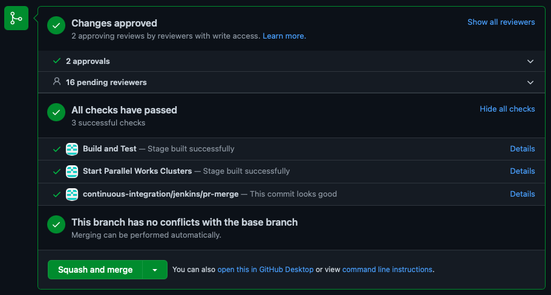

.. _ContributorsGuide:

==============================
SRW App Contributor's Guide
==============================

.. _Background:

Background
===========

Authoritative branch
-----------------------

The ``ufs-srweather-app`` and ``regional_workflow`` repositories each maintain a main branch for development called ``develop``. The HEAD of ``develop`` reflects the latest development changes. It points to regularly updated hashes for individual sub-components. Pull requests (PRs) will be merged to ``develop``. 

The ``develop`` branch is protected by the code management team:
    #. Pull requests for this branch require approval by at least two code reviewers.
    #. A code manager should perform at least one of the reviews and the merge, but other contributors are welcome to provide comments/suggestions.

Code Management Team
--------------------------

Scientists from across multiple labs and organizations have volunteered to review pull requests for the ``develop`` branch:

.. table::

    +------------------+------------------------------------------------+-----------------------------------------------------------------------------------+
    | **Organization** | **Reviewers**                                  | **Areas of Expertise**                                                            |
    +==================+================================================+===================================================================================+
    | EMC              | Chan-Hoo Jeon (@chan-hoo)                      | Workflow, NCO requirements, and operational platform testing                      |
    |                  +------------------------------------------------+-----------------------------------------------------------------------------------+
    |                  | Ben Blake (@BenjaminBlake-NOAA)                | Output visualization, Rocoto                                                      |
    |                  +------------------------------------------------+-----------------------------------------------------------------------------------+
    |                  | Ratko Vasic (@RatkoVasic-NOAA)                 | Workflow, NCO requirements, and operational platform testing                      |
    +------------------+------------------------------------------------+-----------------------------------------------------------------------------------+
    | EPIC             | Mark Potts (@mark-a-potts)                     | HPC systems                                                                       |
    |                  +------------------------------------------------+-----------------------------------------------------------------------------------+
    |                  | Jong Kim (@jkbk2004)                           | UFS Weather Model configuration, forecast sensitivity analysis, data assimilation |
    |                  +------------------------------------------------+-----------------------------------------------------------------------------------+
    |                  | Natalie Perlin (@natalie-perlin)               | Generic Linux/Mac installations, hpc-stack/spack-stack                            |
    |                  +------------------------------------------------+-----------------------------------------------------------------------------------+
    |                  | Gillian Petro (@gspetro-NOAA)                  | Documentation                                                                     |
    |                  +------------------------------------------------+-----------------------------------------------------------------------------------+
    |                  | Edward Snyder (@EdwardSnyder-NOAA)             | WE2E testing, input data                                                          |
    +------------------+------------------------------------------------+-----------------------------------------------------------------------------------+
    | GLERL            | David Wright (@dmwright526)                    | FVCOM integration, output visualization, preprocessing tasks                      |
    +------------------+------------------------------------------------+-----------------------------------------------------------------------------------+
    | GSL              | Jeff Beck (@JeffBeck-NOAA)                     | SRW App configuration/workflow, code management, meteorological evaluation        |
    |                  +------------------------------------------------+-----------------------------------------------------------------------------------+
    |                  | Gerard Ketefian (@gsketefian)                  | ``regional_workflow`` scripts, jinja templates, and verification tasks            |
    |                  +------------------------------------------------+-----------------------------------------------------------------------------------+
    |                  | Linlin Pan (@panll)                            | Workflow, CCPP/physics, verification                                              |
    |                  +------------------------------------------------+-----------------------------------------------------------------------------------+
    |                  | Christina Holt (@christinaholtNOAA)            | Workflow, conda environment support, testing, and code management                 |
    |                  +------------------------------------------------+-----------------------------------------------------------------------------------+
    |                  | Christopher Harrop (@christopherwharrop-noaa)  | Rocoto, code management, and testing                                              |
    |                  +------------------------------------------------+-----------------------------------------------------------------------------------+
    |                  | Daniel Abdi (@danielabdi-noaa)                 | Workflow generation, testing RRFS on the cloud, environment modules               |
    +------------------+------------------------------------------------+-----------------------------------------------------------------------------------+
    | NCAR             | Mike Kavulich (@mkavulich)                     | CCPP/physics                                                                      |
    |                  +------------------------------------------------+-----------------------------------------------------------------------------------+
    |                  | Will Mayfield (@willmayfield)                  | Verification/METplus tasks, regional_workflow (esp. on Cheyenne)                  |
    +------------------+------------------------------------------------+-----------------------------------------------------------------------------------+
    | NSSL             | Yunheng Wang (@ywangwof)                       | HPC systems, code management and regional workflow especially on Stampede, Jet    |
    |                  |                                                | and NSSL computers                                                                |
    +------------------+------------------------------------------------+-----------------------------------------------------------------------------------+

.. _ContribProcess:

Contribution Process
========================

The steps below should be followed in order to make changes to the ``develop`` branch of the ``ufs-srweather-app`` or ``regional_workflow`` repositories. Communication with code managers and the code management team throughout the process is encouraged.

    #. **Issue** - Open an issue to document changes. Click `here <https://github.com/ufs-community/ufs-srweather-app/issues/new/choose>`__ to open a new ``ufs-srweather-app`` issue or see :numref:`Step %s <Issue>` for detailed instructions. 
    #. **GitFlow** - Follow `GitFlow <https://nvie.com/posts/a-successful-git-branching-model/>`__ procedures for development. 
    #. **Fork the repository** - Read more `here <https://docs.github.com/en/get-started/quickstart/fork-a-repo>`__ about forking in GitHub.
    #. **Create a branch** - Create a branch in your fork of the authoritative repository. Follow `GitFlow <https://nvie.com/posts/a-successful-git-branching-model/>`__ conventions when creating the branch. All development should take place on a branch, *not* on ``develop``. Branches should be named as follows, where [name] is a one-word description of the branch:

        * **bugfix/[name]:** Fixes a demonstrably incorrect portion of code
        * **feature/[name]:** Adds a new feature to the code or improves an existing portion of the code
        * **text/[name]:** Changes elements of the repository that do not impact program output or log files (e.g., changes to README, documentation, comments, changing quoted Registry elements, white space alignment). Any change that does not impact the compiled code in any way should fall under this category.
         
    #. **Development** - Perform and test changes in the branch (not on ``develop``!). Document work in the issue and mention the issue number in commit messages to link your work to the issue (e.g., ``commit -m "Issue #23 - <commit message>"``). Test code modifications on as many platforms as possible, and request help with further testing from the code management team when unable to test on all Level 1 platforms. Document changes to the workflow and capabilities in the ``.rst`` files so that the SRW App documentation stays up-to-date. 
    #. **Pull request** - When ready to merge changes back to the ``develop`` branch, the code developer should initiate a pull request (PR) of the feature branch into the ``develop`` branch. Read `here <https://docs.github.com/en/pull-requests/collaborating-with-pull-requests/proposing-changes-to-your-work-with-pull-requests/about-pull-requests>`__ about pull requests in GitHub. When a PR is initiated, the :ref:`PR Template <Template>` autofills. Developers should use the template to provide information about the PR in the proper fields. See the guidelines in :numref:`Section %s <GoodPR>` for more details on making a good pull request. Developers should also tag all relevant reviewers from the code management team on the PR.
    #. **Merge** - When review and testing are complete, a code manager will merge the PR into the target branch (usually ``develop``). PRs that are not ready for merging should have a "Work in Progress" label on them. Users who lack the permissions required to add the label can request in their PR that a code manager do so. 
    #. **Cleanup** - After the PR is merged, the code developer should delete the branch on their fork and close the issue.

.. note::
    Feature branches are intended to be short-lived, concentrated on code with one sole purpose, and applicable to a single PR. These branches should be deleted once merged, and a new feature branch should be created when subsequent code development continues.

.. _Issue:

Opening an Issue
-------------------

All changes should be associated with a GitHub Issue. If developers are working on a change, they should search the existing issues in the appropriate repository (``ufs-srweather-app`` and/or ``regional_workflow``). If an issue does not exist for the work they are doing, they should create one prior to opening a new pull request.

To open an issue, click on `New Issue <https://github.com/ufs-community/ufs-srweather-app/issues/new/choose>`__ within the ``ufs-srweather-app`` GitHub repository and/or within the ``regional_workflow`` repository (depending on where the changes will be made). 

Choose from three options: 
    #. `Bug Report <https://github.com/ufs-community/ufs-srweather-app/issues/new?assignees=&labels=bug&template=bug_report.md&title=>`__: Report specific problems ("bugs") in the code using the following template:

        .. code-block:: console

            <!-- Please remove unwanted/unrelated/irrelevant information such as comments.
            Please copy any output files into a public Github gist (see https://gist.github.com/) and link to the gist, 
            rather than relying on paths that might change. -->

            Your bug may already be reported!
            Please search on the [Issue tracker](https://github.com/ufs-community/ufs-srweather-app/issues) before creating 
            a new issue. 
            If an issue already exists, please use that issue to add any additional information.

            ## Expected behavior
            <!-- Tell us what should happen. -->

            ## Current behavior
            <!-- Tell us what happens instead of the expected behavior. -->

            ## Machines affected
            <!--- Please provide any relevant information about your setup, including machine/compiler combination. -->
            <!-- Reference other issues or PRs in other repositories that this issue is related to, and how they are related. -->

            ## Steps To Reproduce
            <!--- Provide a link to a live example, a code snippet, and/or an explicit set of steps to reproduce this bug.
            1. Step 1
            2. Step 2
            3. See the bug... -->

            ## Detailed Description of Fix (optional)
            <!--- Provide a detailed description of the change or addition you are proposing. -->

            ## Additional Information (optional)
            <!-- Any other relevant information that we should know to correctly understand and reproduce the issue. 
            Please describe in as much detail as possible. -->

            ## Possible Implementation (optional)
            <!--- Suggest an idea for implementing addition or change. -->

            ## Output (optional)
            <!-- Please include any relevant log files, screenshots or other output here. -->

    #. `Feature Request <https://github.com/ufs-community/ufs-srweather-app/issues/new?assignees=&labels=enhancement&template=feature_request.md&title=>`__: New features and feature enhancements fall under this category. Propose features and enhancements using the following template. Optional sections may be deleted.

        .. code-block:: console

            <!-- Please remove unwanted/unrelated/irrelevant information such as comments. 
            Please copy any output files into a public Github gist (see https://gist.github.com/) and link to the gist, 
            rather than relying on paths that might change. -->

            Your issue may already be reported!
            Please search on the [Issue tracker](https://github.com/ufs-community/ufs-srweather-app/issues) before creating 
            a new issue. 
            If an issue already exists, please use that issue to add any additional information.

            ## Description
            <!-- Provide a clear and concise description of the problem to be solved. -->
            <!-- What problem needs to be fixed? -->
            <!-- What new capability needs to be added? --> 

            ## Solution
            <!-- Add a clear and concise description of the proposed solution. -->

            ## Requirements**
            <!-- What does the new code need to accomplish? Does it require an update to a version of software 
            (e.g., modules of NCEPLibs, NetCDF, etc.), components (e.g. UFS-Weather-Model), or system tools (e.g. python3) -->

            ## Acceptance Criteria (Definition of Done)
            <!-- What does it mean for this feature to be finished? -->

            ## Dependencies (optional)
            <!-- Directly reference any issues or PRs in this or other repositories that this issue is related to, 
            and describe how they are related. -->
            <!-- Does this block progress on other issues? Add this issue as a dependency to other issues as appropriate 
            (e.g., #IssueNumber has a dependency on this issue) -->

            ## Alternative Solutions (optional)
            <!-- If applicable, add a description of any alternative solutions or features you've considered. -->

    #. `Text-Only Changes <https://github.com/ufs-community/ufs-srweather-app/issues/new?assignees=&labels=textonly&template=textonly_request.md&title=>`__: Propose text-only changes using the "Text-only request" template. Optional sections may be deleted.

         .. code-block:: console

            ## Description
            <!-- Provide a clear and concise description of the problem to be solved. -->

            ## Solution
            <!-- Add a clear and concise description of the proposed solution. -->

            ## Alternatives (optional)
            <!-- If applicable, add a description of any alternative solutions or features you've considered. -->

            ## Related to (optional)
            <!-- Directly reference any issues or PRs in this or other repositories that this is related to, 
            and describe how they are related. -->

    #. `Other <https://github.com/ufs-community/ufs-srweather-app/issues/new>`__: Open a blank issue, and use the "Feature Request" template above as a starting point to describe the issue. 

For all issue reports, indicate whether this is an issue that you plan to work on and eventually submit a PR for or whether you are merely making a suggestion. After filling out the issue report, click on "Submit new issue." 

.. _GoodPR:

Making a Pull Request
---------------------------

All changes to the SRW App ``develop`` branch should be handled via GitHub's “Pull Request” (PR) functionality from a branch in the developer's fork. Developers must follow the template PR instructions (see :numref:`Step %s <Template>` below) and provide links to the relevant GitHub issue(s). They must also indicate which tests were run on which machines. 

Pull requests will be reviewed and approved by at least two code reviewers, at least one of whom must be a code manager. When a PR has met the contribution and testing requirements and has been approved by two code reviewers, a code manager will merge the PR. 

.. note::

    * If a developer wants to make use of automated testing, any ``ufs-srweather-app`` + ``regional_workflow`` dependencies must be opened in PRs from dependent branches of forks belonging to the same user.
    * The ``Externals.cfg`` file should point to any dependent branches in ``regional_workflow`` (and other components, if necessary) while those branches are under review. Once the corresponding ``regional_workflow`` PR has been merged, the developer should update the references in their ``Externals.cfg`` file to reflect the appropriate hashes in the authoritative repositories. 
    * Developers should mention in their ``ufs-srweather-app`` PR description that they are temporarily pointing to a branch/hash in their fork of ``regional_workflow`` and that it will be updated once the corresponding ``regional_workflow`` PR is merged.

.. _Template:

PR Template
^^^^^^^^^^^^^^^^

Here is the template that is provided when developers click "Create pull request:"

.. code-block:: console
    
    - Update develop to head at ufs-community
    - Use this template to give a detailed message describing the change you want to make to the code.
    - You may delete any sections labeled "optional" and any instructions within <!-- these sections -->.
    - If you are unclear on what should be written here, see https://github.com/wrf-model/WRF/wiki/Making-a-good-pull-request-message 
    for some guidance and review the Code Contributor's Guide
    (https://github.com/ufs-community/ufs-srweather-app/wiki/Contributor's-Guide). 
    - Code reviewers will assess the PR based on the criteria laid out in the Code Reviewer's Guide 
    (https://github.com/ufs-community/ufs-srweather-app/wiki/Code-Manager's-Guide). 
    - The title of this pull request should be a brief summary (ideally less than 100 characters) of the changes included 
    in this PR. Please also include the branch to which this PR is being issued (e.g., "[develop]: Updated UFS_UTILS hash").
    - Use the "Preview" tab to see what your PR will look like when you hit "Create pull request"

    # --- Delete this line and those above before hitting "Create pull request" ---

    ## DESCRIPTION OF CHANGES: 
    <!-- One or more paragraphs describing the problem, solution, and required changes. -->

    ### Type of change
    <!-- Please delete options that are not relevant. Add an X to check off a box. -->
    - [ ] Bug fix (non-breaking change which fixes an issue)
    - [ ] New feature (non-breaking change which adds functionality)
    - [ ] Breaking change (fix or feature that would cause existing functionality 
          to not work as expected)
    - [ ] This change requires a documentation update

    ## TESTS CONDUCTED: 
    <!-- Explicitly state what tests were run on these changes, or if any are still pending 
    (for README or other text-only changes, just put "None required"). Make note of the 
    compilers used, the platform/machine, and other relevant details as necessary. For 
    more complicated changes, or those resulting in scientific changes, please be explicit! -->
    <!-- Add an X to check off a box. -->

    - [ ] hera.intel
    - [ ] orion.intel
    - [ ] cheyenne.intel
    - [ ] cheyenne.gnu
    - [ ] gaea.intel
    - [ ] jet.intel
    - [ ] wcoss2.intel
    - [ ] NOAA Cloud (indicate which platform)
    - [ ] Jenkins
    - [ ] fundamental test suite
    - [ ] comprehensive tests (specify *which* if a subset was used)

    ## DEPENDENCIES:
    <!-- Add any links to external PRs (e.g. regional_workflow and/or UFS PRs). For example:
    - ufs-community/regional_workflow/pull/<pr_number>
    - ufs-community/UFS_UTILS/pull/<pr_number>
    - ufs-community/ufs-weather-model/pull/<pr_number> -->

    ## DOCUMENTATION:
    <!-- If this PR is contributing new capabilities that need to be documented, please also 
    include updates to the RST files (docs/UsersGuide/source) as supporting material. -->

    ## ISSUE: 
    <!-- If this PR is resolving or referencing one or more issues, in this repository or 
    elsewhere, list them here (Remember, issues must always be created before starting work 
    on a PR branch!). For example, "Fixes issue mentioned in #123" or "Related to 
    bug in https://github.com/ufs-community/other_repository/pull/63" -->

    ## CHECKLIST
    <!-- Add an X to check off a box. -->
    - [ ] My code follows the style guidelines in the Contributor's Guide
    - [ ] I have performed a self-review of my own code using the Code Reviewer's Guide
    - [ ] I have commented my code, particularly in hard-to-understand areas
    - [ ] My changes need updates to the documentation. I have made corresponding changes 
          to the documentation
    - [ ] My changes do not require updates to the documentation (explain).
    - [ ] My changes generate no new warnings
    - [ ] New and existing tests pass with my changes
    - [ ] Any dependent changes have been merged and published

    ## LABELS (optional): 
    <!-- If you do not have permissions to add labels to your own PR, request that labels be added here. 
    Add an X to check off a box. Delete any unnecessary labels. -->
    A Code Manager needs to add the following labels to this PR: 
    - [ ] Work In Progress
    - [ ] bug
    - [ ] enhancement
    - [ ] documentation
    - [ ] release
    - [ ] high priority
    - [ ] run_ci
    - [ ] run_we2e_fundamental_tests
    - [ ] run_we2e_comprehensive_tests
    - [ ] Needs Cheyenne test 
    - [ ] Needs Jet test 
    - [ ] Needs Hera test 
    - [ ] Needs Orion test 
    - [ ] help wanted

    ## CONTRIBUTORS (optional): 
    <!-- If others have contributed to this work aside from the PR author, list them here -->

Additional Guidance
^^^^^^^^^^^^^^^^^^^^^^^^

**TITLE:** Titles should start with the target branch name in brackets and should give code reviewers a clear idea of what the change will do in approximately 5-10 words. Some good examples:

    * [develop] Make thompson_mynn_lam3km ccpp suite available
    * [release/public-v2] Add a build_linux_compiler modulefile
    * [develop] Fix module loads on Hera
    * [develop] Add support for Rocoto with generic LINUX platform

All of the above examples concisely describe the changes contained in the pull request. The title will not get cut off in emails and web pages. In contrast, here are some made-up (but plausible) examples of BAD pull request titles:

    * Bug fixes (Bug fixes on what part of the code?)
    * Changes to surface scheme (What kind of changes? Which surface scheme?)

**DESCRIPTION OF CHANGES:** The first line of the description should be a single-line "purpose" for this change. Note the type of change (i.e., bug fix, feature/enhancement, text-only). Summarize the problem, proposed solution, and required changes. If this is an enhancement or new feature, describe why the change is important.

**DOCUMENTATION:** Developers should include documentation on new capabilities and enhancements by updating the appropriate ``.rst`` documentation files in their fork prior to the PR. These documentation updates should be noted in the "Documentation" section of the PR message. If necessary, contributors may submit the ``.rst`` documentation in a subsequent PR. In these cases, the developers should include any existing documentation in the "Documentation" section of the initial PR message or as a file attachment to the PR. Then, the contributor should open an issue (see :numref:`Step %s <Issue>`) reflecting the need for official ``.rst`` documentation updates and include the issue number and explanation in the "Documentation" section of the initial PR template.
 

Tips, Best Practices, and Protocols to Follow When Submitting a PR
^^^^^^^^^^^^^^^^^^^^^^^^^^^^^^^^^^^^^^^^^^^^^^^^^^^^^^^^^^^^^^^^^^^^^^

* **Label PR status appropriately.** If the PR is not completely ready to be merged, please add a "Work in Progress" label. Urgent PRs should be marked "high priority." All PRs should have a type label (e.g., "bug," "enhancement"). Labels can be added on the right-hand side of a submitted PR request by clicking on the gear icon beside "Labels" (below the list of reviewers). If users do not have the permissions to add a label to their PR, they should request in their PR description that a code manager add the appropriate labels. 
* **Indicate urgency.** If a PR is particularly urgent, this information should be provided in the PR "Description" section, and multiple code management team members should be tagged to draw attention to this PR. After submitting the PR, a "high priority" label should be added to it (see below). 
* **Indicate the scope of the PR.** If the PR is extremely minor (e.g., change to the README file), indicate this in the PR message. If it is an extensive PR, the developer should test it on as many platforms as possible and stress the necessity that it be tested on systems for which they do not have access.
* **Clarify in the PR message where the code has been tested.** At a minimum, code should be tested on the platform where code modification has taken place. It should also be tested on machines where code modifications will impact results. If the developer does not have access to these platforms, this should be noted in the PR. 
* **Follow separation of concerns.** For example, module loads are only handled in the appropriate modulefiles, Rocoto always sets the work directory, j-jobs make the work directory, and ex-scripts require the work directory to exist.
* **Target subject matter experts (SMEs) among the code management team.** When possible, tag team members who are familiar with the modifications made in the PR so that the code management team can provide effective and streamlined PR reviews and approvals. Developers can tag SMEs by selecting the gear icon next to "Assignees" (under the Reviewers list) and adding the appropriate names. 
* **Schedule a live code review** if the PR is exceptionally complex in order to brief members of the code management team on the PR either in-person or through a teleconference. Developers should indicate in the PR message that they are interested in a live code review if they believe that it would be beneficial. 

.. _ContribStandards:

Code and Configuration Standards
===================================

General
-----------

* Platform-specific settings should be handled only through configuration and modulefiles, not in code or scripts.
* For changes to the ``scripts``, ``ush``, or ``jobs`` directories, developers should follow the `NCO Guidelines <https://www.nco.ncep.noaa.gov/idsb/implementation_standards/>`__ for what is incorporated into each layer. 
* Developers should ensure that their contributions work with the most recent version of the ``ufs-srweather-app``, including all the specific up-to-date hashes of each subcomponent.
* Modifications should not break any existing supported capabilities on any supported platforms.
* Update the ``.rst`` documentation files where appropriate as part of the PR. The documentation files reside in ``ufs-srweather-app``, so changes to ``regional_workflow`` that require documentation need a corresponding PR to ``ufs-srweather-app``. If necessary, contributors may update the documentation in a subsequent PR. In these cases, the contributor should open an issue reflecting the need for documentation (see :numref:`Step %s <Issue>`) and include the issue number and explanation in the Documentation section of their initial PR. 

SRW Application
------------------

Externals.cfg
    * All externals live in a single ``Externals.cfg`` file.
    * Only a single hash will be maintained for any given external code base. All externals should point to this static hash (not to the top of a branch). 
    * All new entries in ``Externals.cfg`` must point only to authoritative repositories. In other words, entries must point to either a `UFS Community GitHub organization <https://github.com/ufs-community>`__ repository or another NOAA project organization repository. 

        * Temporary exceptions are made for a PR into the ``develop`` branch of ``ufs-srweather-app`` that is dependent on another PR (e.g., a ``regional_workflow`` PR from the same contributor). When the component PR is merged, the contributor must update the corresponding ``ufs-srweather-app`` PR with the hash of the component's authoritative repository.
    
    
Build system
    * Each component must build with CMake
    * Each component must build with Intel compilers on official `Level 1 <https://github.com/ufs-community/ufs-srweather-app/wiki/Supported-Platforms-and-Compilers>`__ platforms and with GNU or Intel compilers on other platforms. 
    * Each component must have a mechanism for platform independence (i.e., no hard-coded machine-specific settings outside of established environment, configuration, and modulefiles). 
    * Each component must build using the standard supported NCEPLIBS environment (currently `HPC-Stack <https://github.com/NOAA-EMC/hpc-stack>`__).

Modulefiles
    * Each component must build using the common modules located in the ``modulefiles/srw_common`` file.

Regional Workflow
----------------------
If changes are made to ``regional_workflow``, a corresponding PR to ``ufs-srweather-app`` should be opened to update the ``regional_workflow`` hash.

**General Coding Standards:** 
    * The ``regional_workflow`` repository must not contain source code for compiled programs. Only scripts and configuration files should reside in this repository. 
    * All bash scripts must explicitly be ``#!/bin/bash`` scripts. They should *not* be login-enabled (i.e., scripts should *not* use the ``-l`` flag).
    * MacOS does not have all Linux utilities by default. Developers should ensure that they do not break any MacOS capabilities with their contribution.
    * All code must be indented appropriately and conform to the style of existing scripts (e.g., local variables should be lowercase, global variables should be uppercase).

**Python Coding Standards:** 
    * All Python code contributions should come with an appropriate ``environment.yaml`` file for the feature. 
    * Keep the use of external Python packages to a minimum for necessary workflow tasks. Currently, the required external Python packages are: ``f90nml``, ``pyyaml``, and ``Jinja2``. 

**Workflow Design:** Follow the `NCO Guidelines <https://www.nco.ncep.noaa.gov/idsb/implementation_standards/>`__ for what is incorporated in each layer of the workflow. This is particularly important in the ``scripts`` directory. 

**Modulefiles:** All official platforms should have a modulefile that can be sourced to provide the appropriate python packages and other settings for the platform. 

**Management of the Configuration File:** New configurable options must be consistent with existing configurable options and be documented in ``ufs-srweather-app/docs/UsersGuide/source/ConfigWorkflow.rst``. Add necessary checks on acceptable options where applicable. Add appropriate default values in ``config_defaults.sh``.

**Management of Template Files:** If a new configurable option is required in an existing template, it must be handled similarly to its counterparts in the scripts that fill in the template. For example, if a new type of namelist is introduced for a new application component, it should make use of the existing ``jinja`` framework for populating namelist settings.

**Namelist Management:** Namelists in ``ufs-srweather-app`` and ``regional_workflow`` are generated using a Python tool and managed by setting YAML configuration parameters. This allows for the management of multiple configuration settings with maximum flexibility and minimum duplication of information.     

.. _Testing: 

Testing
===============

The ``ufs-srweather-app`` repository uses the established workflow end-to-end (WE2E) testing framework (see :numref:`Chapter %s <WE2E_tests>`) to implement two tiers of testing: fundamental and comprehensive. **Fundamental testing** consists of a lightweight set of tests that can be automated and run regularly on each `Level 1 <https://github.com/ufs-community/ufs-srweather-app/wiki/Supported-Platforms-and-Compilers>`__ platform. These tests verify that there are no major, obvious faults in the underlying code when running common combinations of grids, input data, and physics suites. **Comprehensive testing** includes the entire set of WE2E tests and covers a broader range of capabilities, configurations, and components. Eventually, new tests will be added, including regression tests and unit tests. 

Before opening a PR, a minimum set of tests should be run: 
    * Developers should run the fundamental test suite manually on at least one supported platform and report on the outcome in the PR template (see :numref:`Section %s <Testing>`). 
      
      * Developers will not be required to run tests on *all* supported platforms, but if a failure is pointed out by another reviewer (or by automated testing), then the developer should work with reviewers and code managers to ensure that the problem is resolved prior to merging.
    
    * If the PR impacts functionality contained within comprehensive WE2E tests not included in the fundamental test suite, the developer must run those tests on the PR.
    * Any new functionality must be tested explicitly, and any new tests should be described in detail in the PR message. Depending on the impact of this functionality, new tests should be added to the suite of comprehensive WE2E tests, followed by a discussion with code managers on whether they should also be included as fundamental tests.
    
      * In some cases, it may be possible to modify a current test instead of creating a completely new test. Code developers introducing new capabilities should work with code managers to provide the proper configuration files, data, and other information necessary to create new tests for these capabilities.

    * **Coming Soon:** When the above tests are complete, a code manager will add the ``run_we2e_comprehensive_tests`` to initiate fundamental testing on all Level 1 platforms via Jenkins (see :ref:`below <jenkins>`).

.. _jenkins:

Automated Testing on Jenkins
-------------------------------

`Jenkins <https://www.jenkins.io/>`__ is an "open source automation server" that allows users to automate code testing. In the SRW App, developers with write, maintain, or admin `roles <https://docs.github.com/en/organizations/managing-access-to-your-organizations-repositories/repository-roles-for-an-organization>`__ on the SRW App repository can add labels to their PR that automatically initiate particular test suites. 

The following automated testing labels are available (or will be soon) for the SRW App:
   * ``run_ci`` 
   * *Coming Soon:* ``run_we2e_comprehensive_tests``
   * *Coming Soon:* ``run_we2e_fundamental_tests``

Once a testing label is added to the PR and the tests are run, the results of the tests can be viewed by anyone on GitHub. Users must scroll down to the bottom of the PR, where PR approvals, checks, and conflicts are listed. Under checks, GitHub will list which checks have passed and which have failed. Users can click on "Details" beside each check to see the Jenkins log files (see :numref:`Figure %s <JenkinsCheck>`). This will take users to the Jenkins page with information on their PR's tests.

.. _JenkinsCheck:

   *Sample of Jenkins Test Results*

Once on the `Jenkins <https://jenkins-epic.woc.noaa.gov>`__ page specific to the PR check in question, users can view all of the testing output, including "artifacts" from the build. To do this, users must click on the arrow icon in the top right corner of the page. Then, in the left navigation menu, they can click on *S3 Artifacts* and download any files listed there for in-depth review.

