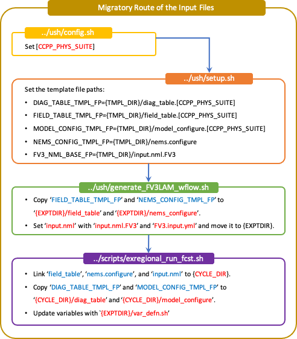

.. _InputOutputFiles:

======================
Input and Output Files
======================
This chapter provides an overview of the input and output files needed by the components
of the UFS SRW Application (:term:`UFS_UTILS`, the UFS :term:`Weather Model`, and :term:`UPP`).
Links to more detailed documentation for each of the components are provided.

Input Files
===========
The SRW Application requires numerous input files to run: static datasets (fix files
containing climatological information, terrain and land use data), initial and boundary
conditions files, and model configuration files (such as namelists).

Initial and Boundary Condition Files
------------------------------------
The external model files needed for initializing the runs can be obtained in a number of
ways, including: pulled directly from `NOMADS <https://nomads.ncep.noaa.gov/pub/data/nccf/com/>`_;
limited data availability), pulled from the NOAA HPSS during the workflow execution (requires
user access), or obtained and staged by the user from a different source. The data format for
these files can be :term:`GRIB2` or :term:`NEMSIO`. More information on downloading and staging
the external model data can be found in :numref:`Section %s <DownloadingStagingInput>`. Once staged,
the end-to-end application will run the system and write output files to disk.

Pre-processing (UFS_UTILS)
--------------------------
When a user runs the SRW Application as described in the quickstart guide
:numref:`Section %s <Quickstart>`, input data for the pre-processing utilities is linked
from a location on disk to your experiment directory by the workflow generation step. The
pre-processing utilities use many different datasets to create grids, and to generate model
input datasets from the external model files.  A detailed description of the input files
for the pre-processing utilities can be found `here 
<https://noaa-emcufs-utils.readthedocs.io/en/ufs-v2.0.0/>`_.

UFS Weather Model
-----------------
The input files for the weather model include both static (fixed) files and grid and date
specific files (terrain, initial conditions, boundary conditions, etc). The static fix files
must be staged by the user unless you are running on a pre-configured platform, in which case
you can link to the existing copy on that machine. See :numref:`Section %s <StaticFixFiles>`
for more information. The static, grid, and date specific files are linked in the experiment
directory by the workflow scripts. An extensive description of the input files for the weather
model can be found in the `UFS Weather Model User's Guide <https://ufs-weather-model.readthedocs.io/en/ufs-v2.0.0/>`_.
The namelists and configuration files for the SRW Application are created from templates by the
workflow, as described in :numref:`Section %s <WorkflowTemplates>`.

Unified Post Processor (UPP)
----------------------------
Documentation for the UPP input files can be found in the `UPP User's Guide
<https://upp.readthedocs.io/en/upp-v9.0.0/InputsOutputs.html>`_.

.. _WorkflowTemplates:

Workflow
--------
The SRW Application uses a series of template files, combined with user selected settings,
to create the required namelists and parameter files needed by the Application. These
templates can be reviewed to see what defaults are being used, and where configuration parameters
are assigned from the ``config.sh`` file.

List of Template Files
^^^^^^^^^^^^^^^^^^^^^^
The template files for the SRW Application are located in ``regional_workflow/ush/templates``
and are shown in :numref:`Table %s <TemplateFiles>`.

.. _TemplateFiles:

.. table::  Template files for a regional workflow.

   +-----------------------------+-------------------------------------------------------------+
   | **File Name**               | **Description**                                             |
   +=============================+=============================================================+
   | data_table                  | Cycle-independent file that the forecast model reads in at  |
   |                             | the start of each forecast. It is an empty file. No need to |
   |                             | change.                                                     |
   +-----------------------------+-------------------------------------------------------------+
   | diag_table_[CCPP]           | File specifying the output fields of the forecast model.    |
   |                             | A different diag_table may be configured for different      |
   |                             | CCPP suites.                                                |
   +-----------------------------+-------------------------------------------------------------+
   | field_table_[CCPP]          | Cycle-independent file that the forecast model reads in at  |
   |                             | the start of each forecast. It specifies the tracers that   |
   |                             | the forecast model will advect.  A different field_table    |
   |                             | may be needed for different CCPP suites.                    |
   +-----------------------------+-------------------------------------------------------------+
   | FV3.input.yml               | YAML configuration file containing the forecast model’s     |
   |                             | namelist settings for various physics suites. The values    |
   |                             | specified in this file update the corresponding values in   |
   |                             | the ``input.nml`` file. This file may be modified for the   |
   |                             | specific namelist options of your experiment.               |
   +-----------------------------+-------------------------------------------------------------+
   | FV3LAM_wflow.xml            | Rocoto XML file to run the workflow. It is filled in using  |
   |                             | the ``fill_template.py`` python script that is called in    |
   |                             | the ``generate_FV3LAM_wflow.sh``.                           |
   +-----------------------------+-------------------------------------------------------------+
   | input.nml.FV3               | Namelist file of the weather model.                         |
   +-----------------------------+-------------------------------------------------------------+
   | model_configure             | Settings and configurations for the NUOPC/ESMF main         |
   |                             | component.                                                  |
   +-----------------------------+-------------------------------------------------------------+
   | nems.configure              | NEMS (NOAA Environmental Modeling System) configuration     |
   |                             | file, no need to change because it is an atmosphere-only    |
   |                             | model in the SRW Application.                               |
   +-----------------------------+-------------------------------------------------------------+
   | regional_grid.nml           | Namelist settings for the code that generates an ESG grid.  |
   +-----------------------------+-------------------------------------------------------------+
   | README.xml_templating.md    | Instruction of Rocoto XML templating with Jinja.            |
   +-----------------------------+-------------------------------------------------------------+

Additional information related to the ``diag_table_[CCPP]``, ``field_table_[CCPP]``, ``input.nml.FV3``,
``model_conigure``, and ``nems.configure`` can be found in the `UFS Weather Model User's Guide
<https://ufs-weather-model.readthedocs.io/en/ufs-v2.0.0/InputsOutputs.html#input-files>`_,
while information on the ``regional_grid.nml`` can be found in the `UFS_UTILS User’s Guide
<https://noaa-emcufs-utils.readthedocs.io/en/ufs-v2.0.0/>`_.

Migratory Route of the Input Files in the Workflow
^^^^^^^^^^^^^^^^^^^^^^^^^^^^^^^^^^^^^^^^^^^^^^^^^^
:numref:`Figure %s <MigratoryRoute>` shows how the case-specific input files in the
``ufs-srweather-app/regional_workflow/ush/templates/`` directory flow to the experiment directory.
The value of ``CCPP_PHYS_SUITE`` is specified in the configuration file ``config.sh``. The template
input files corresponding to ``CCPP_PHYS_SUITE``, such as ``field_table`` and ``nems_configure``, are
copied to the experiment directory ``EXPTDIR`` and the namelist file of the weather model ``input.nml``
is created from the ``input.nml.FV3`` and ``FV3.input.yml`` files by running the script ``generate_FV3LAM_wflow.sh``.
While running the task ``RUN_FCST`` in the regional workflow as shown in :numref:`Figure %s <WorkflowTasksFig>`,
the ``field_table``, ``nems.configure``, and ``input.nml`` files, located in ``EXPTDIR`` are linked to the
cycle directory ``CYCLE_DIR/``, and ``diag_table`` and ``model_configure`` are copied from the ``templates``
directory. Finally, these files are updated with the variables specified in ``var_defn.sh``.

.. _MigratoryRoute:

    *Migratory route of input files*

.. _OutputFiles:

Output Files
============

The location of the output files written to disk is defined by the experiment directory,
``EXPTDIR/YYYYMMDDHH``, as set in ``config.sh``. 

Initial and boundary condition files
------------------------------------
The external model data used by ``chgres_cube`` (as part of the pre-processing utilities) are located
in the experiment run directory under ``EXPTDIR/YYYYMMDDHH/{EXTRN_MDL_NAME_ICS/LBCS}``.

Pre-processing (UFS_UTILS)
--------------------------
The files output by the pre-processing utilities reside in the ``INPUT`` directory under the
experiment run directory ``EXPTDIR/YYYYMMDDHH/INPUT`` and consist of the following:

* ``C403_grid.tile7.halo3.nc``
* ``gfs_bndy.tile7.000.nc``
* ``gfs_bndy.tile7.006.nc``
* ``gfs_ctrl.nc``
* ``gfs_data.nc -> gfs_data.tile7.halo0.nc``
* ``grid_spec.nc -> ../../grid/C403_mosaic.halo3.nc``
* ``grid.tile7.halo4.nc -> ../../grid/C403_grid.tile7.halo4.nc``
* ``oro_data.nc -> ../../orog/C403_oro_data.tile7.halo0.nc``
* ``sfc_data.nc -> sfc_data.tile7.halo0.nc``

These output files are used as inputs for the UFS weather model, and are described in the `Users Guide 
<https://ufs-weather-model.readthedocs.io/en/ufs-v2.0.0/InputsOutputs.html#grid-description-and-initial-condition-files>`_.

UFS Weather Model
-----------------
As mentioned previously, the workflow can be run in ‘community’ or ‘nco’ mode, which determines
the location and names of the output files.  In addition to this option, output can also be in
netCDF or NEMSIO format.  The output file format is set in the ``model_configure`` files using the
``output_file`` variable.  At this time, due to limitations in the post-processing component, only netCDF
format output is recommended for the SRW application.

.. note::
   In summary, the fully supported options for this release include running in ‘community’ mode with netCDF format output files.

In this case, the netCDF output files are written to the ``EXPTDIR/YYYYMMDDHH`` directory. The bases of
the file names are specified in the input file ``model_configure`` and are set to the following in the SRW Application:

* ``dynfHHH.nc``
* ``phyfHHH.nc``

Additional details may be found in the UFS Weather Model `Users Guide
<https://ufs-weather-model.readthedocs.io/en/ufs-v2.0.0/InputsOutputs.html#output-files>`_.

Unified Post Processor (UPP)
----------------------------
Documentation for the UPP output files can be found `here <https://upp.readthedocs.io/en/upp-v9.0.0/InputsOutputs.html>`_.

For the SRW Application, the weather model netCDF output files are written to the ``EXPTDIR/YYYYMMDDHH/postprd``
directory and have the naming convention (file->linked to):

* ``BGRD3D_{YY}{JJJ}{hh}{mm}f{fhr}00 -> {domain}.t{cyc}z.bgrd3df{fhr}.tmXX.grib2``
* ``BGDAWP_{YY}{JJJ}{hh}{mm}f{fhr}00 -> {domain}.t{cyc}z.bgdawpf{fhr}.tmXX.grib2``

The default setting for the output file names uses ``rrfs`` for ``{domain}``.  This may be overridden by
the user in the ``config.sh`` settings.

If you wish to modify the fields or levels that are output from the UPP, you will need to make
modifications to file ``fv3lam.xml``, which resides in the UPP repository distributed with the UFS SRW
Application. Specifically, if the code was cloned in the directory ``ufs-srweather-app``, the file will be
located in ``ufs-srweather-app/src/UPP/parm``.

.. note::
   This process requires advanced knowledge of which fields can be output for the UFS Weather Model.

Use the directions in the `UPP User's Guide <https://upp.readthedocs.io/en/upp-v9.0.0/InputsOutputs.html#control-file>`_
for details on how to make modifications to the ``fv3lam.xml`` file and for remaking the flat text file that
the UPP reads, which is called ``postxconfig-NT-fv3lam.txt`` (default).

Once you have created the new flat text file reflecting your changes, you will need to modify your
``config.sh`` to point the workflow to the new text file. In your ``config.sh``, set the following:

.. code-block:: console

   USE_CUSTOM_POST_CONFIG_FILE=”TRUE”
   CUSTOM_POST_CONFIG_PATH=”/path/to/custom/postxconfig-NT-fv3lam.txt”

which tells the workflow to use the custom file located in the user-defined path. The path should
include the filename. If this is set to true and the file path is not found, then an error will occur
when trying to generate the SRW Application workflow.

You may then start your case workflow as usual and the UPP will use the new flat ``*.txt`` file.

.. _DownloadingStagingInput:

Downloading and Staging Input Data
==================================
A set of input files, including static (fix) data and raw initial and lateral boundary conditions
(IC/LBCs), are needed to run the SRW Application. 

.. _StaticFixFiles:

Static Files
------------
A set of fix files are necessary to run the SRW Application. Environment variables describe the
location of the static files: ``FIXgsm``, ``TOPO_DIR``, and ``SFC_CLIMO_INPUT_DIR`` are the directories
where the static files are located. If you are on a pre-configured or configurable platform, there is no
need to stage the fixed files manually because they have been prestaged and the paths
are set in ``regional_workflow/ush/setup.sh``. If the user's platform is not defined
in that file, the static files can be pulled individually or as a full tar file from the `FTP data repository
<https://ftp.emc.ncep.noaa.gov/EIB/UFS/SRW/v1p0/fix/>`_ or from `Amazon Web Services (AWS) cloud storage
<https://ufs-data.s3.amazonaws.com/public_release/ufs-srweather-app-v1.0.0/fix/fix_files.tar.gz>`_
and staged on your machine. The paths to the staged files must then be set in ``config.sh``
as follows:

* ``FIXgsm=/path-to/fix/fix_am``
* ``TOPO_DIR=/path-to/fix/fix_am/fix_orog``
* ``SFC_CLIMO_INPUT_DIR=/path-to/fix_am/fix/sfc_climo/``

Initial Condition Formats and Source
------------------------------------
The SRW Application currently supports raw initial and lateral boundary conditions from numerous models
(i.e., FV3GFS, NAM, RAP, HRRR). The data can be provided in three formats: :term:`NEMSIO`, netCDF,
or :term:`GRIB2`.  The SRW Application currently only supports the use of NEMSIO and netCDF input files
from the GFS.

Environment variables describe what IC/LBC files to use (pre-staged files or files to be automatically
pulled from the NOAA HPSS) and the location of the and IC/LBC files: ``USE_USER_STAGED_EXTRN_FILES``
is the ``T/F`` flag defining what raw data files to use, ``EXTRN_MDL_SOURCE_BASEDIR_ICS`` is the
directory where the initial conditions are located, and ``EXTRN_MDL_SOURCE_BASEDIR_LBCS`` is the
directory where the lateral boundary conditions are located. 

If you have access to the NOAA HPSS and want to automatically download the IC/LBC files using the
workflow, these environment variables can be left out of the ``config.sh`` file. However, if you do
not have access to the NOAA HPSS and you need to pull and stage the data manually, you will need to
set ``USE_USER_STAGED_EXTRN_FILES`` to ``TRUE`` and then set the paths to the where the IC/LBC files are located. 

A small sample of IC/LBCs is available at the `FTP data repository
<https://ftp.emc.ncep.noaa.gov/EIB/UFS/SRW/v1p0/simple_test_case/gst_model_data.tar.gz>`_ or from `AWS cloud storage
<https://ufs-data.s3.amazonaws.com/public_release/ufs-srweather-app-v1.0.0/ic/gst_model_data.tar.gz>`_.

Initial and Lateral Boundary Condition Organization
---------------------------------------------------
The suggested directory structure and naming convention for the raw input files is described
below. While there is flexibility to modify these settings, this will provide the most reusability
for multiple dates when using the SRW Application workflow.

For ease of reusing the ``config.sh`` for multiple dates and cycles, it is recommended to set up
your raw IC/LBC files such that it includes the model name (e.g., FV3GFS, NAM, RAP, HRRR) and
``YYYYMMDDHH``, for example:  ``/path-to/model_data/FV3GFS/2019061518``. Since both initial
and lateral boundary condition files are necessary, you can also include an ICS and LBCS directory.
The sample IC/LBCs available at the FTP data repository are structured as follows:

* ``/path-to/model_data/MODEL/YYYYMMDDHH/ICS``
* ``/path-to/model_data/MODEL/YYYYMMDDHH/LBCS``

When files are pulled from the NOAA HPSS, the naming convention looks something like:

* FV3GFS (GRIB2): ``gfs.t{cycle}z.pgrb2.0p25.f{fhr}``
* FV3GFS (NEMSIO): ICs: ``gfs.t{cycle}z.atmanl.nemsio`` and ``gfs.t{cycle}z.sfcanl.nemsio``;
  LBCs: ``gfs.t{cycle}z.atmf{fhr}.nemsio``
* RAP (GRIB2): ``rap.t{cycle}z.wrfprsf{fhr}.grib2``
* HRRR (GRIB2): ``hrrr.t{cycle}z.wrfprsf{fhr}.grib2``

In order to preserve the original file name, the ``f00`` files are placed in the ``ICS`` directory
and all other forecast files are placed in the ``LBCS`` directory. Then, a symbolic link of the
original files in the ``ICS/LBCS`` directory to the ``YYYYMMDDHH`` directory is suggested with
the cycle removed. For example:

.. code-block:: console

   ln -sf /path-to/model_data/RAP/2020041212/ICS/rap.t12z.wrfprsf00.grib2 /path-to/model_data/RAP/2020041212/rap.wrfprsf00.grib2

Doing this allows for the following to be set in the ``config.sh`` regardless of what cycle you are running:

.. code-block:: console

   USE_USER_STAGED_EXTRN_FILES="TRUE"
   EXTRN_MDL_SOURCE_BASEDIR_ICS="/path-to/model_data/HRRR"
   EXTRN_MDL_FILES_ICS=( "hrrr.wrfprsf00.grib2" )
   EXTRN_MDL_SOURCE_BASEDIR_LBCS="/path-to/model_data/RAP"
   EXTRN_MDL_FILES_LBCS=( "rap.wrfprsf03.grib2" "rap.wrfprsf06.grib2" )

If you choose to forgo the extra ``ICS`` and ``LBCS`` directory, you may also simply either
rename the original files to remove the cycle or modify the ``config.sh`` to set: 

.. code-block:: console

   EXTRN_MDL_FILES_ICS=( "hrrr.t{cycle}z.wrfprsf00.grib2" )
   EXTRN_MDL_FILES_LBCS=( "rap.t{cycle}z.wrfprsf03.grib2" "rap.t{cycle}z.wrfprsf06.grib2" )

Default Initial and Lateral Boundary Conditions
-----------------------------------------------
The default initial and lateral boundary condition files are set to be a severe weather case
from 20190615 at 00 UTC. FV3GFS GRIB2 files are the default model and file format. A tar file
(``gst_model_data.tar.gz``) containing the model data for this case is available on EMC's FTP 
data repository at https://ftp.emc.ncep.noaa.gov/EIB/UFS/SRW/v1p0/simple_test_case/. It is 
also available on Amazon Web Services (AWS) at 
https://ufs-data.s3.amazonaws.com/public_release/ufs-srweather-app-v1.0.0/ic/gst_model_data.tar.gz.

Running the App for Different Dates
-----------------------------------
If users want to run the SRW Application for dates other than 06-15-2019, you will need to
make a change in the case to specify the desired data. This is done by modifying the
``config.sh`` ``DATE_FIRST_CYCL``, ``DATE_LAST_CYCL``, and ``CYCL_HRS`` settings. The
forecast length can be modified by changed the ``FCST_LEN_HRS``. In addition, the lateral
boundary interval can be specified using the ``LBC_SPEC_INTVL_HRS`` variable.

Users will need to ensure that the initial and lateral boundary condition files are available
in the specified path for their new date, cycle, and forecast length.

Staging Initial Conditions Manually
-----------------------------------
If users want to run the SRW Application with raw model files for dates other than what
are currently available on the preconfigured platforms, they need to stage the data manually.
The data should be placed in ``EXTRN_MDL_SOURCE_BASEDIR_ICS`` and ``EXTRN_MDL_SOURCE_BASEDIR_LBCS``.
Raw model files may be available from a number of sources. A few examples are provided here for convenience. 

NOMADS: https://nomads.ncep.noaa.gov/pub/data/nccf/com/{model}/prod, where model may be:

* GFS (GRIB2 or NEMSIO) - available for the last 10 days
  https://nomads.ncep.noaa.gov/pub/data/nccf/com/gfs/prod/ 
* NAM - available for the last 8 days
  https://nomads.ncep.noaa.gov/pub/data/nccf/com/nam/prod/  
* RAP - available for the last 2 days
  https://nomads.ncep.noaa.gov/pub/data/nccf/com/rap/prod/ 
* HRRR - available for the last 2 days
  https://nomads.ncep.noaa.gov/pub/data/nccf/com/hrrr/prod/

NCDC archive:

* GFS: https://www.ncdc.noaa.gov/data-access/model-data/model-datasets/global-forcast-system-gfs 
* NAM: https://www.ncdc.noaa.gov/data-access/model-data/model-datasets/north-american-mesoscale-forecast-system-nam 
* RAP: https://www.ncdc.noaa.gov/data-access/model-data/model-datasets/rapid-refresh-rap

AWS S3:

* GFS: https://registry.opendata.aws/noaa-gfs-bdp-pds/
* HRRR: https://registry.opendata.aws/noaa-hrrr-pds/ (necessary fields for initializing available for dates 2015 and newer)

Google Cloud:

* HRRR: https://console.cloud.google.com/marketplace/product/noaa-public/hrrr

Others: 

* Univ. of Utah HRRR archive: http://home.chpc.utah.edu/~u0553130/Brian_Blaylock/cgi-bin/hrrr_download.cgi 
* NAM nest archive: https://www.ready.noaa.gov/archives.php
* NAM data older than 6 months can be requested through the Archive Information Request System: https://www.ncei.noaa.gov/has/HAS.FileAppRouter?datasetname=NAM218&subqueryby=STATION&applname=&outdest=FILE
* RAP isobaric data older than 6 months can be requested through the Archive Information Request System: https://www.ncei.noaa.gov/has/HAS.FileAppRouter?datasetname=RAP130&subqueryby=STATION&applname=&outdest=FILE

Coexistence of Multiple Files for the Same Date
-----------------------------------------------
If you would like to have multiple file formats (e.g., GRIB2, NEMSIO, netCDF) for the same date
it is recommended to have a separate directory for each file format. For example, if you have GFS
GRIB2 and NEMSIO files your directory structure might look like:

.. code-block:: console

   /path-to/model_data/FV3GFS/YYYYMMDDHH/ICS and LBCS
   /path-to/model_data/FV3GFS_nemsio/YYYYMMDDHH/ICS and LBCS

If you want to use GRIB2 format files for FV3GFS you must also set two additional environment
variables, including:

.. code-block:: console

   FV3GFS_FILE_FMT_ICS="grib2"
   FV3GFS_FILE_FMT_LBCS="grib2"

This is ONLY necessary if you are using FV3GFS GRIB2 files. These settings may be removed if you
are initializing from NEMSIO format FV3GFS files.

Best Practices for Conserving Disk Space and Keeping Files Safe
---------------------------------------------------------------
Initial and lateral boundary condition files are large and can occupy a significant amount of
disk space. If various users will employ a common file system to conduct runs, it is recommended
that the users share the same ``EXTRN_MDL_SOURCE_BASEDIR_ICS`` and ``EXTRN_MDL_SOURCE_BASEDIR_LBCS``
directories. That way, if raw model input files are already on disk for a given date they do not
need to be replicated.

The files in the subdirectories of the ``EXTRN_MDL_SOURCE_BASEDIR_ICS`` and ``EXTRN_MDL_SOURCE_BASEDIR_LBCS``
directories should be write-protected. This prevents these files from being accidentally modified or deleted.
The directories should generally be group writable so the directory can be shared among multiple users.
