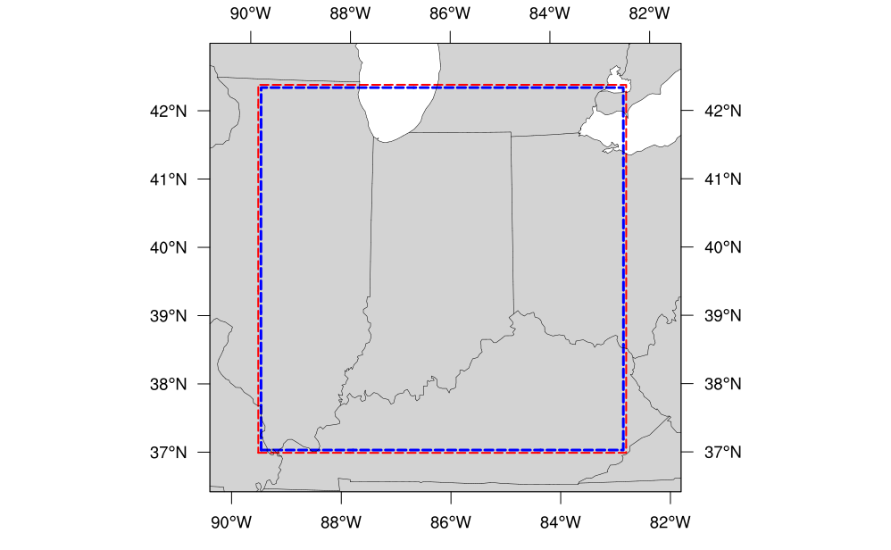

.. _LAMGrids:

=================================================================================
Limited Area Model (:term:`LAM`) Grids:  Predefined and User-Generated Options
=================================================================================
In order to set up the workflow and generate an experiment with the UFS SRW App, the user
must choose between four predefined :term:`FV3`-:term:`LAM` grids or generate a user-defined grid.
At this time, full support will only be provided to those using one of the four predefined
grids supported in this release. However, preliminary information is provided at the end of
this chapter that describes how users can leverage the SRW App workflow scripts to generate
their own user-defined grid. Currently, this feature is not fully supported and is
"use at your own risk."

Predefined Grids
=================
The UFS SRW App release includes four predefined limited area model (:term:`LAM`) grids to choose between
prior to configuring an experiment and generating a workflow. To select a predefined grid,
the ``PREDEF_GRID_NAME`` variable within the ``config.sh`` script needs to be set to one
of the following four options:

* ``RRFS_CONUS_3km``
* ``SUBCONUS_Ind_3km``
* ``RRFS_CONUS_13km``
* ``RRFS_CONUS_25km``

These four options are provided for flexibility related to compute resources and supported physics options. The high-resolution 3-km :term:`CONUS` grid generally requires more compute power and works well with three of the four supported physics suites (see :numref:`Table %s <GridPhysicsCombos>`). Low-resolution grids (i.e., 13-km and 25-km domains) require less compute power and should generally be used with the fourth supported physics suite: ``FV3_GFS_v16``. 

..
   COMMENT: FV3_WoFS can run on a 13-km and 25-km grid according to Yunheng. Can the HRRR and RRFS_v1beta also run on the 13-km and 25-km grids? Why is FV3_GFS_v16 preferred? Because it has cumulus physics?

.. _GridPhysicsCombos:

.. table:: Preferred grid and physics combinations for supported domains & physics suites

   +-------------------+------------------+
   | Grid              | Physics Suite(s) |
   +===================+==================+
   | RRFS_CONUS_3km    | FV3_RRFS_v1beta  |
   |                   |                  |
   |                   | FV3_HRRR         |
   |                   |                  |
   |                   | FV3_WoFS         |
   +-------------------+------------------+
   | SUBCONUS_Ind_3km  | FV3_RRFS_v1beta  |
   |                   |                  |
   |                   | FV3_HRRR         |
   |                   |                  |
   |                   | FV3_WoFS         |
   +-------------------+------------------+
   | RRFS_CONUS_13km   | FV3_GFS_v16      |
   +-------------------+------------------+
   | RRFS_CONUS_25km   | FV3_GFS_v16      |
   +-------------------+------------------+

In theory, any of the supported physics suites could be used with any of the predefined grids, but the results will be more accurate and meaningful with appropriate grid/physics pairings. 

The predefined :term:`CONUS` grids follow the naming convention (e.g., RRFS_CONUS_*km) of the prototype 3-km continental United States (CONUS) grid being tested for the Rapid Refresh Forecast System (RRFS). The RRFS will be a convection-allowing, hourly-cycled, :term:`FV3`-:term:`LAM`-based ensemble planned for operational implementation in 2024. All four supported grids were created to fit completely within the High Resolution Rapid Refresh (`HRRR <https://rapidrefresh.noaa.gov/hrrr/>`_) domain to allow for use of HRRR data to initialize the SRW App. 

Predefined 3-km CONUS Grid
-----------------------------

The 3km CONUS domain is ideal for running the ``FV3_RRFS_v1beta`` physics suite, since this suite definition file (:term:`SDF`) was specifically created for convection-allowing scales and is the precursor to the operational physics suite that will be used in the RRFS. The 3-km domain can also be used with the ``FV3_HRRR`` and ``FV3_WoFS`` physics suites, which likewise do not include convective parameterization. In fact, the ``FV3_WoFS`` physics suite is configured to run at 3-km *or less* and could therefore run with even higher-resolution user-defined domains if desired. However, the ``FV3_GFS_v16`` suite generally should *not* be used with the 3-km domain because the cumulus physics used in that physics suite is not configured to run at the 3-km resolution. 

.. _RRFS_CONUS_3km:

.. figure:: _static/RRFS_CONUS_3km.sphr.native_wrtcmp.png

   *The boundary of the RRFS_CONUS_3km computational grid (red) and corresponding write-component grid (blue).*

The boundary of the ``RRFS_CONUS_3km`` domain is shown in :numref:`Figure %s <RRFS_CONUS_3km>` (in red), and the boundary of the :ref:`write-component grid <WriteComp>` sits just inside the computational domain (in blue). This extra grid is required because the post-processing utility (:term:`UPP`) is currently unable to process data on the native FV3 gnomonic grid (in red). Therefore, model data are interpolated to a Lambert conformal grid (the write component grid) in order for UPP to read in and correctly process the data.

.. note::
   While it is possible to initialize the FV3-LAM with coarser external model data when using the ``RRFS_CONUS_3km`` domain, it is generally advised to use external model data that has a resolution similar to that of the native FV3-LAM (predefined) grid.

Predefined SUBCONUS Grid Over Indianapolis
--------------------------------------------

.. _SUBCONUS_Ind_3km:

n blue. 

   *The boundary of the SUBCONUS_Ind_3km computational grid (red) and corresponding write-component grid (blue).*

The ``SUBCONUS_Ind_3km`` grid covers only a small section of the :term:`CONUS` over Indianapolis. Like the ``RRFS_CONUS_3km`` grid, it is ideally paired with the ``FV3_RRFS_v1beta``, ``FV3_HRRR``, or ``FV3_WoFS`` physics suites, since these are all convection-allowing physics suites designed to work well on high-resolution grids. 

Predefined 13-km Grid
------------------------

.. _RRFS_CONUS_13km:

.. figure:: _static/RRFS_CONUS_13km.sphr.native_wrtcmp.png

   *The boundary of the RRFS_CONUS_13km computational grid (red) and corresponding write-component grid (blue).*

The ``RRFS_CONUS_13km`` grid (:numref:`Fig. %s <RRFS_CONUS_13km>`) covers the full :term:`CONUS`. This grid is meant to be run with the ``FV3_GFS_v16`` physics suite. The ``FV3_GFS_v16`` physics suite uses convective :term:`parameterizations`, whereas the other supported suites do not. Convective parameterizations are necessary for low-resolution grids because convection occurs on scales smaller than 25km and 13km. 

Predefined 25-km Grid
------------------------

.. _RRFS_CONUS_25km:

.. figure:: _static/RRFS_CONUS_25km.sphr.native_wrtcmp.png

   *The boundary of the RRFS_CONUS_25km computational grid (red) and corresponding write-component grid (blue).*

The final predefined :term:`CONUS` grid (:numref:`Fig. %s <RRFS_CONUS_25km>`) uses a 25-km resolution and
is meant mostly for quick testing to ensure functionality prior to using a higher-resolution domain.
However, for users who would like to use the 25-km domain for research, the ``FV3_GFS_v16`` :term:`SDF` is recommended for the reasons mentioned :ref:`above <RRFS_CONUS_13km>`. 

Ultimately, the choice of grid is experiment-dependent and resource-dependent. For example, a user may wish to use the ``FV3_GFS_v16`` physics suite, which uses cumulus physics that are not configured to run at the 3-km resolution. In this case, the 13-km or 25-km domain options are better suited to the experiment. Users will also have fewer computational constraints when running with the 13-km and 25-km domains, so depending on the resources available to them, certain grids may be better options than others. 

.. _UserDefinedGrid:

Creating User-Generated Grids
===============================
While the four predefined grids available in this release are ideal for users just starting
out with the SRW App, more advanced users may wish to create their own grid for testing over
a different region and/or with a different resolution. Creating a user-defined grid requires
knowledge of how the SRW App workflow functions. In particular, it is important to understand the set of
scripts that handle the workflow and experiment generation (see :numref:`Figure %s <WorkflowGeneration>` and :numref:`Figure %s <WorkflowTasksFig>`). It is also important to note that user-defined grids are not a supported feature of the current release; however, information is being provided for the benefit of the FV3-LAM community.

With those caveats in mind, this section provides instructions for adding a new grid to the FV3-LAM
workflow that will be generated using the "ESGgrid" method (i.e., using the regional_esg_grid code
in the `UFS_UTILS <https://github.com/ufs-community/UFS_UTILS>`__ repository, where ESG stands for "Extended Schmidt Gnomonic"). We assume here that the grid to be generated covers a domain that (1) does not contain either of the poles and (2) does not cross the -180 deg --> +180 deg discontinuity in longitude near the international date line. Instructions for domains that do not have these restrictions will be provided in a future release.

The steps to add such a grid to the workflow are as follows:

#. Choose the name of the grid. For the purposes of this documentation, the grid will be called "NEW_GRID".

#. Add NEW_GRID to the array ``valid_vals_PREDEF_GRID_NAME`` in the ``ufs-srweather-app/regional_workflow/ush/valid_param_vals.sh`` file.

#. In ``ufs-srweather-app/regional_workflow/ush/set_predef_grid_params.sh``, add a stanza to
   the case statement ``case ${PREDEF_GRID_NAME} in`` for NEW_GRID. An example of such a stanza
   is given :ref:`below <NewGridExample>` along with comments describing the variables that need to be set.

To run a forecast experiment on NEW_GRID, start with a workflow configuration file for a successful experiment (e.g., ``config.sh``, located in the ``ufs-srweather-app/regional_workflow/ush`` subdirectory), and change the line for ``PREDEF_GRID_NAME`` to the following:

.. code-block:: console

   PREDEF_GRID_NAME="NEW_GRID"

Then, generate a new experiment/workflow using ``generate_FV3LAM_wflow.sh`` in the :ref:`usual way <GenerateWorkflow>`.

Code Example
---------------

The following is an example of a code stanza for "NEW_GRID" to be added to ``set_predef_grid_params.sh``:

.. _NewGridExample:

.. code-block:: console

   #
   #---------------------------------------------------------------------
   #
   # Stanza for NEW_GRID.  This grid covers [provide a description of the
   # domain that NEW_GRID covers, its grid cell size, etc].
   #
   #---------------------------------------------------------------------
   #
   "NEW_GRID")
   
   # The method used to generate the grid.  This example is specifically
   # for the "ESGgrid" method.

     GRID_GEN_METHOD= "ESGgrid"
   
   # The longitude and latitude of the center of the grid, in degrees.

     ESGgrid_LON_CTR=-97.5
     ESGgrid_LAT_CTR=38.5
   
   # The grid cell sizes in the x and y directions, where x and y are the 
   # native coordinates of any ESG grid. The units of x and y are in
   # meters. These should be set to the nominal resolution we want the 
   # grid to have. The cells will have exactly these sizes in xy-space 
   # (computational space) but will have varying size in physical space.
   # The advantage of the ESGgrid generation method over the GFDLgrid 
   # method is that an ESGgrid will have a much smaller variation in grid
   # size in physical space than a GFDLgrid.

     ESGgrid_DELX="25000.0"
     ESGgrid_DELY="25000.0"
   
   # The number of cells along the x and y axes.

     ESGgrid_NX=200
     ESGgrid_NY=112
   
   # The width of the halo (in units of grid cells) that the temporary 
   # wide-halo grid created during the grid generation task (make_grid) 
   # will have. This wide-halo grid gets "shaved" down to obtain the 
   # 4-cell-wide halo and 3-cell-wide halo grids that the forecast model
   # (as well as other codes) will actually use. Recall that the halo is
   # needed to provide lateral boundary conditions to the forecast model.
   # Usually, there is no need to modify this parameter.

     ESGgrid_WIDE_HALO_WIDTH=6
   
   # The default physics time step that the forecast model will use. This
   # is the (inverse) frequency with which (most of) the physics suite is 
   # called. The smaller the grid cell size is, the smaller this value 
   # needs to be in order to avoid numerical instabilities during the 
   # forecast. The values specified below are used only if DT_ATMOS is 
   # not explicitly set in the user-specified experiment configuration 
   # file config.sh. Note that this parameter may be suite dependent.

     if [ "${CCPP_PHYS_SUITE}" = "FV3_GFS_v16" ]; then
       DT_ATMOS=${DT_ATMOS:-"300"}
     elif [ "${CCPP_PHYS_SUITE}" = "FV3_RRFS_v1beta" ]; then
       DT_ATMOS=${DT_ATMOS:-"40"}
     else
       DT_ATMOS=${DT_ATMOS:-"40"}
     fi
   
   # Default MPI task layout (decomposition) along the x and y directions and blocksize.
   # The values specified below are used only if they are not explicitly set in the user-specified
   # experiment configuration file config.sh.

     LAYOUT_X=${LAYOUT_X:-"5"}
     LAYOUT_Y=${LAYOUT_Y:-"2"}
     BLOCKSIZE=${BLOCKSIZE:-"40"}
   
   # The parameters for the write-component (aka "quilting") grid. This 
   # is the grid to which the output fields from the forecast are 
   # interpolated. The output fields are not specified on the native grid 
   # but are instead remapped to this write-component grid because the 
   # post-processing software (UPP; called during the run_post tasks) is
   # not able to process fields on the native grid. The variable 
   # "QUILTING", which specifies whether or not to use the 
   # write-component grid, is by default set to "TRUE".

     if [ "$QUILTING" = "TRUE" ]; then
   
   # The number of "groups" of MPI tasks that may be running at any given 
   # time to write out the output. Each write group will be writing to 
   # one set of output files (a dynf${fhr}.nc and a phyf${fhr}.nc file, 
   # where $fhr is the forecast hour). Each write group contains 
   # WRTCMP_write_tasks_per_group tasks. Usually, it is sufficient to 
   # have just one write group. This may need to be increased if the 
   # forecast is proceeding so quickly that a single write group cannot 
   # complete writing to its set of files before there is a need/request
   # to start writing the next set of files at the next output time (this
   # can happen, for instance, if the forecast model is trying to write 
   # output at every time step).

       WRTCMP_write_groups="1"
   
   # The number of MPI tasks to allocate to each write group.

       WRTCMP_write_tasks_per_group="2"
   
   # The coordinate system in which the write-component grid is 
   # specified. See the array valid_vals_WRTCMP_output_grid (defined in 
   # the script valid_param_vals.sh) for the values this can take on.  
   # The following example is specifically for the Lambert conformal 
   # coordinate system.

       WRTCMP_output_grid="lambert_conformal"
   
   # The longitude and latitude of the center of the write-component 
   # grid.

       WRTCMP_cen_lon="${ESGgrid_LON_CTR}"
       WRTCMP_cen_lat="${ESGgrid_LAT_CTR}"
   
   # The first and second standard latitudes needed for the Lambert 
   # conformal coordinate mapping.

       WRTCMP_stdlat1="${ESGgrid_LAT_CTR}"
       WRTCMP_stdlat2="${ESGgrid_LAT_CTR}"
   
   # The number of grid points in the x and y directions of the 
   # write-component grid. Note that this xy coordinate system is that of
   # the write-component grid (which in this case is Lambert conformal).
   # Thus, it is in general different than the xy coordinate system of 
   # the native ESG grid.

       WRTCMP_nx="197"
       WRTCMP_ny="107"
   
   # The longitude and latitude of the lower-left corner of the 
   # write-component grid, in degrees.

       WRTCMP_lon_lwr_left="-121.12455072"
       WRTCMP_lat_lwr_left="23.89394570"
   
   # The grid cell sizes along the x and y directions of the 
   # write-component grid. Units depend on the coordinate system used by
   # the grid (i.e. the value of WRTCMP_output_grid). For a Lambert 
   # conformal write-component grid, the units are in meters.

       WRTCMP_dx="${ESGgrid_DELX}"
       WRTCMP_dy="${ESGgrid_DELY}"
   
     fi
     ;;

