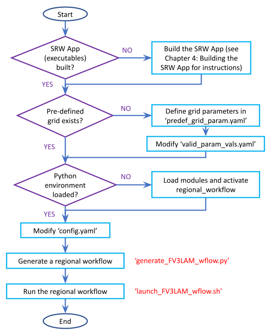
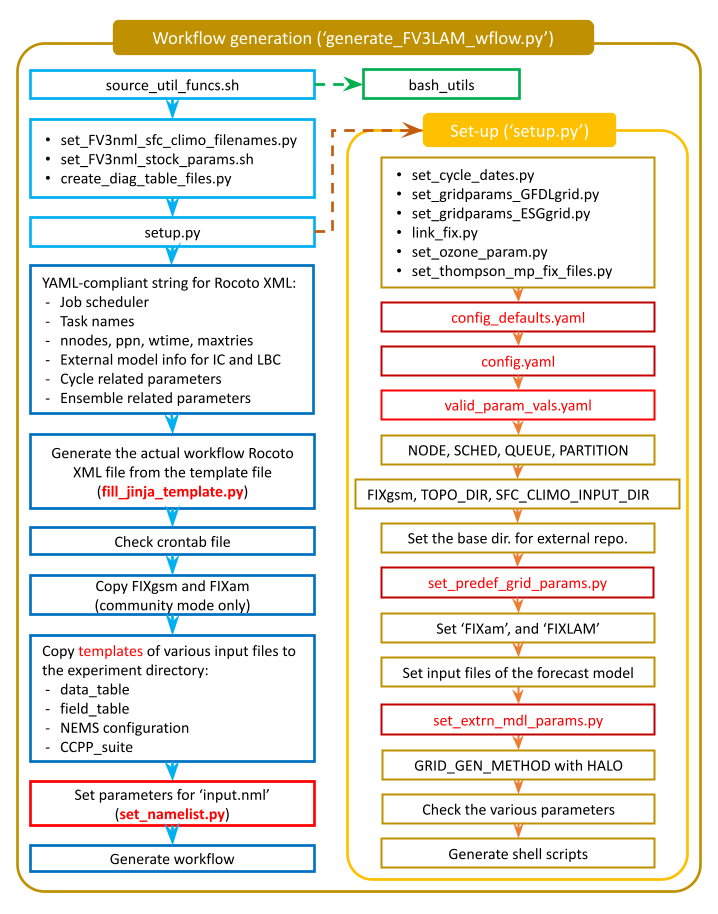
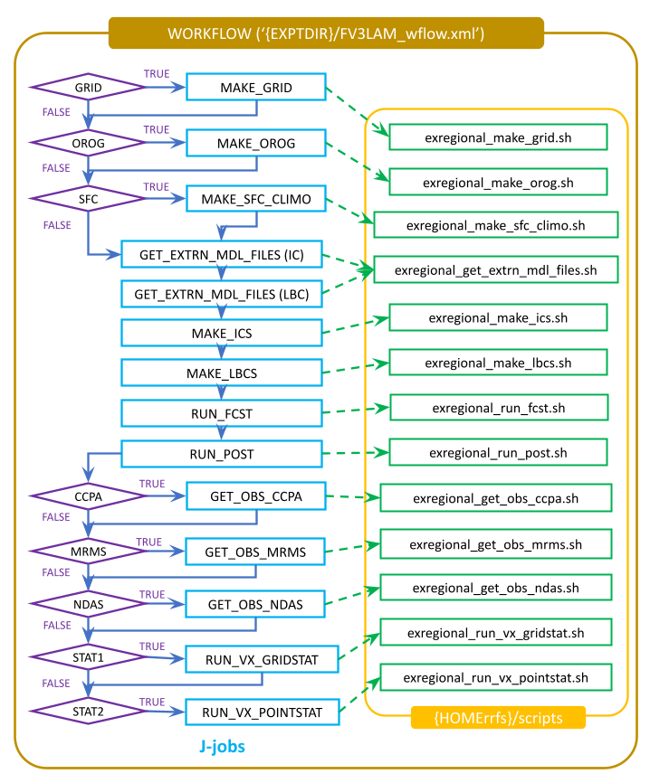

.. _RunSRW:

===========================
Running the SRW App
=========================== 

This chapter explains how to set up and run the "out-of-the-box" case for the SRW Application. However, the steps are relevant to any SRW App experiment and can be modified to suit user goals. This chapter assumes that users have already built the SRW App by following the steps in :numref:`Chapter %s <BuildSRW>`. These steps are also applicable to containerized versions of the SRW App and assume that the user has completed all of :numref:`Section %s <DownloadCodeC>`.

The out-of-the-box SRW App case builds a weather forecast for June 15-16, 2019. Multiple convective weather events during these two days produced over 200 filtered storm reports. Severe weather was clustered in two areas: the Upper Midwest through the Ohio Valley and the Southern Great Plains. This forecast uses a predefined 25-km Continental United States (:term:`CONUS`) domain (RRFS_CONUS_25km), the Global Forecast System (:term:`GFS`) version 16 physics suite (FV3_GFS_v16 :term:`CCPP`), and :term:`FV3`-based GFS raw external model data for initialization.

.. attention::

   The SRW Application has `four levels of support <https://github.com/ufs-community/ufs-srweather-app/wiki/Supported-Platforms-and-Compilers>`__. The steps described in this chapter will work most smoothly on preconfigured (Level 1) systems. This chapter can also serve as a starting point for running the SRW App on other systems (including generic Linux/Mac systems), but the user may need to perform additional troubleshooting. 


The overall procedure for generating an experiment is shown in :numref:`Figure %s <AppOverallProc>`, with the scripts to generate and run the workflow shown in red. Once the SRW App has been built, as described in :numref:`Chapter %s <BuildSRW>`, the steps to run a forecast are as follows:

   #. :ref:`Download and stage data <Data>`
   #. :ref:`Optional: Configure a new grid <GridSpecificConfig>`
   #. :ref:`Generate a regional workflow experiment <GenerateForecast>`

      * :ref:`Load the python environment for the regional workflow <SetUpPythonEnv>`
      * :ref:`Set the experiment configuration parameters <UserSpecificConfig>`
      * :ref:`Optional: Plot the output <PlotOutput>`
      * :ref:`Optional: Configure METplus Verification Suite <VXConfig>`

   #. :ref:`Run the regional workflow <Run>`

.. _AppOverallProc:



   *Overall Layout of the SRW App Workflow*

.. _Data:

Download and Stage the Data
============================

The SRW App requires input files to run. These include static datasets, initial and boundary conditions files, and model configuration files. On Level 1 systems, the data required to run SRW App tests are already available in the following locations: 

.. _DataLocations:
.. table:: Data Locations for Level 1 Systems

   +--------------+------------------------------------------------------------------------------+
   | Machine      | File location                                                                |
   +==============+==============================================================================+
   | Cheyenne     | /glade/work/epicufsrt/contrib/UFS_SRW_data/develop/input_model_data/         |
   +--------------+------------------------------------------------------------------------------+
   | Gaea         | /lustre/f2/dev/role.epic/contrib/UFS_SRW_data/develop/input_model_data/      |
   +--------------+------------------------------------------------------------------------------+
   | Hera         | /scratch1/NCEPDEV/nems/role.epic/UFS_SRW_data/develop/input_model_data/      |
   +--------------+------------------------------------------------------------------------------+
   | Jet          | /mnt/lfs4/HFIP/hfv3gfs/role.epic/UFS_SRW_data/develop/input_model_data/      |
   +--------------+------------------------------------------------------------------------------+
   | NOAA Cloud   | /contrib/EPIC/UFS_SRW_data/develop/input_model_data/                         |
   +--------------+------------------------------------------------------------------------------+
   | Orion        | /work/noaa/epic-ps/role-epic-ps/UFS_SRW_data/develop/input_model_data/       |
   +--------------+------------------------------------------------------------------------------+
   | WCOSS2       | /lfs/h2/emc/lam/noscrub/UFS_SRW_App/develop/input_model_data/                |
   +--------------+------------------------------------------------------------------------------+ 
    
For Level 2-4 systems, the data must be added to the user's system. Detailed instructions on how to add the data can be found in :numref:`Section %s <DownloadingStagingInput>`. Sections :numref:`%s <Input>` and :numref:`%s <OutputFiles>` contain useful background information on the input and output files used in the SRW App. 

.. _GridSpecificConfig:

Grid Configuration
=======================

The SRW App officially supports the four predefined grids shown in :numref:`Table %s <PredefinedGrids>`. The out-of-the-box SRW App case uses the ``RRFS_CONUS_25km`` predefined grid option. More information on the predefined and user-generated grid options can be found in :numref:`Chapter %s <LAMGrids>`. Users who plan to utilize one of the four predefined domain (grid) options may continue to :numref:`Step %s <GenerateForecast>`. Users who plan to create a new custom predefined grid should refer to :numref:`Section %s <UserDefinedGrid>` for instructions. At a minimum, these users will need to add the new grid name to the ``valid_param_vals.yaml`` file and add the corresponding grid-specific parameters in the ``predef_grid_params.yaml`` file.

.. _PredefinedGrids:

.. table::  Predefined Grids Supported in the SRW App

   +----------------------+-------------------+--------------------------------+
   | **Grid Name**        | **Grid Type**     | **Quilting (write component)** |
   +======================+===================+================================+
   | RRFS_CONUS_25km      | ESG grid          | lambert_conformal              |
   +----------------------+-------------------+--------------------------------+
   | RRFS_CONUS_13km      | ESG grid          | lambert_conformal              |
   +----------------------+-------------------+--------------------------------+
   | RRFS_CONUS_3km       | ESG grid          | lambert_conformal              |
   +----------------------+-------------------+--------------------------------+
   | SUBCONUS_Ind_3km     | ESG grid          | lambert_conformal              |
   +----------------------+-------------------+--------------------------------+


.. _GenerateForecast:

Generate the Forecast Experiment 
=================================
Generating the forecast experiment requires three steps:

#. :ref:`Load the python environment for the regional workflow <SetUpPythonEnv>`
#. :ref:`Set experiment configuration parameters <ExptConfig>`
#. :ref:`Run a script to generate the experiment workflow <GenerateWorkflow>`

The first two steps depend on the platform being used and are described here for each Level 1 platform. Users will need to adjust the instructions to reflect their machine configuration if they are working on a Level 2-4 platform. Information in :numref:`Chapter %s: Configuring the Workflow <ConfigWorkflow>` can help with this. 

.. _SetUpPythonEnv:

Load the Conda/Python Environment for the Regional Workflow
--------------------------------------------------------------

The workflow requires Python3 installed using conda, with the additional packages built in a separate conda evironment named ``regional_workflow``. This environment has the following additional packages: ``PyYAML``, ``Jinja2``, ``f90nml``, ``scipy``, ``matplotlib``, ``pygrib``, ``cartopy``. This conda/Python environment has already been set up on Level 1 platforms and can be activated in the following way:

.. code-block:: console

   source <path/to/etc/lmod-setup.sh/OR/lmod-setup.csh> <platform>
   module use <path/to/modulefiles>
   module load wflow_<platform>

where ``<platform>`` refers to a valid machine name (see :numref:`Section %s <user>`). 

.. note::
   If users source the lmod-setup file on a system that doesn't need it, it will not cause any problems (it will simply do a ``module purge``).

A brief recipe for building the regional workflow environment on a Linux or Mac system can be found in  :numref:`Section %s <LinuxMacVEnv>`. 

The ``wflow_<platform>`` modulefile will then output instructions to activate the regional workflow. The user should run the commands specified in the modulefile output. The command may vary from system to system. For example, if the output says: 

.. code-block:: console

   Please do the following to activate conda:
       > conda activate regional_workflow

then the user should run ``conda activate regional_workflow``. This activates the ``regional_workflow`` conda environment, and the user typically sees ``(regional_workflow)`` in front of the Terminal prompt at this point.

Preparing the Workflow Environment on Non-Level 1 Systems
^^^^^^^^^^^^^^^^^^^^^^^^^^^^^^^^^^^^^^^^^^^^^^^^^^^^^^^^^^^^^^

Users on non-Level 1 systems can copy one of the provided ``wflow_<platform>`` files and use it as a template to create a ``wflow_<platform>`` file that works for their system. The ``wflow_macos`` and ``wflow_linux`` template modulefiles are provided in the ``modulefiles`` directory. Modifications are required to provide paths for python, miniconda modules, module loads, conda initialization, and the path for user's ``regional_workflow`` conda environment. After making modifications to a ``wflow_<platform>`` file, users can run the commands from :numref:`Step %s <SetUpPythonEnv>` above to activate the regional workflow.

.. note::
   ``conda`` needs to be initialized before running ``conda activate regional_workflow`` command. Depending on the user's system and login setup, this may be accomplished in a variety of ways. Conda initialization usually involves the following command: ``source <conda_basedir>/etc/profile.d/conda.sh``, where ``<conda_basedir>`` is the base conda installation directory.

.. _ExptConfig:

Set Experiment Configuration Parameters
------------------------------------------

Each experiment requires certain basic information to run (e.g., date, grid, physics suite). This information is specified in ``config_defaults.yaml`` and in the user-specified ``config.yaml`` file. When generating a new experiment, the SRW App first reads and assigns default values from ``config_defaults.yaml``. Then, it reads and (re)assigns variables from the user's custom ``config.yaml`` file. 

For background info on ``config_defaults.yaml``, read :numref:`Section %s <DefaultConfigSection>`, or jump to :numref:`Section %s <UserSpecificConfig>` to continue configuring the experiment.

.. _DefaultConfigSection:

Default configuration: ``config_defaults.yaml``
^^^^^^^^^^^^^^^^^^^^^^^^^^^^^^^^^^^^^^^^^^^^^^^^^^

.. note::
   This section provides background information on available parameters and how the SRW App uses the ``config_defaults.yaml`` file. It is informative, but users do not need to modify ``config_defaults.yaml`` to run the out-of-the-box case for the SRW App. Therefore, users may skip to :numref:`Step %s <UserSpecificConfig>` to continue configuring their experiment. 

Configuration parameters in the ``config_defaults.yaml`` file appear in :numref:`Table %s <ConfigVarsDefault>`. Some of these default values are intentionally invalid in order to ensure that the user assigns valid values in the user-specified ``config.yaml`` file. Any settings provided in ``config.yaml`` will override the settings in ``config_defaults.yaml``. There is usually no need for a user to modify the default configuration file. Additional information on the default settings can be found in the ``config_defaults.yaml`` file comments and in :numref:`Chapter %s <ConfigWorkflow>`.

.. _ConfigVarsDefault:

.. table::  Configuration variables specified in the config_defaults.yaml script

   +-----------------------------+-----------------------------------------------------------------------+
   | **Group Name**              | **Configuration variables**                                           |
   +=============================+=======================================================================+
   | User                        | RUN_ENVIR, MACHINE, MACHINE_FILE, ACCOUNT                             |
   +-----------------------------+-----------------------------------------------------------------------+
   | Platform                    | WORKFLOW_MANAGER, NCORES_PER_NODE, BUILD_MOD_FN, WFLOW_MOD_FN,        |
   |                             | BUILD_VER_FN, RUN_VER_FN, SCHED, DOMAIN_PREGEN_BASEDIR,               |
   |                             | ENV_INIT_SCRIPTS_FPS, PRE_TASK_CMDS, PARTITION_DEFAULT, QUEUE_DEFAULT,|
   |                             | PARTITION_HPSS, QUEUE_HPSS, PARTITION_FCST, QUEUE_FCST,               |
   |                             | RUN_CMD_UTILS, RUN_CMD_FCST, RUN_CMD_POST, SLURM_NATIVE_CMD,          |
   |                             | MODEL, MET_INSTALL_DIR, METPLUS_PATH, MET_BIN_EXEC, CCPA_OBS_DIR,     |
   |                             | MRMS_OBS_DIR, NDAS_OBS_DIR                                            |
   +-----------------------------+-----------------------------------------------------------------------+
   | Workflow                    | WORKFLOW_ID, USE_CRON_TO_RELAUNCH, CRON_RELAUNCH_INTVL_MNTS,          |
   |                             | EXPT_BASEDIR, EXPT_SUBDIR, EXEC_SUBDIR, DOT_OR_USCORE,                |
   |                             | EXPT_CONFIG_FN, CONSTANTS_FN, RGNL_GRID_NML_FN,                       |
   |                             | FV3_NML_BASE_SUITE_FN, FV3_NML_YAML_CONFIG_FN, FV3_NML_BASE_ENS_FN,   |
   |                             | FV3_EXEC_FN, DIAG_TABLE_TMPL_FN, FIELD_TABLE_TMPL_FN,                 |
   |                             | DATA_TABLE_TMPL_FN, MODEL_CONFIG_TMPL_FN, NEMS_CONFIG_TMPL_FN,        |
   |                             | FCST_MODEL, WFLOW_XML_FN, GLOBAL_VAR_DEFNS_FN,                        |
   |                             | EXTRN_MDL_VAR_DEFNS_FN, WFLOW_LAUNCH_SCRIPT_FN, WFLOW_LAUNCH_LOG_FN,  |
   |                             | CCPP_PHYS_SUITE, GRID_GEN_METHOD, DATE_FIRST_CYCL, DATE_LAST_CYCL,    |
   |                             | INCR_CYCL_FREQ, FCST_LEN_HRS, GET_OBS, TN_VX, TN_VX_ENSGRID,          |
   |                             | TN_VX_ENSGRID_PROB_REFC, MAXTRIES_VX_ENSGRID_PROB_REFC,               |
   |                             | PREEXISTING_DIR_METHOD, VERBOSE, DEBUG, COMPILER                      |
   +-----------------------------+-----------------------------------------------------------------------+
   | NCO                         | envir, NET, model_ver, RUN, OPSROOT                                   |
   +-----------------------------+-----------------------------------------------------------------------+
   | Workflow Switches           | RUN_TASK_MAKE_GRID, RUN_TASK_MAKE_OROG, RUN_TASK_MAKE_SFC_CLIMO,      |
   |                             | RUN_TASK_GET_EXTRN_ICS, RUN_TASK_GET_EXTRN_LBCS, RUN_TASK_MAKE_ICS,   |
   |                             | RUN_TASK_MAKE_LBCS, RUN_TASK_RUN_FCST, RUN_TASK_RUN_POST,             |
   |                             | RUN_TASK_GET_OBS_CCPA, RUN_TASK_GET_OBS_MRMS, RUN_TASK_GET_OBS_NDAS,  |
   |                             | RUN_TASK_VX_GRIDSTAT, RUN_TASK_VX_POINTSTAT, RUN_TASK_VX_ENSGRID,     |
   |                             | RUN_TASK_VX_ENSPOINT                                                  |
   +-----------------------------+-----------------------------------------------------------------------+
   | task_make_grid              | TN_MAKE_GRID, NNODES_MAKE_GRID, PPN_MAKE_GRID, WTIME_MAKE_GRID,       |
   |                             | MAXTRIES_MAKE_GRID, GRID_DIR, ESGgrid_LON_CTR, ESGgrid_LAT_CTR,       |
   |                             | ESGgrid_DELX, ESGgrid_DELY, ESGgrid_NX, ESGgrid_NY, ESGgrid_PAZI,     |
   |                             | ESGgrid_WIDE_HALO_WIDTH, GFDLgrid_LON_T6_CTR, GFDLgrid_LAT_T6_CTR,    |
   |                             | GFDLgrid_NUM_CELLS, GFDLgrid_STRETCH_FAC, GFDLgrid_REFINE_RATIO,      |
   |                             | GFDLgrid_ISTART_OF_RGNL_DOM_ON_T6G, GFDLgrid_IEND_OF_RGNL_DOM_ON_T6G, |
   |                             | GFDLgrid_JSTART_OF_RGNL_DOM_ON_T6G, GFDLgrid_JEND_OF_RGNL_DOM_ON_T6G, |
   |                             | GFDLgrid_USE_NUM_CELLS_IN_FILENAMES                                   |
   +-----------------------------+-----------------------------------------------------------------------+
   | task_make_orog              | TN_MAKE_OROG, NNODES_MAKE_OROG, PPN_MAKE_OROG, WTIME_MAKE_OROG,       |
   |                             | MAXTRIES_MAKE_OROG, KMP_AFFINITY_MAKE_OROG, OMP_NUM_THREADS_MAKE_OROG |
   |                             | OMP_STACKSIZE_MAKE_OROG, OROG_DIR                                     |
   +-----------------------------+-----------------------------------------------------------------------+
   | task_make_sfc_climo         | TN_MAKE_SFC_CLIMO, NNODES_MAKE_SFC_CLIMO, PPN_MAKE_SFC_CLIMO,         |
   |                             | WTIME_MAKE_SFC_CLIMO, MAXTRIES_MAKE_SFC_CLIMO,                        |
   |                             | KMP_AFFINITY_MAKE_SFC_CLIMO, OMP_NUM_THREADS_MAKE_SFC_CLIMO,          |
   |                             | OMP_STACKSIZE_MAKE_SFC_CLIMO, SFC_CLIMO_DIR                           |
   +-----------------------------+-----------------------------------------------------------------------+
   | task_get_extrn_ics          | TN_GET_EXTRN_ICS, NNODES_GET_EXTRN_ICS, PPN_GET_EXTRN_ICS,            |
   |                             | WTIME_GET_EXTRN_ICS, MAXTRIES_GET_EXTRN_ICS, EXTRN_MDL_NAME_ICS,      |
   |                             | EXTRN_MDL_ICS_OFFSET_HRS, FV3GFS_FILE_FMT_ICS,                        |
   |                             | EXTRN_MDL_SYSBASEDIR_ICS, USE_USER_STAGED_EXTRN_FILES,                |
   |                             | EXTRN_MDL_SOURCE_BASEDIR_ICS, EXTRN_MDL_FILES_ICS,                    |
   |                             | EXTRN_MDL_FILES_ICS, EXTRN_MDL_FILES_ICS, EXTRN_MDL_DATA_STORES,      |
   |                             | NOMADS, NOMADS_file_type                                              |
   +-----------------------------+-----------------------------------------------------------------------+
   | task_get_extrn_lbcs         | TN_GET_EXTRN_LBCS, NNODES_GET_EXTRN_LBCS, PPN_GET_EXTRN_LBCS,         |
   |                             | WTIME_GET_EXTRN_LBCS, MAXTRIES_GET_EXTRN_LBCS, EXTRN_MDL_NAME_LBCS,   |
   |                             | LBC_SPEC_INTVL_HRS, EXTRN_MDL_LBCS_OFFSET_HRS, FV3GFS_FILE_FMT_LBCS,  |
   |                             | EXTRN_MDL_SYSBASEDIR_LBCS, USE_USER_STAGED_EXTRN_FILES,               |
   |                             | EXTRN_MDL_SOURCE_BASEDIR_LBCS, EXTRN_MDL_FILES_LBCS,                  |
   |                             | EXTRN_MDL_DATA_STORE, NOMADS, NOMADS_file_type                        |
   +-----------------------------+-----------------------------------------------------------------------+
   | task_make_ics               | TN_MAKE_ICS, NNODES_MAKE_ICS, PPN_MAKE_ICS, WTIME_MAKE_ICS,           |
   |                             | MAXTRIES_MAKE_ICS, KMP_AFFINITY_MAKE_ICS, OMP_NUM_THREADS_MAKE_ICS,   |
   |                             | OMP_STACKSIZE_MAKE_ICS, USE_FVCOM, FVCOM_WCSTART, FVCOM_DIR,          |
   |                             | FVCOM_FILE                                                            |
   +-----------------------------+-----------------------------------------------------------------------+
   | task_make_lbcs              | TN_MAKE_LBCS, NNODES_MAKE_LBCS, PPN_MAKE_LBCS, WTIME_MAKE_LBCS,       |
   |                             | MAXTRIES_MAKE_LBCS, KMP_AFFINITY_MAKE_LBCS, OMP_NUM_THREADS_MAKE_LBCS,| 
   |                             | OMP_STACKSIZE_MAKE_LBCS                                               |
   +-----------------------------+-----------------------------------------------------------------------+
   | task_run_fcst               | TN_RUN_FCST, NNODES_RUN_FCST, PPN_RUN_FCST, WTIME_RUN_FCST,           |
   |                             | MAXTRIES_RUN_FCST, KMP_AFFINITY_RUN_FCST, OMP_NUM_THREADS_RUN_FCST,   |
   |                             | OMP_STACKSIZE_RUN_FCST, DT_ATMOS, RESTART_INTERVAL, WRITE_DOPOST,     |
   |                             | LAYOUT_X, LAYOUT_Y, BLOCKSIZE, QUILTING, PRINT_ESMF,                  |
   |                             | WRTCMP_write_groups, WRTCMP_write_tasks_per_group,                    |
   |                             | WRTCMP_cen_lon, WRTCMP_cen_lat, WRTCMP_lon_lwr_left,                  |
   |                             | WRTCMP_lat_lwr_left, WRTCMP_lon_upr_rght, WRTCMP_lat_upr_rght,        |
   |                             | WRTCMP_dlon, WRTCMP_dlat, WRTCMP_stdlat1, WRTCMP_stdlat2, WRTCMP_nx,  |
   |                             | WRTCMP_ny, WRTCMP_dx, WRTCMP_dy, PREDEF_GRID_NAME, USE_MERRA_CLIMO,   |
   |                             | SFC_CLIMO_FIELDS, FIXgsm, FIXaer, FIXlut, TOPO_DIR,                   |
   |                             | SFC_CLIMO_INPUT_DIR, SYMLINK_FIX_FILES, FNGLAC, FNMXIC, FNTSFC,       |
   |                             | FNSNOC, FNZORC, FNAISC, FNSMCC, FNMSKH, FIXgsm_FILES_TO_COPY_TO_FIXam,|
   |                             | FV3_NML_VARNAME_TO_FIXam_FILES_MAPPING,                               |
   |                             | FV3_NML_VARNAME_TO_SFC_CLIMO_FIELD_MAPPING,                           |
   |                             | CYCLEDIR_LINKS_TO_FIXam_FILES_MAPPING                                 |
   +-----------------------------+-----------------------------------------------------------------------+
   | task_run_post               | TN_RUN_POST, NNODES_RUN_POST, PPN_RUN_POST, WTIME_RUN_POST,           | 
   |                             | MAXTRIES_RUN_POST, KMP_AFFINITY_RUN_POST, OMP_NUM_THREADS_RUN_POST,   |
   |                             | OMP_STACKSIZE_RUN_POST, SUB_HOURLY_POST, DT_SUB_HOURLY_POST_MNTS,     |
   |                             | USE_CUSTOM_POST_CONFIG_FILE, CUSTOM_POST_CONFIG_FP,                   |
   |                             | POST_OUTPUT_DOMAIN_NAME                                               |
   +-----------------------------+-----------------------------------------------------------------------+
   | Global                      | USE_CRTM, CRTM_DIR, DO_ENSEMBLE, NUM_ENS_MEMBERS,                     |
   |                             | NEW_LSCALE, DO_SHUM, ISEED_SHUM, SHUM_MAG, SHUM_LSCALE, SHUM_TSCALE,  |
   |                             | SHUM_INT, DO_SPPT, ISEED_SPPT, SPPT_MAG, SPPT_LOGIT, SPPT_LSCALE,     |
   |                             | SPPT_TSCALE, SPPT_INT, SPPT_SFCLIMIT, USE_ZMTNBLCK, DO_SKEB,          |
   |                             | ISEED_SKEB, SKEB_MAG, SKEB_LSCALE, SKEP_TSCALE, SKEB_INT, SKEBNORM,   |
   |                             | SKEB_VDOF, DO_SPP, ISEED_SPP, SPP_VAR_LIST, SPP_MAG_LIST, SPP_LSCALE, |
   |                             | SPP_TSCALE, SPP_SIGTOP1, SPP_SIGTOP2, SPP_STDDEV_CUTOFF, DO_LSM_SPP,  |
   |                             | LSM_SPP_TSCALE, LSM_SPP_LSCALE, ISEED_LSM_SPP, LSM_SPP_VAR_LIST,      |
   |                             | LSM_SPP_MAG_LIST, HALO_BLEND                                          |
   +-----------------------------+-----------------------------------------------------------------------+
   | task_get_obs_ccpa           | TN_GET_OBS_CCPA, NNODES_GET_OBS_CCPA, PPN_GET_OBS_CCPA,               |
   |                             | WTIME_GET_OBS_CCPA, MAXTRIES_GET_OBS_CCPA                             |
   +-----------------------------+-----------------------------------------------------------------------+
   | task_get_obs_mrms           | TN_GET_OBS_MRMS, NNODES_GET_OBS_MRMS, PPN_GET_OBS_MRMS,               |
   |                             | WTIME_GET_OBS_MRMS, MAXTRIES_GET_OBS_MRMS                             |
   +-----------------------------+-----------------------------------------------------------------------+
   | task_get_obs_ndas           | TN_GET_OBS_NDAS, NNODES_GET_OBS_NDAS, PPN_GET_OBS_NDAS,               |
   |                             | WTIME_GET_OBS_NDAS, MAXTRIES_GET_OBS_NDAS                             |
   +-----------------------------+-----------------------------------------------------------------------+
   | task_run_vx_gridstat        | TN_VX_GRIDSTAT, NNODES_VX_GRIDSTAT, PPN_VX_GRIDSTAT,                  |
   |                             | WTIME_VX_GRIDSTAT, MAXTRIES_VX_GRIDSTAT                               |
   +-----------------------------+-----------------------------------------------------------------------+
   | task_run_vx_gridstat_refc   | TN_VX_GRIDSTAT_REFC, NNODES_VX_GRIDSTAT, PPN_VX_GRIDSTAT,             |
   |                             | WTIME_VX_GRIDSTAT, MAXTRIES_VX_GRIDSTAT_REFC                          |
   +-----------------------------+-----------------------------------------------------------------------+
   | task_run_vx_gridstat_retop  | TN_VX_GRIDSTAT_RETOP, NNODES_VX_GRIDSTAT, PPN_VX_GRIDSTAT,            |
   |                             | WTIME_VX_GRIDSTAT, MAXTRIES_VX_GRIDSTAT_RETOP                         |
   +-----------------------------+-----------------------------------------------------------------------+
   | task_run_vx_gridstat_03h    | TN_VX_GRIDSTAT_03h, NNODES_VX_GRIDSTAT, PPN_VX_GRIDSTAT,              |
   |                             | WTIME_VX_GRIDSTAT, MAXTRIES_VX_GRIDSTAT_03h                           |
   +-----------------------------+-----------------------------------------------------------------------+
   | task_run_vx_gridstat_06h    | TN_VX_GRIDSTAT_06h, NNODES_VX_GRIDSTAT, PPN_VX_GRIDSTAT,              |
   |                             | WTIME_VX_GRIDSTAT, MAXTRIES_VX_GRIDSTAT_06h                           |
   +-----------------------------+-----------------------------------------------------------------------+
   | task_run_vx_gridstat_24h    | TN_VX_GRIDSTAT_24h, NNODES_VX_GRIDSTAT, PPN_VX_GRIDSTAT,              |
   |                             | WTIME_VX_GRIDSTAT, MAXTRIES_VX_GRIDSTAT_24h                           |
   +-----------------------------+-----------------------------------------------------------------------+
   | task_run_vx_pointstat       | TN_VX_POINTSTAT, NNODES_VX_POINTSTAT, PPN_VX_POINTSTAT,               |
   |                             | WTIME_VX_POINTSTAT, MAXTRIES_VX_POINTSTAT                             |
   +-----------------------------+-----------------------------------------------------------------------+
   | task_run_vx_ensgrid         | TN_VX_ENSGRID_03h, MAXTRIES_VX_ENSGRID_03h, TN_VX_ENSGRID_06h,        |
   |                             | MAXTRIES_VX_ENSGRID_06h, TN_VX_ENSGRID_24h, MAXTRIES_VX_ENSGRID_24h,  |
   |                             | TN_VX_ENSGRID_RETOP, MAXTRIES_VX_ENSGRID_RETOP,                       |
   |                             | TN_VX_ENSGRID_PROB_RETOP, MAXTRIES_VX_ENSGRID_PROB_RETOP,             |
   |                             | NNODES_VX_ENSGRID, PPN_VX_ENSGRID, WTIME_VX_ENSGRID,                  |
   |                             | MAXTRIES_VX_ENSGRID                                                   |
   +-----------------------------+-----------------------------------------------------------------------+
   | task_run_vx_ensgrid_refc    | TN_VX_ENSGRID_REFC, NNODES_VX_ENSGRID, PPN_VX_ENSGRID,                |
   |                             | WTIME_VX_ENSGRID, MAXTRIES_VX_ENSGRID_REFC                            |
   +-----------------------------+-----------------------------------------------------------------------+
   | task_run_vx_ensgrid_mean    | TN_VX_ENSGRID_MEAN, NNODES_VX_ENSGRID_MEAN, PPN_VX_ENSGRID_MEAN,      |
   |                             | WTIME_VX_ENSGRID_MEAN, MAXTRIES_VX_ENSGRID_MEAN                       |
   +-----------------------------+-----------------------------------------------------------------------+
   | task_run_vx_ensgrid_mean_03h| TN_VX_ENSGRID_MEAN_03h, NNODES_VX_ENSGRID_MEAN, PPN_VX_ENSGRID_MEAN,  |
   |                             | WTIME_VX_ENSGRID_MEAN, MAXTRIES_VX_ENSGRID_MEAN_03h                   |
   +-----------------------------+-----------------------------------------------------------------------+
   | task_run_vx_ensgrid_mean_06h| TN_VX_ENSGRID_MEAN_06h, NNODES_VX_ENSGRID_MEAN, PPN_VX_ENSGRID_MEAN,  |
   |                             | WTIME_VX_ENSGRID_MEAN, MAXTRIES_VX_ENSGRID_MEAN_06h                   |
   +-----------------------------+-----------------------------------------------------------------------+
   | task_run_vx_ensgrid_mean_24h| TN_VX_ENSGRID_MEAN_24h, NNODES_VX_ENSGRID_MEAN, PPN_VX_ENSGRID_MEAN,  |
   |                             | WTIME_VX_ENSGRID_MEAN, MAXTRIES_VX_ENSGRID_MEAN_24h                   |
   +-----------------------------+-----------------------------------------------------------------------+
   | task_run_vx_ensgrid_prob    | TN_VX_ENSGRID_PROB, NNODES_VX_ENSGRID_PROB, PPN_VX_ENSGRID_PROB,      |
   |                             | WTIME_VX_ENSGRID_PROB, MAXTRIES_VX_ENSGRID_PROB                       |
   +-----------------------------+-----------------------------------------------------------------------+
   | task_run_vx_ensgrid_prob_03h| TN_VX_ENSGRID_PROB_03h, NNODES_VX_ENSGRID_PROB, PPN_VX_ENSGRID_PROB,  |
   |                             | WTIME_VX_ENSGRID_PROB, MAXTRIES_VX_ENSGRID_PROB_03h                   |
   +-----------------------------+-----------------------------------------------------------------------+
   | task_run_vx_ensgrid_prob_06h| TN_VX_ENSGRID_PROB_06h, NNODES_VX_ENSGRID_PROB, PPN_VX_ENSGRID_PROB,  |
   |                             | WTIME_VX_ENSGRID_PROB, MAXTRIES_VX_ENSGRID_PROB_06h                   |
   +-----------------------------+-----------------------------------------------------------------------+
   | task_run_vx_ensgrid_prob_24h| TN_VX_ENSGRID_PROB_24h, NNODES_VX_ENSGRID_PROB, PPN_VX_ENSGRID_PROB,  |
   |                             | WTIME_VX_ENSGRID_PROB, MAXTRIES_VX_ENSGRID_PROB_24h                   |
   +-----------------------------+-----------------------------------------------------------------------+
   | task_run_vx_enspoint        | TN_VX_ENSPOINT, NNODES_VX_ENSPOINT, PPN_VX_ENSPOINT,                  |
   |                             | WTIME_VX_ENSPOINT, MAXTRIES_VX_ENSPOINT                               |
   +-----------------------------+-----------------------------------------------------------------------+
   | task_run_vx_enspoint_mean   | TN_VX_ENSPOINT_MEAN, NNODES_VX_ENSPOINT_MEAN, PPN_VX_ENSPOINT_MEAN,   |
   |                             | WTIME_VX_ENSPOINT_MEAN, MAXTRIES_VX_ENSPOINT_MEAN                     |
   +-----------------------------+-----------------------------------------------------------------------+
   | task_run_vx_enspoint_prob   | TN_VX_ENSPOINT_PROB, NNODES_VX_ENSPOINT_PROB, PPN_VX_ENSPOINT_PROB,   |
   |                             | WTIME_VX_ENSPOINT_PROB, MAXTRIES_VX_ENSPOINT_PROB                     |
   +-----------------------------+-----------------------------------------------------------------------+
   
.. _UserSpecificConfig:

User-specific configuration: ``config.yaml``
^^^^^^^^^^^^^^^^^^^^^^^^^^^^^^^^^^^^^^^^^^^^^^^

The user must specify certain basic experiment configuration information in a ``config.yaml`` file located in the ``ufs-srweather-app/ush`` directory. Two example templates are provided in that directory: ``config.community.yaml`` and ``config.nco.yaml``. The first file is a minimal example for creating and running an experiment in *community* mode (with ``RUN_ENVIR`` set to ``community``). The second is an example for creating and running an experiment in the *NCO* (operational) mode (with ``RUN_ENVIR`` set to ``nco``). The *community* mode is recommended in most cases and is fully supported for this release. The operational/NCO mode is typically used by developers at the Environmental Modeling Center (:term:`EMC`) and at the Global Systems Laboratory (:term:`GSL`) working on pre-implementation testing for the Rapid Refresh Forecast System (RRFS). :numref:`Table %s <ConfigCommunity>` compares the configuration variables that appear in the ``config.community.yaml`` with their default values in ``config_default.yaml``.

.. _ConfigCommunity:

.. table::   Configuration variables specified in the config.community.yaml script

   +--------------------------------+-------------------+------------------------------------+
   | **Parameter**                  | **Default Value** | **config.community.yaml Value**    |
   +================================+===================+====================================+
   | RUN_ENVIR                      | "nco"             | "community"                        |
   +--------------------------------+-------------------+------------------------------------+
   | MACHINE                        | "BIG_COMPUTER"    | "hera"                             |
   +--------------------------------+-------------------+------------------------------------+
   | ACCOUNT                        | "project_name"    | "an_account"                       |
   +--------------------------------+-------------------+------------------------------------+
   | MODEL                          | ""                | "FV3_GFS_v16_CONUS_25km"           |
   +--------------------------------+-------------------+------------------------------------+
   | METPLUS_PATH                   | ""                | ""                                 |
   +--------------------------------+-------------------+------------------------------------+
   | MET_INSTALL_DIR                | ""                | ""                                 |
   +--------------------------------+-------------------+------------------------------------+
   | CCPA_OBS_DIR                   | ""                | ""                                 |
   +--------------------------------+-------------------+------------------------------------+
   | MRMS_OBS_DIR                   | ""                | ""                                 |
   +--------------------------------+-------------------+------------------------------------+
   | NDAS_OBS_DIR                   | ""                | ""                                 |
   +--------------------------------+-------------------+------------------------------------+
   | EXPT_SUBDIR                    | ""                | "test_community"                   |
   +--------------------------------+-------------------+------------------------------------+
   | CCPP_PHYS_SUITE                | "FV3_GFS_v16"     | "FV3_GFS_v16"                      |
   +--------------------------------+-------------------+------------------------------------+
   | DATE_FIRST_CYCL                | "YYYYMMDDHH"      | '2019061518'                       |
   +--------------------------------+-------------------+------------------------------------+
   | DATE_LAST_CYCL                 | "YYYYMMDDHH"      | '2019061518'                       |
   +--------------------------------+-------------------+------------------------------------+
   | FCST_LEN_HRS                   | 24                | 12                                 |
   +--------------------------------+-------------------+------------------------------------+
   | PREEXISTING_DIR_METHOD         | "delete"          | "rename"                           |
   +--------------------------------+-------------------+------------------------------------+
   | VERBOSE                        | true              | true                               |
   +--------------------------------+-------------------+------------------------------------+
   | COMPILER                       | "intel"           | "intel"                            |
   +--------------------------------+-------------------+------------------------------------+
   | RUN_TASK_MAKE_GRID             | true              | true                               |
   +--------------------------------+-------------------+------------------------------------+
   | RUN_TASK_MAKE_OROG             | true              | true                               |
   +--------------------------------+-------------------+------------------------------------+
   | RUN_TASK_MAKE_SFC_CLIMO        | true              | true                               |
   +--------------------------------+-------------------+------------------------------------+
   | RUN_TASK_GET_OBS_CCPA          | false             | false                              |
   +--------------------------------+-------------------+------------------------------------+
   | RUN_TASK_GET_OBS_MRMS          | false             | false                              |
   +--------------------------------+-------------------+------------------------------------+
   | RUN_TASK_GET_OBS_NDAS          | false             | false                              |
   +--------------------------------+-------------------+------------------------------------+
   | RUN_TASK_VX_GRIDSTAT           | false             | false                              |
   +--------------------------------+-------------------+------------------------------------+
   | RUN_TASK_VX_POINTSTAT          | false             | false                              |
   +--------------------------------+-------------------+------------------------------------+
   | RUN_TASK_VX_ENSGRID            | false             | false                              |
   +--------------------------------+-------------------+------------------------------------+
   | RUN_TASK_VX_ENSPOINT           | false             | false                              |
   +--------------------------------+-------------------+------------------------------------+
   | EXTRN_MDL_NAME_ICS             | "FV3GFS"          | "FV3GFS"                           |
   +--------------------------------+-------------------+------------------------------------+
   | FV3GFS_FILE_FMT_ICS            | "nemsio"          | "grib2"                            |
   +--------------------------------+-------------------+------------------------------------+
   | EXTRN_MDL_NAME_LBCS            | "FV3GFS"          | "FV3GFS"                           |
   +--------------------------------+-------------------+------------------------------------+
   | FV3GFS_FILE_FMT_LBCS           | "nemsio"          | "grib2"                            |
   +--------------------------------+-------------------+------------------------------------+
   | LBC_SPEC_INTVL_HRS             | 6                 | 6                                  |
   +--------------------------------+-------------------+------------------------------------+
   | WTIME_RUN_FCST                 | "04:30:00"        | "02:00:00"                         |
   +--------------------------------+-------------------+------------------------------------+
   | QUILTING                       | true              | true                               |
   +--------------------------------+-------------------+------------------------------------+
   | PREDEF_GRID_NAME               | ""                | "RRFS_CONUS_25km"                  |
   +--------------------------------+-------------------+------------------------------------+
   | DO_ENSEMBLE                    | false             | false                              |
   +--------------------------------+-------------------+------------------------------------+
   | NUM_ENS_MEMBERS                | 1                 | 2                                  |
   +--------------------------------+-------------------+------------------------------------+
   

To get started, make a copy of ``config.community.yaml``. From the ``ufs-srweather-app`` directory, run:

.. code-block:: console

   cd /path/to/ufs-srweather-app/ush
   cp config.community.yaml config.yaml

The default settings in this file include a predefined 25-km :term:`CONUS` grid (RRFS_CONUS_25km), the :term:`GFS` v16 physics suite (FV3_GFS_v16 :term:`CCPP`), and :term:`FV3`-based GFS raw external model data for initialization.

.. note::

   Users who are accustomed to the former shell script workflow can reuse an old ``config.sh`` file by setting ``EXPT_CONFIG_FN: "config.sh"`` in ``config_defaults.yaml``. Alternatively, users can convert their ``config.sh`` file to a ``config.yaml`` file by running: 

   .. code-block:: console

      ./config_utils.py -c $PWD/config.sh -t $PWD/config_defaults.yaml -o yaml >config.yaml

Next, users should edit the new ``config.yaml`` file to customize it for their machine. At a minimum, users must change the ``MACHINE`` and ``ACCOUNT`` variables. Then, they can choose a name for the experiment directory by setting ``EXPT_SUBDIR``. If users have pre-staged initialization data for the experiment, they can set ``USE_USER_STAGED_EXTRN_FILES: true``, and set the paths to the data for ``EXTRN_MDL_SOURCE_BASEDIR_ICS`` and ``EXTRN_MDL_SOURCE_BASEDIR_LBCS``. If the modulefile used to set up the build environment in :numref:`Section %s <BuildExecutables>` uses a GNU compiler, check that the line ``COMPILER: "gnu"`` appears in the ``workflow:`` section of the ``config.yaml`` file. On platforms where Rocoto and :term:`cron` are available, users can automate resubmission of their experiment workflow by adding the following lines to the ``workflow:`` section of the ``config.yaml`` file:

.. code-block:: console

   USE_CRON_TO_RELAUNCH: true
   CRON_RELAUNCH_INTVL_MNTS: 3

.. note::

   Generic Linux and MacOS users should refer to :numref:`Section %s <LinuxMacEnvConfig>` for additional details on configuring an experiment and python environment. 

Detailed information on additional parameter options can be viewed in :numref:`Chapter %s: Configuring the Workflow <ConfigWorkflow>`. Additionally, information about the four predefined Limited Area Model (LAM) Grid options can be found in :numref:`Chapter %s: Limited Area Model (LAM) Grids <LAMGrids>`.

On Level 1 systems, the following fields typically need to be updated or added to the appropriate section of the ``config.yaml`` file in order to run the out-of-the-box SRW App case:

.. code-block:: console

   user:
      MACHINE: hera
      ACCOUNT: an_account
   workflow:
      EXPT_SUBDIR: test_community
   task_get_extrn_ics:
      USE_USER_STAGED_EXTRN_FILES: true
      EXTRN_MDL_SOURCE_BASEDIR_ICS: "/path/to/UFS_SRW_App/develop/input_model_data/<model_type>/<data_type>/<YYYYMMDDHH>"
   task_get_extrn_lbcs:
      USE_USER_STAGED_EXTRN_FILES: true
      EXTRN_MDL_SOURCE_BASEDIR_LBCS: "/path/to/UFS_SRW_App/develop/input_model_data/<model_type>/<data_type>/<YYYYMMDDHH>"

where: 
   * ``MACHINE`` refers to a valid machine name (see :numref:`Section %s <user>` for options).
   * ``ACCOUNT`` refers to a valid account name. Not all systems require a valid account name, but most do. 

   .. hint::

      To determine an appropriate ACCOUNT field for Level 1 systems, run ``groups``, and it will return a list of projects you have permissions for. Not all of the listed projects/groups have an HPC allocation, but those that do are potentially valid account names. 

   * ``EXPT_SUBDIR`` is changed to an experiment name of the user's choice.
   * ``</path/to/>`` is the path to the SRW App data on the user's machine (see :numref:`Section %s <Data>`). 
   * ``<model_type>`` refers to a subdirectory containing the experiment data from a particular model. Valid values on Level 1 systems correspond to the valid values for ``EXTRN_MDL_NAME_ICS`` and ``EXTRN_MDL_NAME_LBCS`` (see :numref:`Chapter %s <ConfigWorkflow>` for options). 
   * ``<data_type>`` refers to one of 3 possible data formats: ``grib2``, ``nemsio``, or ``netcdf``. 
   * ``<YYYYMMDDHH>`` refers to a subdirectory containing data for the :term:`cycle` date (in YYYYMMDDHH format). 

.. note::

   On ``JET``, users should also add ``PARTITION_DEFAULT: xjet`` and ``PARTITION_FCST: xjet`` to the ``platform:`` section of the ``config.yaml`` file.

For example, to run the out-of-the-box experiment on Gaea, add or modify variables in the ``user``, ``workflow``, ``task_get_extrn_ics``, and ``task_get_extrn_lbcs`` sections of ``config.yaml`` (unmodified variables are not shown in this example): 

   .. code-block::
      
      user:
         MACHINE: gaea
         ACCOUNT: hfv3gfs
      workflow:
         EXPT_SUBDIR: run_basic_srw
      task_get_extrn_ics:
         USE_USER_STAGED_EXTRN_FILES: true
         EXTRN_MDL_SOURCE_BASEDIR_ICS: /lustre/f2/dev/role.epic/contrib/UFS_SRW_data/develop/input_model_data/FV3GFS/grib2/2019061518
         EXTRN_MDL_DATA_STORES: disk
      task_get_extrn_lbcs:
         USE_USER_STAGED_EXTRN_FILES: true
         EXTRN_MDL_SOURCE_BASEDIR_LBCS: /lustre/f2/dev/role.epic/contrib/UFS_SRW_data/develop/input_model_data/FV3GFS/grib2/2019061518
         EXTRN_MDL_DATA_STORES: disk

To determine whether the ``config.yaml`` file adjustments are valid, users can run the following script from the ``ush`` directory:

.. code-block:: console

   ./config_utils.py -c $PWD/config.yaml -v $PWD/config_defaults.yaml

A correct ``config.yaml`` file will output a ``SUCCESS`` message. A ``config.yaml`` file with problems will output a ``FAILURE`` message describing the problem. For example:

.. code-block:: console

   INVALID ENTRY: EXTRN_MDL_FILES_ICS=[]
   FAILURE

.. note::

   The regional workflow must be loaded for the ``config_utils.py`` script to validate the ``config.yaml`` file. 

Valid values for configuration variables should be consistent with those in the ``ush/valid_param_vals.yaml`` script. In addition, various sample configuration files can be found within the subdirectories of ``tests/WE2E/test_configs``.

To configure an experiment and python environment for a general Linux or Mac system, see the :ref:`next section <LinuxMacEnvConfig>`. To configure an experiment to run METplus verification tasks, see :numref:`Section %s <VXConfig>`. Otherwise, skip to :numref:`Section %s <GenerateWorkflow>` to generate the workflow.

.. _PlotOutput:

Plotting Configuration (optional)
^^^^^^^^^^^^^^^^^^^^^^^^^^^^^^^^^^^

An optional Python plotting task (PLOT_ALLVARS) can be activated in the workflow to generate plots for the :term:`FV3`-:term:`LAM` post-processed :term:`GRIB2`
output over the :term:`CONUS`. It generates graphics plots for a number of variables, including:

   * 2-m temperature
   * 2-m dew point temperature
   * 10-m winds
   * 250 hPa winds
   * Accumulated precipitation
   * Composite reflectivity
   * Surface-based :term:`CAPE`/:term:`CIN`
   * Max/Min 2-5 km updraft helicity
   * Sea level pressure (SLP)

.. COMMENT: * 500 hPa heights, winds, and vorticity --> seems to be omitted? Why?

This workflow task can produce both plots from a single experiment and difference plots that compare the same cycle from two experiments. When plotting the difference, the two experiments must be on the same domain and available for 
the same cycle starting date/time and forecast hours. Other parameters may differ (e.g., the experiments may use different physics suites).

.. _Cartopy:

Cartopy Shapefiles
`````````````````````

The Python plotting tasks require a path to the directory where the Cartopy Natural Earth shapefiles are located. The medium scale (1:50m) cultural and physical shapefiles are used to create coastlines and other geopolitical borders on the map. On `Level 1 <https://github.com/ufs-community/ufs-srweather-app/wiki/Supported-Platforms-and-Compilers>`__ systems, this path is already set in the system's machine file using the variable ``FIXshp``. Users on other systems will need to download the shapefiles and update the path of ``$FIXshp`` in the machine file they are using (e.g., ``$SRW/ush/machine/macos.yaml`` for a generic MacOS system, where ``$SRW`` is the path to the ``ufs-srweather-app`` directory). The subset of shapefiles required for the plotting task can be obtained from the `SRW Data Bucket <https://noaa-ufs-srw-pds.s3.amazonaws.com/NaturalEarth/NaturalEarth.tgz>`__. The full set of medium-scale (1:50m) Cartopy shapefiles can be downloaded `here <https://www.naturalearthdata.com/downloads/>`__. 

Task Configuration
`````````````````````

Users will need to add or modify certain variables in ``config.yaml`` to run the plotting task(s). At a minimum, users must set ``RUN_TASK_PLOT_ALLVARS`` to true in the ``workflow_switches:`` section:

.. code-block:: console

   workflow_switches:
      RUN_TASK_PLOT_ALLVARS: true

Users may also wish to adjust the start, end, and increment value for the plotting task. For example:  

.. code-block:: console

   task_plot_allvars:
      PLOT_FCST_START: 0
      PLOT_FCST_INC: 6
      PLOT_FCST_END: 12

If the user chooses not to set these values, the default values will be used (see :numref:`Section %s <PlotVars>`).

.. note::
   If a forecast starts at 18h, this is considered the 0th forecast hour, so "starting forecast hour" should be 0, not 18. 

When plotting output from a single experiment, no further adjustments are necessary. The output files (in ``.png`` format) will be located in the experiment directory under the ``$CDATE/postprd`` subdirectory where ``$CDATE`` 
corresponds to the cycle date and hour in YYYYMMDDHH format (e.g., ``2019061518``).

Plotting the Difference Between Two Experiments
""""""""""""""""""""""""""""""""""""""""""""""""""

When plotting the difference between two experiments (``expt1`` and ``expt2``), users must set the ``COMOUT_REF`` template variable in ``expt2``'s ``config.yaml`` file to point at forecast output from the ``expt1`` directory. For example, in *community* mode, users can set ``COMOUT_REF`` as follows in the ``expt2`` configuration file:

.. code-block:: console

   task_plot_allvars:
      COMOUT_REF: '${EXPT_BASEDIR}/expt1/${PDY}${cyc}/postprd'

This will ensure that ``expt2`` can produce a difference plot comparing ``expt1`` and ``expt2``. In *community* mode, using default directory names and settings, ``$COMOUT_REF`` will resemble ``/path/to/expt_dirs/test_community/2019061518/postprd``. Additional details on the plotting variables are provided in :numref:`Section %s <PlotVars>`. 

The output files (in ``.png`` format) will be located in the ``postprd`` directory for the experiment.

.. _LinuxMacEnvConfig:

User-Specific Configuration on a Generic Linux/MacOS System
^^^^^^^^^^^^^^^^^^^^^^^^^^^^^^^^^^^^^^^^^^^^^^^^^^^^^^^^^^^^^^^^^

The configuration process for Linux and MacOS systems is similar to the process for other systems, but it requires a few extra steps.

.. note::
    Examples in this subsection presume that the user is running in the Terminal with a bash shell environment. If this is not the case, users will need to adjust the commands to fit their command line application and shell environment. 

.. _MacMorePackages:

Install/Upgrade Mac-Specific Packages
````````````````````````````````````````
MacOS requires the installation of a few additional packages and, possibly, an upgrade to bash. Users running on MacOS should execute the following commands:

.. code-block:: console

   bash --version
   brew install bash       # or: brew upgrade bash
   brew install coreutils
   brew gsed               # follow directions to update the PATH env variable

.. _LinuxMacVEnv: 

Creating a *conda* Environment on Linux and Mac
``````````````````````````````````````````````````

Users need to create a conda ``regional_workflow`` environment. The environment can be stored in a local path, which could be a default location or a user-specified location (e.g. ``$HOME/condaenv/venvs/`` directory). (To determine the default location, use the ``conda info`` command, and look for the ``envs directories`` list.) A brief recipe for creating a virtual conda environment on non-Level 1 platforms:

.. code-block:: console

   conda create --name regional_workflow python=<python3-conda-version>
   conda activate regional_workflow
   conda install -c conda-forge f90nml
   conda install jinja2
   conda install pyyaml
   # install packages for graphics environment
   conda install scipy
   conda install matplotlib
   conda install -c conda-forge pygrib
   conda install cartopy
   # verify the packages installed
   conda list
   conda deactivate

where ``<python3-conda-version>`` is a numeric version (e.g. ``3.9.12``) in the conda base installation resulting from the query ``python3 --version``.

.. _LinuxMacExptConfig:

Configuring an Experiment on General Linux and MacOS Systems
``````````````````````````````````````````````````````````````

**Optional: Install Rocoto**

.. note::
   Users may `install Rocoto <https://github.com/christopherwharrop/rocoto/blob/develop/INSTALL>`__ if they want to make use of a workflow manager to run their experiments. However, this option has not yet been tested on MacOS and has had limited testing on general Linux plaforms.


**Configure the SRW App:**

Configure an experiment using a template. Copy the contents of ``config.community.yaml`` into ``config.yaml``: 

.. code-block:: console

   cd /path/to/ufs-srweather-app/ush
   cp config.community.yaml config.yaml

In the ``config.yaml`` file, set ``MACHINE: macos`` or ``MACHINE: linux``, and modify the account and experiment info. For example: 

.. code-block:: console

   user:
      RUN_ENVIR: community
      MACHINE: macos
      ACCOUNT: user 
   workflow:
      EXPT_SUBDIR: test_community
      PREEXISTING_DIR_METHOD: rename
      VERBOSE: true
      COMPILER: gnu
   task_get_extrn_ics:
      USE_USER_STAGED_EXTRN_FILES: true
      EXTRN_MDL_SOURCE_BASEDIR_ICS: /path/to/input_model_data/FV3GFS/grib2/2019061518
      EXTRN_MDL_DATA_STORES: disk
   task_get_extrn_lbcs:
      USE_USER_STAGED_EXTRN_FILES: true
      EXTRN_MDL_SOURCE_BASEDIR_LBCS: /path/to/input_model_data/FV3GFS/grib2/2019061518
      EXTRN_MDL_DATA_STORES: disk
   task_run_fcst:
      PREDEF_GRID_NAME: RRFS_CONUS_25km	
      QUILTING: true

Due to the limited number of processors on MacOS systems, users must also configure the domain decomposition parameters directly in the section of the ``predef_grid_params.yaml`` file pertaining to the grid they want to use. Domain decomposition needs to take into account the number of available CPUs and configure the variables ``LAYOUT_X``, ``LAYOUT_Y``, and ``WRTCMP_write_tasks_per_group`` accordingly. 

The example below is for systems with 8 CPUs:

.. code-block:: console

   task_run_fcst:
      LAYOUT_X: 3
      LAYOUT_Y: 2
      WRTCMP_write_tasks_per_group: 2

.. note::
   The number of MPI processes required by the forecast will be equal to ``LAYOUT_X`` * ``LAYOUT_Y`` + ``WRTCMP_write_tasks_per_group``. 

For a machine with 4 CPUs, the following domain decomposition could be used:

.. code-block:: console

   task_run_fcst:
      LAYOUT_X: 3
      LAYOUT_Y: 1
      WRTCMP_write_tasks_per_group: 1

**Configure the Machine File**

Configure a ``macos.yaml`` or ``linux.yaml`` machine file in ``ufs-srweather-app/ush/machine`` based on the number of CPUs (``NCORES_PER_NODE``) in the system (usually 8 or 4 in MacOS; varies on Linux systems). Job scheduler (``SCHED``) options can be viewed :ref:`here <sched>`. Users must also set the path to the fix file directories. 

.. code-block:: console

   platform:
      # Architecture information
      WORKFLOW_MANAGER: none
      NCORES_PER_NODE: 8
      SCHED: none
      # Run commands for executables
      RUN_CMD_FCST: 'mpirun -np ${PE_MEMBER01}'
      RUN_CMD_POST: 'mpirun -np 4'
      RUN_CMD_SERIAL: time
      RUN_CMD_UTILS: 'mpirun -np 4'
      # Commands to run at the start of each workflow task.
      PRE_TASK_CMDS: '{ ulimit -a; }'

   task_make_orog:
      # Path to location of static input files used by the make_orog task
      TOPO_DIR: path/to/FIXgsm/files 

   task_make_sfc_climo:
      # Path to location of static surface climatology input fields used by sfc_climo_gen
      SFC_CLIMO_INPUT_DIR: path/to/FIXgsm/files 

   task_run_fcst:
      FIXaer: /path/to/FIXaer/files
      FIXgsm: /path/to/FIXgsm/files
      FIXlut: /path/to/FIXlut/files

   data:
      # Used by setup.py to set the values of EXTRN_MDL_SOURCE_BASEDIR_ICS and EXTRN_MDL_SOURCE_BASEDIR_LBCS
      FV3GFS: /Users/username/DATA/UFS/FV3GFS 

The ``data:`` section of the machine file can point to various data sources that the user has pre-staged on disk. For example:

.. code-block:: console

   data:
      FV3GFS:
         nemsio: /Users/username/DATA/UFS/FV3GFS/nemsio
         grib2: /Users/username/DATA/UFS/FV3GFS/grib2
         netcdf: /Users/username/DATA/UFS/FV3GFS/netcdf
      RAP: /Users/username/DATA/UFS/RAP/grib2
      HRRR: /Users/username/DATA/UFS/HRRR/grib2

This can be helpful when conducting multiple experiments with different types of data. 

.. _VXConfig:

Configure METplus Verification Suite (Optional)
^^^^^^^^^^^^^^^^^^^^^^^^^^^^^^^^^^^^^^^^^^^^^^^^^^

Users who want to use the METplus verification suite to evaluate their forecasts need to add additional information to their ``config.yaml`` file. Other users may skip to the :ref:`next section <SetUpPythonEnv>`. 

.. attention::
   METplus *installation* is not included as part of the build process for this release of the SRW App. However, METplus is preinstalled on many `Level 1 & 2 <https://dtcenter.org/community-code/metplus/metplus-4-1-existing-builds>`__ systems. For the v2.1.0 release, METplus *use* is supported on systems with a functioning METplus installation, although installation itself is not supported. For more information about METplus, see :numref:`Section %s <MetplusComponent>`.

.. note::
   If METplus users update their METplus installation, they must update the module load statements in ``ufs-srweather-app/modulefiles/tasks/<machine>/run_vx.local`` file to correspond to their system's updated installation:

   .. code-block:: console
      
      module use -a </path/to/met/modulefiles/>
      module load met/<version.X.X>

To use METplus verification, the path to the MET and METplus directories must be added to ``config.yaml``:

.. code-block:: console

   platform:
      METPLUS_PATH: </path/to/METplus/METplus-4.1.0>
      MET_INSTALL_DIR: </path/to/met/10.1.0>

Users who have already staged the observation data needed for METplus (i.e., the :term:`CCPA`, :term:`MRMS`, and :term:`NDAS` data) on their system should set the path to this data and set the corresponding ``RUN_TASK_GET_OBS_*`` parameters to false in ``config.yaml``. 

.. code-block:: console

   platform:
      CCPA_OBS_DIR: /path/to/UFS_SRW_App/develop/obs_data/ccpa/proc
      MRMS_OBS_DIR: /path/to/UFS_SRW_App/develop/obs_data/mrms/proc
      NDAS_OBS_DIR: /path/to/UFS_SRW_App/develop/obs_data/ndas/proc
   workflow_switches:
      RUN_TASK_GET_OBS_CCPA: false
      RUN_TASK_GET_OBS_MRMS: false
      RUN_TASK_GET_OBS_NDAS: false

If users have access to NOAA :term:`HPSS` but have not pre-staged the data, they can simply set the ``RUN_TASK_GET_OBS_*`` tasks to true, and the machine will attempt to download the appropriate data from NOAA HPSS. In this case, the ``*_OBS_DIR`` paths must be set to the location where users want the downloaded data to reside. 

Users who do not have access to NOAA HPSS and do not have the data on their system will need to download :term:`CCPA`, :term:`MRMS`, and :term:`NDAS` data manually from collections of publicly available data, such as the ones listed `here <https://dtcenter.org/nwp-containers-online-tutorial/publicly-available-data-sets>`__. 

Next, the verification tasks must be turned on according to the user's needs. Users should add some or all of the following tasks to ``config.yaml``, depending on the verification procedure(s) they have in mind:

.. code-block:: console

   workflow_switches:
      RUN_TASK_VX_GRIDSTAT: true
      RUN_TASK_VX_POINTSTAT: true
      RUN_TASK_VX_ENSGRID: true
      RUN_TASK_VX_ENSPOINT: true

These tasks are independent, so users may set some values to true and others to false depending on the needs of their experiment. Note that the ENSGRID and ENSPOINT tasks apply only to ensemble model verification. Additional verification tasks appear in :numref:`Table %s <VXWorkflowTasksTable>`. More details on all of the parameters in this section are available in :numref:`Section %s <VXTasks>`. 

.. _GenerateWorkflow: 

Generate the Regional Workflow
-------------------------------------------

Run the following command from the ``ufs-srweather-app/ush`` directory to generate the workflow:

.. code-block:: console

   ./generate_FV3LAM_wflow.py

The last line of output from this script, starting with ``*/1 * * * *`` or ``*/3 * * * *``, can be saved and :ref:`used later <Automate>` to automatically run portions of the workflow if users have the Rocoto workflow manager installed on their system. 

This workflow generation script creates an experiment directory and populates it with all the data needed to run through the workflow. The flowchart in :numref:`Figure %s <WorkflowGeneration>` describes the experiment generation process. First, ``generate_FV3LAM_wflow.py`` runs the ``setup.py`` script to set the configuration parameters. Second, it symlinks the time-independent (fix) files and other necessary data input files from their location to the experiment directory (``$EXPTDIR``). Third, it creates the input namelist file ``input.nml`` based on the ``input.nml.FV3`` file in the ``parm`` directory. Lastly, it creates the workflow XML file ``FV3LAM_wflow.xml`` that is executed when running the experiment with the Rocoto workflow manager.

The ``setup.py`` script reads three other configuration scripts in order: (1) ``config_defaults.yaml`` (:numref:`Section %s <DefaultConfigSection>`), (2) ``config.yaml`` (:numref:`Section %s <UserSpecificConfig>`), and (3) ``set_predef_grid_params.py``. If a parameter is specified differently in these scripts, the file containing the last defined value will be used.

The generated workflow will appear in ``$EXPTDIR``, where ``EXPTDIR=${EXPT_BASEDIR}/${EXPT_SUBDIR}``. These variables were specified in ``config_defaults.yaml`` and ``config.yaml`` in :numref:`Step %s <ExptConfig>`. The settings for these paths can also be viewed in the console output from the ``./generate_FV3LAM_wflow.py`` script or in the ``log.generate_FV3LAM_wflow`` file, which can be found in ``$EXPTDIR``.

.. _WorkflowGeneration:

_ESGgrid.py, link_fix.py, set_ozone_param.py, set_thompson_mp_fix_files.py, config_defaults.yaml, config.yaml, and valid_param_vals.yaml. Then, it sets a number of variables, including FIXgsm, TOPO_DIR, and SFC_CLIMO_INPUT_DIR variables. Next, set_predef_grid_params.py is called, and the FIXam and FIXLAM directories are set, along with the forecast input files. The setup script also calls set_extrn_mdl_params.py, sets the GRID_GEN_METHOD with HALO, checks various parameters, and generates shell scripts. Then, the workflow generation script sets up YAML-compliant strings and generates the actual Rocoto workflow XML file from the template file (fill_jinja_template.py). The workflow generation script checks the crontab file and, if applicable, copies certain fix files to the experiment directory. Then, it copies templates of various input files to the experiment directory and sets parameters for the input.nml file. Finally, it generates the workflow. Additional information on each step appears in comments within each script. 

   *Experiment Generation Description*

.. _WorkflowTaskDescription: 

Description of Workflow Tasks
--------------------------------

.. note::
   This section gives a general overview of workflow tasks. To begin running the workflow, skip to :numref:`Step %s <Run>`

:numref:`Figure %s <WorkflowTasksFig>` illustrates the overall workflow. Individual tasks that make up the workflow are specified in the ``FV3LAM_wflow.xml`` file. :numref:`Table %s <WorkflowTasksTable>` describes the function of each baseline task. The first three pre-processing tasks; ``MAKE_GRID``, ``MAKE_OROG``, and ``MAKE_SFC_CLIMO``; are optional. If the user stages pre-generated grid, orography, and surface climatology fix files, these three tasks can be skipped by adding the following lines to the ``config.yaml`` file before running the ``generate_FV3LAM_wflow.py`` script: 

.. code-block:: console

   workflow_switches:
      RUN_TASK_MAKE_GRID: false
      RUN_TASK_MAKE_OROG: false
      RUN_TASK_MAKE_SFC_CLIMO: false


.. _WorkflowTasksFig:

the scripts directory. The get_ics, get_lbcs, make_ics, make_lbcs, and run_fcst tasks call their respective exregional scripts. The run_post task will run, and if METplus verification tasks have been configured, those will run during post-processing by calling their exregional scripts. 

   *Flowchart of the Workflow Tasks*


The ``FV3LAM_wflow.xml`` file runs the specific j-job scripts (``jobs/JREGIONAL_[task name]``) in the prescribed order when the experiment is launched via the ``launch_FV3LAM_wflow.sh`` script or the ``rocotorun`` command. Each j-job task has its own source script (or "ex-script") named ``exregional_[task name].sh`` in the ``scripts`` directory. Two database files named ``FV3LAM_wflow.db`` and ``FV3LAM_wflow_lock.db`` are generated and updated by the Rocoto calls. There is usually no need for users to modify these files. To relaunch the workflow from scratch, delete these two ``*.db`` files and then call the launch script repeatedly for each task. 


.. _WorkflowTasksTable:

.. table::  Baseline Workflow Tasks in the SRW App

   +----------------------+------------------------------------------------------------+
   | **Workflow Task**    | **Task Description**                                       |
   +======================+============================================================+
   | make_grid            | Pre-processing task to generate regional grid files. Only  |
   |                      | needs to be run once per experiment.                       |
   +----------------------+------------------------------------------------------------+
   | make_orog            | Pre-processing task to generate orography files. Only      |
   |                      | needs to be run once per experiment.                       |
   +----------------------+------------------------------------------------------------+
   | make_sfc_climo       | Pre-processing task to generate surface climatology files. |
   |                      | Only needs to be run once per experiment.                  |
   +----------------------+------------------------------------------------------------+
   | get_extrn_ics        | Cycle-specific task to obtain external data for the        |
   |                      | initial conditions (ICs)                                   |
   +----------------------+------------------------------------------------------------+
   | get_extrn_lbcs       | Cycle-specific task to obtain external data for the        |
   |                      | lateral boundary conditions (LBCs)                         |
   +----------------------+------------------------------------------------------------+
   | make_ics             | Generate initial conditions from the external data         |
   +----------------------+------------------------------------------------------------+
   | make_lbcs            | Generate LBCs from the external data                       |
   +----------------------+------------------------------------------------------------+
   | run_fcst             | Run the forecast model (UFS Weather Model)                 |
   +----------------------+------------------------------------------------------------+
   | run_post             | Run the post-processing tool (UPP)                         |
   +----------------------+------------------------------------------------------------+

In addition to the baseline tasks described in :numref:`Table %s <WorkflowTasksTable>` above, users may choose to run some or all of the METplus verification tasks. These tasks are described in :numref:`Table %s <VXWorkflowTasksTable>` below. 

.. _VXWorkflowTasksTable:

.. table:: Verification (VX) Workflow Tasks in the SRW App

   +-----------------------+------------------------------------------------------------+
   | **Workflow Task**     | **Task Description**                                       |
   +=======================+============================================================+
   | GET_OBS_CCPA          | Retrieves and organizes hourly :term:`CCPA` data from NOAA |
   |                       | HPSS. Can only be run if ``RUN_TASK_GET_OBS_CCPA: true``   |
   |                       | *and* user has access to NOAA :term:`HPSS` data.           |
   +-----------------------+------------------------------------------------------------+
   | GET_OBS_NDAS          | Retrieves and organizes hourly :term:`NDAS` data from NOAA |
   |                       | HPSS. Can only be run if ``RUN_TASK_GET_OBS_NDAS: true``   |
   |                       | *and* user has access to NOAA HPSS data.                   |
   +-----------------------+------------------------------------------------------------+
   | GET_OBS_MRMS          | Retrieves and organizes hourly :term:`MRMS` composite      |
   |                       | reflectivity and :term:`echo top` data from NOAA HPSS. Can |
   |                       | only be run if ``RUN_TASK_GET_OBS_MRMS: true`` *and* user  |
   |                       | has access to NOAA HPSS data.                              |
   +-----------------------+------------------------------------------------------------+
   | VX_GRIDSTAT           | Runs METplus grid-to-grid verification for 1-h accumulated |
   |                       | precipitation                                              |
   +-----------------------+------------------------------------------------------------+
   | VX_GRIDSTAT_REFC      | Runs METplus grid-to-grid verification for composite       |
   |                       | reflectivity                                               |
   +-----------------------+------------------------------------------------------------+
   | VX_GRIDSTAT_RETOP     | Runs METplus grid-to-grid verification for :term:`echo top`|
   +-----------------------+------------------------------------------------------------+
   | VX_GRIDSTAT_##h       | Runs METplus grid-to-grid verification for 3-h, 6-h, and   |
   |                       | 24-h (i.e., daily) accumulated precipitation. Valid values |
   |                       | for ``##`` are ``03``, ``06``, and ``24``.                 |
   +-----------------------+------------------------------------------------------------+
   | VX_POINTSTAT          | Runs METplus grid-to-point verification for surface and    |
   |                       | upper-air variables                                        |
   +-----------------------+------------------------------------------------------------+
   | VX_ENSGRID            | Runs METplus grid-to-grid ensemble verification for 1-h    |
   |                       | accumulated precipitation. Can only be run if              |
   |                       | ``DO_ENSEMBLE: true`` and ``RUN_TASK_VX_ENSGRID: true``.   |
   +-----------------------+------------------------------------------------------------+
   | VX_ENSGRID_REFC       | Runs METplus grid-to-grid ensemble verification for        |
   |                       | composite reflectivity. Can only be run if                 |
   |                       | ``DO_ENSEMBLE: true`` and                                  |
   |                       | ``RUN_TASK_VX_ENSGRID: true``.                             |
   +-----------------------+------------------------------------------------------------+
   | VX_ENSGRID_RETOP      | Runs METplus grid-to-grid ensemble verification for        |
   |                       | :term:`echo top`. Can only be run if ``DO_ENSEMBLE: true`` |
   |                       | and ``RUN_TASK_VX_ENSGRID: true``.                         |
   +-----------------------+------------------------------------------------------------+
   | VX_ENSGRID_##h        | Runs METplus grid-to-grid ensemble verification for 3-h,   |
   |                       | 6-h, and 24-h (i.e., daily) accumulated precipitation.     |
   |                       | Valid values for ``##`` are ``03``, ``06``, and ``24``.    |
   |                       | Can only be run if ``DO_ENSEMBLE: true`` and               |
   |                       | ``RUN_TASK_VX_ENSGRID: true``.                             |
   +-----------------------+------------------------------------------------------------+
   | VX_ENSGRID_MEAN       | Runs METplus grid-to-grid verification for ensemble mean   |
   |                       | 1-h accumulated precipitation. Can only be run if          |
   |                       | ``DO_ENSEMBLE: true`` and ``RUN_TASK_VX_ENSGRID: true``.   |
   +-----------------------+------------------------------------------------------------+
   | VX_ENSGRID_PROB       | Runs METplus grid-to-grid verification for 1-h accumulated |
   |                       | precipitation probabilistic output. Can only be run if     |
   |                       | ``DO_ENSEMBLE: true`` and ``RUN_TASK_VX_ENSGRID: true``.   |
   +-----------------------+------------------------------------------------------------+
   | VX_ENSGRID_MEAN_##h   | Runs METplus grid-to-grid verification for ensemble mean   |
   |                       | 3-h, 6-h, and 24h (i.e., daily) accumulated precipitation. |
   |                       | Valid values for ``##`` are ``03``, ``06``, and ``24``.    |
   |                       | Can only be run if ``DO_ENSEMBLE: true`` and               |
   |                       | ``RUN_TASK_VX_ENSGRID: true``.                             |
   +-----------------------+------------------------------------------------------------+
   | VX_ENSGRID_PROB_##h   | Runs METplus grid-to-grid verification for 3-h, 6-h, and   |
   |                       | 24h (i.e., daily) accumulated precipitation probabilistic  |
   |                       | output. Valid values for ``##`` are ``03``, ``06``, and    |
   |                       | ``24``. Can only be run if ``DO_ENSEMBLE: true`` and       |
   |                       | ``RUN_TASK_VX_ENSGRID: true``.                             |
   +-----------------------+------------------------------------------------------------+
   | VX_ENSGRID_PROB_REFC  | Runs METplus grid-to-grid verification for ensemble        |
   |                       | probabilities for composite reflectivity. Can only be run  |
   |                       | if ``DO_ENSEMBLE: true`` and                               |
   |                       | ``RUN_TASK_VX_ENSGRID: true``.                             |
   +-----------------------+------------------------------------------------------------+
   | VX_ENSGRID_PROB_RETOP | Runs METplus grid-to-grid verification for ensemble        |
   |                       | probabilities for :term:`echo top`. Can only be run if     |
   |                       | ``DO_ENSEMBLE: true`` and ``RUN_TASK_VX_ENSGRID: true``.   | 
   +-----------------------+------------------------------------------------------------+
   | VX_ENSPOINT           | Runs METplus grid-to-point ensemble verification for       |
   |                       | surface and upper-air variables. Can only be run if        |
   |                       | ``DO_ENSEMBLE: true`` and ``RUN_TASK_VX_ENSPOINT: true``.  |
   +-----------------------+------------------------------------------------------------+
   | VX_ENSPOINT_MEAN      | Runs METplus grid-to-point verification for ensemble mean  |
   |                       | surface and upper-air variables. Can only be run if        |
   |                       | ``DO_ENSEMBLE: true`` and ``RUN_TASK_VX_ENSPOINT: true``.  |
   +-----------------------+------------------------------------------------------------+
   | VX_ENSPOINT_PROB      | Runs METplus grid-to-point verification for ensemble       |
   |                       | probabilities for surface and upper-air variables. Can     |
   |                       | only be run if ``DO_ENSEMBLE: true`` and                   |
   |                       | ``RUN_TASK_VX_ENSPOINT: true``.                            |
   +-----------------------+------------------------------------------------------------+


.. _Run:

Run the Workflow 
=======================

The workflow can be run using the Rocoto workflow manager (see :numref:`Section %s <UseRocoto>`) or using standalone wrapper scripts (see :numref:`Section %s <RunUsingStandaloneScripts>`). 

.. attention::

   If users are running the SRW App on a system that does not have Rocoto installed (e.g., `Level 3 & 4 <https://github.com/ufs-community/ufs-srweather-app/wiki/Supported-Platforms-and-Compilers>`__ systems, such as MacOS or generic Linux systems), they should follow the process outlined in :numref:`Section %s <RunUsingStandaloneScripts>` instead of the instructions in this section.


.. _UseRocoto:

Run the Workflow Using Rocoto
--------------------------------

The information in this section assumes that Rocoto is available on the desired platform. All official HPC platforms for the UFS SRW App release make use of the Rocoto workflow management software for running experiments. However, if Rocoto is not available, it is still possible to run the workflow using stand-alone scripts according to the process outlined in :numref:`Section %s <RunUsingStandaloneScripts>`. 

There are three ways to run the workflow with Rocoto: (1) automation via crontab (2) by calling the ``launch_FV3LAM_wflow.sh`` script, and (3) by manually issuing the ``rocotorun`` command.

.. note::
   Users may find it helpful to review :numref:`Chapter %s <RocotoInfo>` to gain a better understanding of Rocoto commands and workflow management before continuing, but this is not required to run the experiment. 

Optionally, an environment variable can be set to navigate to the ``$EXPTDIR`` more easily. If the login shell is bash, it can be set as follows:

.. code-block:: console

   export EXPTDIR=/<path-to-experiment>/<directory_name>

If the login shell is csh/tcsh, it can be set using:

.. code-block:: console

   setenv EXPTDIR /<path-to-experiment>/<directory_name>


.. _Automate:

Automated Option
^^^^^^^^^^^^^^^^^^^

The simplest way to run the Rocoto workflow is to automate the process using a job scheduler such as :term:`Cron`. For automatic resubmission of the workflow at regular intervals (e.g., every 3 minutes), the user can add the following commands to their ``config.yaml`` file *before* generating the experiment:

.. code-block:: console

   USE_CRON_TO_RELAUNCH: true
   CRON_RELAUNCH_INTVL_MNTS: 3

This will automatically add an appropriate entry to the user's :term:`cron table` and launch the workflow. Alternatively, the user can add a crontab entry manually using the ``crontab -e`` command. As mentioned in :numref:`Section %s <GenerateWorkflow>`, the last line of output from ``./generate_FV3LAM_wflow.py`` (starting with ``*/3 * * * *``), can be pasted into the crontab file. It can also be found in the ``$EXPTDIR/log.generate_FV3LAM_wflow`` file. The crontab entry should resemble the following: 

.. code-block:: console

   */3 * * * * cd <path/to/experiment/subdirectory> && ./launch_FV3LAM_wflow.sh called_from_cron="TRUE"

where ``<path/to/experiment/subdirectory>`` is changed to correspond to the user's ``$EXPTDIR``. The number ``3`` can be changed to a different positive integer and simply means that the workflow will be resubmitted every three minutes.

.. hint::

   * On NOAA Cloud instances, ``*/1 * * * *`` (or ``CRON_RELAUNCH_INTVL_MNTS: 1``) is the preferred option for cron jobs because compute nodes will shut down if they remain idle too long. If the compute node shuts down, it can take 15-20 minutes to start up a new one. 
   * On other NOAA HPC systems, admins discourage the ``*/1 * * * *`` due to load problems. ``*/3 * * * *`` (or ``CRON_RELAUNCH_INTVL_MNTS: 3``) is the preferred option for cron jobs on non-NOAA Cloud systems. 

To check the experiment progress:

.. code-block:: console
   
   cd $EXPTDIR
   rocotostat -w FV3LAM_wflow.xml -d FV3LAM_wflow.db -v 10

After finishing the experiment, open the crontab using ``crontab -e`` and delete the crontab entry. 

.. note::

   On Orion, *cron* is only available on the orion-login-1 node, so users will need to work on that node when running *cron* jobs on Orion.

.. _Success:

The workflow run is complete when all tasks have "SUCCEEDED". If everything goes smoothly, users will eventually see a workflow status table similar to the following: 

.. code-block:: console

   CYCLE              TASK                   JOBID         STATE        EXIT STATUS   TRIES   DURATION
   ==========================================================================================================
   201906151800       make_grid              4953154       SUCCEEDED         0          1          5.0
   201906151800       make_orog              4953176       SUCCEEDED         0          1         26.0
   201906151800       make_sfc_climo         4953179       SUCCEEDED         0          1         33.0
   201906151800       get_extrn_ics          4953155       SUCCEEDED         0          1          2.0
   201906151800       get_extrn_lbcs         4953156       SUCCEEDED         0          1          2.0
   201906151800       make_ics               4953184       SUCCEEDED         0          1         16.0
   201906151800       make_lbcs              4953185       SUCCEEDED         0          1         71.0
   201906151800       run_fcst               4953196       SUCCEEDED         0          1       1035.0
   201906151800       run_post_f000          4953244       SUCCEEDED         0          1          5.0
   201906151800       run_post_f001          4953245       SUCCEEDED         0          1          4.0
   ...
   201906151800       run_post_f012          4953381       SUCCEEDED         0          1          7.0

If users choose to run METplus verification tasks as part of their experiment, the output above will include additional lines after ``run_post_f012``. The output will resemble the following but may be significantly longer when using ensemble verification: 

.. code-block:: console

   CYCLE              TASK                   JOBID          STATE       EXIT STATUS   TRIES   DURATION
   ==========================================================================================================
   201906151800       make_grid              30466134       SUCCEEDED        0          1          5.0
   ...
   201906151800       run_post_f012          30468271       SUCCEEDED        0          1          7.0
   201906151800       run_gridstatvx         30468420       SUCCEEDED        0          1         53.0
   201906151800       run_gridstatvx_refc    30468421       SUCCEEDED        0          1        934.0
   201906151800       run_gridstatvx_retop   30468422       SUCCEEDED        0          1       1002.0
   201906151800       run_gridstatvx_03h     30468491       SUCCEEDED        0          1         43.0
   201906151800       run_gridstatvx_06h     30468492       SUCCEEDED        0          1         29.0
   201906151800       run_gridstatvx_24h     30468493       SUCCEEDED        0          1         20.0
   201906151800       run_pointstatvx        30468423       SUCCEEDED        0          1        670.0


Launch the Rocoto Workflow Using a Script
^^^^^^^^^^^^^^^^^^^^^^^^^^^^^^^^^^^^^^^^^^^^

Users who prefer not to automate their experiments can run the Rocoto workflow using the ``launch_FV3LAM_wflow.sh`` script provided. Simply call it without any arguments from the experiment directory: 

.. code-block:: console

   cd $EXPTDIR
   ./launch_FV3LAM_wflow.sh

This script creates a log file named ``log.launch_FV3LAM_wflow`` in ``$EXPTDIR`` or appends information to the file if it already exists. The launch script also creates the ``log/FV3LAM_wflow.log`` file, which shows Rocoto task information. Check the end of the log file periodically to see how the experiment is progressing:

.. code-block:: console

   tail -n 40 log.launch_FV3LAM_wflow

In order to launch additional tasks in the workflow, call the launch script again; this action will need to be repeated until all tasks in the workflow have been launched. To (re)launch the workflow and check its progress on a single line, run: 

.. code-block:: console

   ./launch_FV3LAM_wflow.sh; tail -n 40 log.launch_FV3LAM_wflow

This will output the last 40 lines of the log file, which list the status of the workflow tasks (e.g., SUCCEEDED, DEAD, RUNNING, SUBMITTING, QUEUED). The number 40 can be changed according to the user's preferences. The output will look similar to this:

.. code-block:: console

   CYCLE                    TASK                       JOBID        STATE   EXIT STATUS   TRIES  DURATION
   ======================================================================================================
   201906151800        make_grid         druby://hfe01:33728   SUBMITTING             -       0       0.0
   201906151800        make_orog                           -            -             -       -         -
   201906151800   make_sfc_climo                           -            -             -       -         -
   201906151800    get_extrn_ics         druby://hfe01:33728   SUBMITTING             -       0       0.0
   201906151800   get_extrn_lbcs         druby://hfe01:33728   SUBMITTING             -       0       0.0
   201906151800         make_ics                           -            -             -       -         -
   201906151800        make_lbcs                           -            -             -       -         -
   201906151800         run_fcst                           -            -             -       -         -
   201906151800      run_post_00                           -            -             -       -         -
   201906151800      run_post_01                           -            -             -       -         -
   201906151800      run_post_02                           -            -             -       -         -
   201906151800      run_post_03                           -            -             -       -         -
   201906151800      run_post_04                           -            -             -       -         -
   201906151800      run_post_05                           -            -             -       -         -
   201906151800      run_post_06                           -            -             -       -         -

   Summary of workflow status:
   ~~~~~~~~~~~~~~~~~~~~~~~~~~

     0 out of 1 cycles completed.
     Workflow status:  IN PROGRESS

If all the tasks complete successfully, the "Workflow status" at the bottom of the log file will change from "IN PROGRESS" to "SUCCESS". If certain tasks could not complete, the "Workflow status" will instead change to "FAILURE". Error messages for each task can be found in the task log files located in ``$EXPTDIR/log``. 

The workflow run is complete when all tasks have "SUCCEEDED", and the ``rocotostat`` command outputs a table similar to the one :ref:`above <Success>`.


.. _RocotoManualRun:

Launch the Rocoto Workflow Manually
^^^^^^^^^^^^^^^^^^^^^^^^^^^^^^^^^^^^^^

**Load Rocoto**

Instead of running the ``./launch_FV3LAM_wflow.sh`` script, users can load Rocoto and any other required modules manually. This gives the user more control over the process and allows them to view experiment progress more easily. On Level 1 systems, the Rocoto modules are loaded automatically in :numref:`Step %s <SetUpPythonEnv>`. For most other systems, users can load a modified ``wflow_<platform>`` modulefile, or they can use a variant on the following commands to load the Rocoto module:

.. code-block:: console

   module use <path_to_rocoto_package>
   module load rocoto

Some systems may require a version number (e.g., ``module load rocoto/1.3.3``)

**Run the Rocoto Workflow**

After loading Rocoto, ``cd`` to the experiment directory and call ``rocotorun`` to launch the workflow tasks. This will start any tasks that do not have a dependency. As the workflow progresses through its stages, ``rocotostat`` will show the state of each task and allow users to monitor progress: 

.. code-block:: console

   cd $EXPTDIR
   rocotorun -w FV3LAM_wflow.xml -d FV3LAM_wflow.db -v 10
   rocotostat -w FV3LAM_wflow.xml -d FV3LAM_wflow.db -v 10

The ``rocotorun`` and ``rocotostat`` commands above will need to be resubmitted regularly and repeatedly until the experiment is finished. In part, this is to avoid having the system time out. This also ensures that when one task ends, tasks dependent on it will run as soon as possible, and ``rocotostat`` will capture the new progress. 

If the experiment fails, the ``rocotostat`` command will indicate which task failed. Users can look at the log file in the ``log`` subdirectory for the failed task to determine what caused the failure. For example, if the ``make_grid`` task failed, users can open the ``make_grid.log`` file to see what caused the problem: 

.. code-block:: console

   cd $EXPTDIR/log
   vi make_grid.log

.. note::
   
   If users have the `Slurm workload manager <https://slurm.schedmd.com/documentation.html>`__ on their system, they can run the ``squeue`` command in lieu of ``rocotostat`` to check what jobs are currently running. 


.. _RunUsingStandaloneScripts:

Run the Workflow Using Stand-Alone Scripts
---------------------------------------------

The regional workflow can be run using standalone shell scripts in cases where the Rocoto software is not available on a given platform. If Rocoto *is* available, see :numref:`Section %s <UseRocoto>` to run the workflow using Rocoto. 

.. attention:: 

   When working on an HPC system, users should allocate a compute node prior to running their experiment. The proper command will depend on the system's resource manager, but some guidance is offered in :numref:`Section %s <WorkOnHPC>`. It may be necessay to reload the regional workflow (see :numref:`Section %s <SetUpPythonEnv>`). It may also be necessary to load the ``build_<platform>_<compiler>`` scripts as described in :numref:`Section %s <CMakeApproach>`.

#. ``cd`` into the experiment directory. For example, from ``ush``, presuming default directory settings:

   .. code-block:: console
      
      cd ../../expt_dirs/test_community

#. Set the environment variable ``$EXPTDIR`` for either bash or csh, respectively:

   .. code-block:: console

      export EXPTDIR=`pwd`
      setenv EXPTDIR `pwd`

#. Set the ``PDY`` and ``cyc`` environment variables. ``PDY`` refers to the first 8 characters (YYYYMMDD) of the ``DATE_FIRST_CYCL`` variable defined in the ``config.yaml``. ``cyc`` refers to the last two digits of ``DATE_FIRST_CYCL`` (HH) defined in ``config.yaml``. For example, if the ``config.yaml`` file defines ``DATE_FIRST_CYCL: '2019061518'``, the user should run:

   .. code-block:: console 
      
      export PDY=20190615 && export cyc=18 
   
   before running the wrapper scripts.

#. Copy the wrapper scripts from the ``ush`` directory into the experiment directory. Each workflow task has a wrapper script that sets environment variables and runs the job script.

   .. code-block:: console

      cp <path/to>/ufs-srweather-app/ush/wrappers/* .

#. Set the ``OMP_NUM_THREADS`` variable. 

   .. code-block:: console

      export OMP_NUM_THREADS=1

#. Run each of the listed scripts in order.  Scripts with the same stage number (listed in :numref:`Table %s <RegionalWflowTasks>`) may be run simultaneously.

   .. code-block:: console

      ./run_make_grid.sh
      ./run_get_ics.sh
      ./run_get_lbcs.sh
      ./run_make_orog.sh
      ./run_make_sfc_climo.sh
      ./run_make_ics.sh
      ./run_make_lbcs.sh
      ./run_fcst.sh
      ./run_post.sh

Each task should finish with error code 0. For example: 

.. code-block:: console
   
   End exregional_get_extrn_mdl_files.sh at Wed Nov 16 18:08:19 UTC 2022 with error code 0 (time elapsed: 00:00:01)

Check the batch script output file in your experiment directory for a “SUCCESS” message near the end of the file.

.. _RegionalWflowTasks:

.. table::  List of tasks in the regional workflow in the order that they are executed.
            Scripts with the same stage number may be run simultaneously. The number of
            processors and wall clock time is a good starting point for Cheyenne or Hera 
            when running a 48-h forecast on the 25-km CONUS domain. For a brief description of tasks, see :numref:`Table %s <WorkflowTasksTable>`. 

   +------------+------------------------+----------------+----------------------------+
   | **Stage/** | **Task Run Script**    | **Number of**  | **Wall Clock Time (H:mm)** |
   |            |                        | **Processors** |                            |             
   +============+========================+================+============================+
   | 1          | run_get_ics.sh         | 1              | 0:20 (depends on HPSS vs   |
   |            |                        |                | FTP vs staged-on-disk)     |
   +------------+------------------------+----------------+----------------------------+
   | 1          | run_get_lbcs.sh        | 1              | 0:20 (depends on HPSS vs   |
   |            |                        |                | FTP vs staged-on-disk)     |
   +------------+------------------------+----------------+----------------------------+
   | 1          | run_make_grid.sh       | 24             | 0:20                       |
   +------------+------------------------+----------------+----------------------------+
   | 2          | run_make_orog.sh       | 24             | 0:20                       |
   +------------+------------------------+----------------+----------------------------+
   | 3          | run_make_sfc_climo.sh  | 48             | 0:20                       |
   +------------+------------------------+----------------+----------------------------+
   | 4          | run_make_ics.sh        | 48             | 0:30                       |
   +------------+------------------------+----------------+----------------------------+
   | 4          | run_make_lbcs.sh       | 48             | 0:30                       |
   +------------+------------------------+----------------+----------------------------+
   | 5          | run_fcst.sh            | 48             | 0:30                       |
   +------------+------------------------+----------------+----------------------------+
   | 6          | run_post.sh            | 48             | 0:25 (2 min per output     |
   |            |                        |                | forecast hour)             |
   +------------+------------------------+----------------+----------------------------+

Users can access log files for specific tasks in the ``$EXPTDIR/log`` directory. To see how the experiment is progressing, users can also check the end of the ``log.launch_FV3LAM_wflow`` file from the command line:

.. code-block:: console

   tail -n 40 log.launch_FV3LAM_wflow

.. hint:: 
   If any of the scripts return an error that "Primary job terminated normally, but one process returned a non-zero exit code," there may not be enough space on one node to run the process. On an HPC system, the user will need to allocate a(nother) compute node. The process for doing so is system-dependent, and users should check the documentation available for their HPC system. Instructions for allocating a compute node on NOAA HPC systems can be viewed in :numref:`Section %s <WorkOnHPC>` as an example.

.. note::
   On most HPC systems, users will need to submit a batch job to run multi-processor jobs. On some HPC systems, users may be able to run the first two jobs (serial) on a login node/command-line. Example scripts for Slurm (Hera) and PBS (Cheyenne) resource managers are provided (``sq_job.sh`` and ``qsub_job.sh``, respectively). These examples will need to be adapted to each user's system. Alternatively, some batch systems allow users to specify most of the settings on the command line (with the ``sbatch`` or ``qsub`` command, for example). 
