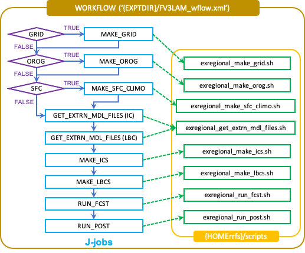

.. _SRWAppOverview:

========================================
Short-Range Weather Application Overview
========================================
The UFS Short-Range Weather Application (SRW App) is an umbrella repository that contains the tool
``manage_externals`` to check out all of the components required for the application. Once the
build process is complete, all the files and executables necessary for a regional experiment are
located in the ``regional_workflow`` and ``bin`` directories, respectively, under the ``ufs-srweather-app`` directory.
Users can utilize the pre-defined domains or build their own domain (details provided in :numref:`Chapter %s <LAMGrids>`).
In either case, users must create/modify the case-specific (``config.sh``) and/or grid-specific configuration
files (``set_predef_grid_params.sh``). The overall procedure is shown in :numref:`Figure %s <AppOverallProc>`,
with the scripts to generate and run the workflow shown in red. The steps are as follows:

#. Clone the UFS Short Range Weather Application from GitHub.
#. Check out the external repositories.
#. Set up the build environment and build the regional workflow system using ``cmake/make``.
#. Optional: Add new grid information to the ``set_predef_grid_param.sh`` configuration file and update ``valid_param_vals.sh``.
#. Modify the case-specific ``config.sh`` configuration file.
#. Load the python environment for the regional workflow
#. Generate a regional workflow experiment.
#. Run the regional workflow as needed.

Each step will be described in detail in the following sections.

.. _AppOverallProc:

.. figure:: _static/FV3LAM_wflow_overall.png

    *Overall layout of the SRW App.*

.. _DownloadSRWApp:

Download from GitHub
====================
Retrieve the UFS Short Range Weather Application (SRW App) repository from GitHub and checkout the ``ufs-v1.0.0`` tag: 

.. code-block:: console

   git clone -b ufs-v1.0.0 https://github.com/ufs-community/ufs-srweather-app.git
   cd ufs-srweather-app

The cloned repository contains the configuration files and sub-directories shown in
:numref:`Table %s <FilesAndSubDirs>`.

.. _FilesAndSubDirs:

.. table::  Files and sub-directories of the ufs-srweather-app repository.

   +--------------------------------+--------------------------------------------------------+
   | **File/directory Name**        | **Description**                                        |
   +================================+========================================================+
   | CMakeLists.txt                 | Main cmake file for SRW App                            |
   +--------------------------------+--------------------------------------------------------+
   | Externals.cfg                  | Tags of the GitHub repositories/branches for the       |
   |                                | external repositories                                  |
   +--------------------------------+--------------------------------------------------------+
   | LICENSE.md                     | CC0 license information                                |
   +--------------------------------+--------------------------------------------------------+
   | README.md                      | Quick start guide                                      |
   +--------------------------------+--------------------------------------------------------+
   | ufs_srweather_app_meta.h.in    | Meta information for SRW App which can be used by      |
   |                                | other packages                                         |
   +--------------------------------+--------------------------------------------------------+
   | ufs_srweather_app.settings.in  | SRW App configuration summary                          |
   +--------------------------------+--------------------------------------------------------+
   | env                            | Contains build and workflow environment files          |
   +--------------------------------+--------------------------------------------------------+
   | docs                           | Contains release notes, documentation, and Users' Guide|
   +--------------------------------+--------------------------------------------------------+
   | manage_externals               | Utility for checking out external repositories         |
   +--------------------------------+--------------------------------------------------------+
   | src                            | Contains CMakeLists.txt; external repositories         |
   |                                | will be cloned in this directory.                      |
   +--------------------------------+--------------------------------------------------------+

.. _CheckoutExternals:

External Components
===================
Check out the external repositories, including regional_workflow, ufs-weather-model, ufs_utils, and emc_post for the SRW App.

.. code-block:: console

   ./manage_externals/checkout_externals

This step will use the configuration ``Externals.cfg`` file in the ``ufs-srweather-app`` directory to
clone the specific tags (version of codes) of the external repositories as listed in 
:numref:`Section %s <HierarchicalRepoStr>`. 

.. _BuildExecutables:

Building the Executables for the Application
============================================
Before building the executables, the build environment must be set up for your specific platform.
Instructions for loading the proper modules and/or setting the correct environment variables 
can be found in the ``env/`` directory in files named ``build_<platform>_<compiler>.env.`` For the
most part, the commands in those files can be directly copied and pasted, but you may need to modify
certain variables such as the path to NCEP libraries for your specific platform.  Here is a directory
listing example of these kinds of files: 

.. code-block:: console

   $ ls -l env/
      -rw-rw-r-- 1 user ral 1228 Oct  9 10:09 build_cheyenne_intel.env
      -rw-rw-r-- 1 user ral 1134 Oct  9 10:09 build_hera_intel.env
      -rw-rw-r-- 1 user ral 1228 Oct  9 10:09 build_jet_intel.env
      ...

The following steps will build the pre-processing utilities, forecast model, and post-processor:

.. code-block:: console

   make dir
   cd build
   cmake .. -DCMAKE_INSTALL_PREFIX=..
   make -j 4 >& build.out &

where ``-DCMAKE_INSTALL_PREFIX`` specifies the location in which the ``bin``, ``include``, ``lib``,
and ``share`` directories containing various components of the SRW App will be created, and its
recommended value ``..`` denotes one directory up from the build directory. In the next line for
the ``make`` call, ``-j 4`` indicates the build will run in parallel with 4 threads. If this step is successful, the
executables listed in :numref:`Table %s <ExecDescription>` will be located in the
``ufs-srweather-app/bin`` directory.

.. _ExecDescription:

.. table::  Names and descriptions of the executables produced by the build step and used by the SRW App.

   +------------------------+---------------------------------------------------------------------------------+
   | **Executable Name**    | **Description**                                                                 |
   +========================+=================================================================================+
   | chgres_cube            | Reads in raw external model (global or regional) and surface climatology data   |
   |                        | to create initial and lateral boundary conditions                               |
   +------------------------+---------------------------------------------------------------------------------+
   | filter_topo            | Filters topography based on resolution                                          |
   +------------------------+---------------------------------------------------------------------------------+
   | global_equiv_resol     | Calculates a global, uniform, cubed-sphere equivalent resolution for the        |
   |                        | regional Extended Schmidt Gnomonic (ESG) grid                                   |
   +------------------------+---------------------------------------------------------------------------------+
   | make_solo_mosaic       | Creates mosaic files with halos                                                 |
   +------------------------+---------------------------------------------------------------------------------+
   | ncep_post              | Post-processor for the model output                                             |
   +------------------------+---------------------------------------------------------------------------------+
   | NEMS.exe               | UFS Weather Model executable                                                    |
   +------------------------+---------------------------------------------------------------------------------+
   | orog                   | Generates orography, land mask, and gravity wave drag files from fixed files    |
   +------------------------+---------------------------------------------------------------------------------+
   | regional_esg_grid      | Generates an ESG regional grid based on a user-defined namelist                 |
   +------------------------+---------------------------------------------------------------------------------+
   | sfc_climo_gen          | Creates surface climatology fields from fixed files for use in ``chgres_cube``  |
   +------------------------+---------------------------------------------------------------------------------+
   | shave                  | Shaves the excess halo rows down to what is required for the LBCs in the        |
   |                        | orography and grid files                                                        |
   +------------------------+---------------------------------------------------------------------------------+
   | vcoord_gen             | Generates hybrid coordinate interface profiles                                  |
   +------------------------+---------------------------------------------------------------------------------+

.. _GridSpecificConfig:

Grid-specific Configuration
===========================

Some SRW App parameters depend on the characteristics of the grid such as resolution and domain size.
These include ``ESG grid`` and ``Input configuration`` as well as the variables
related to the write component (quilting). The SRW App officially supports three different predefined
grids as shown in :numref:`Table %s <PredefinedGrids>`. Their names can be found under
``valid_vals_PREDEF_GRID_NAME`` in the ``valid_param_vals`` script, and their grid-specific configuration
variables are specified in the ``set_predef_grid_params`` script. If users want to create a new domain,
they should put its name in the ``valid_param_vals`` script and the corresponding grid-specific
parameters in the ``set_predef_grid_params`` script. More information on the predefined and user-generated options 
can be found in :numref:`Chapter %s <LAMGrids>`.

.. _PredefinedGrids:

.. table::  Predefined grids in the SRW App.

   +----------------------+-------------------+--------------------------------+
   | **Grid Name**        | **Grid Type**     | **Quilting (write component)** |
   +======================+===================+================================+
   | RRFS_CONUS_25km      | ESG grid          | lambert_conformal              |
   +----------------------+-------------------+--------------------------------+
   | RRFS_CONUS_13km      | ESG grid          | lambert_conformal              |
   +----------------------+-------------------+--------------------------------+
   | RRFS_CONUS_3km       | ESG grid          | lambert_conformal              |
   +----------------------+-------------------+--------------------------------+

Case-specific Configuration
===========================

.. _DefaultConfigSection:

Default configuration: ``config_defaults.sh``
--------------------------------------------
When generating a new experiment (described in detail in :numref:`Section %s <GeneratingWflowExpt>`),
the ``config_defaults.sh`` file is read first and assigns default values to the experiment
parameters. Important configuration variables in the ``config_defaults.sh`` file are shown in 
:numref:`Table %s <ConfigVarsDefault>`, with more documentation found in the file itself, and
in :numref:`Chapter %s <ConfigWorkflow>`. Some of these default values are intentionally invalid in order
to ensure that the user assigns valid values in the user-specified configuration ``config.sh`` file.
Therefore, any settings provided in ``config.sh`` will override the default ``config_defaults.sh`` 
settings. Note that there is usually no need for a user to modify the default configuration file. 

.. _ConfigVarsDefault:

.. table::  Configuration variables specified in the config_defaults.sh script.

   +----------------------+------------------------------------------------------------+
   | **Group Name**       | **Configuration variables**                                |
   +======================+============================================================+
   | Experiment mode      | RUN_ENVIR                                                  | 
   +----------------------+------------------------------------------------------------+
   | Machine and queue    | MACHINE, ACCOUNT, SCHED, PARTITION_DEFAULT, QUEUE_DEFAULT, |
   |                      | PARTITION_HPSS, QUEUE_HPSS, PARTITION_FCST, QUEUE_FCST     |
   +----------------------+------------------------------------------------------------+
   | Cron                 | USE_CRON_TO_RELAUNCH, CRON_RELAUNCH_INTVL_MNTS             |
   +----------------------+------------------------------------------------------------+
   | Experiment Dir.      | EXPT_BASEDIR, EXPT_SUBDIR                                  |
   +----------------------+------------------------------------------------------------+
   | NCO mode             | COMINgfs, STMP, NET, envir, RUN, PTMP                      |
   +----------------------+------------------------------------------------------------+
   | Separator            | DOT_OR_USCORE                                              |
   +----------------------+------------------------------------------------------------+
   | File name            | EXPT_CONFIG_FN, RGNL_GRID_NML_FN, DATA_TABLE_FN,           |
   |                      | DIAG_TABLE_FN, FIELD_TABLE_FN, FV3_NML_BASE_SUITE_FN,      |
   |                      | FV3_NML_YALM_CONFIG_FN, FV3_NML_BASE_ENS_FN,               |
   |                      | MODEL_CONFIG_FN, NEMS_CONFIG_FN, FV3_EXEC_FN,              |
   |                      | WFLOW_XML_FN, GLOBAL_VAR_DEFNS_FN,                         |
   |                      | EXTRN_MDL_ICS_VAR_DEFNS_FN, EXTRN_MDL_LBCS_VAR_DEFNS_FN,   |
   |                      | WFLOW_LAUNCH_SCRIPT_FN, WFLOW_LAUNCH_LOG_FN                |
   +----------------------+------------------------------------------------------------+
   | Forecast             | DATE_FIRST_CYCL, DATE_LAST_CYCL, CYCL_HRS, FCST_LEN_HRS    |
   +----------------------+------------------------------------------------------------+
   | IC/LBC               | EXTRN_MDL_NAME_ICS, EXTRN_MDL_NAME_LBCS,                   |
   |                      | LBC_SPEC_INTVL_HRS, FV3GFS_FILE_FMT_ICS,                   |
   |                      | FV3GFS_FILE_FMT_LBCS                                       |
   +----------------------+------------------------------------------------------------+
   | NOMADS               | NOMADS, NOMADS_file_type                                   |
   +----------------------+------------------------------------------------------------+
   | External model       | USE_USER_STAGED_EXTRN_FILES, EXTRN_MDL_SOURCE_BASEDRI_ICS, |
   |                      | EXTRN_MDL_FILES_ICS, EXTRN_MDL_SOURCE_BASEDIR_LBCS,        |
   |                      | EXTRN_MDL_FILES_LBCS                                       |
   +----------------------+------------------------------------------------------------+
   | CCPP                 | CCPP_PHYS_SUITE                                            |
   +----------------------+------------------------------------------------------------+
   | GRID                 | GRID_GEN_METHOD                                            |
   +----------------------+------------------------------------------------------------+
   | ESG grid             | ESGgrid_LON_CTR, ESGgrid_LAT_CTR, ESGgrid_DELX,            |
   |                      | ESGgrid_DELY, ESGgrid_NX, ESGgrid_NY,                      |
   |                      | ESGgrid_WIDE_HALO_WIDTH                                    |
   +----------------------+------------------------------------------------------------+
   | Input configuration  | DT_ATMOS, LAYOUT_X, LAYOUT_Y, BLOCKSIZE, QUILTING,         |
   |                      | PRINT_ESMF, WRTCMP_write_groups,                           |
   |                      | WRTCMP_write_tasks_per_group, WRTCMP_output_grid,          |
   |                      | WRTCMP_cen_lon, WRTCMP_cen_lat, WRTCMP_lon_lwr_left,       |
   |                      | WRTCMP_lat_lwr_left, WRTCMP_lon_upr_rght,                  |
   |                      | WRTCMP_lat_upr_rght, WRTCMP_dlon, WRTCMP_dlat,             |
   |                      | WRTCMP_stdlat1, WRTCMP_stdlat2, WRTCMP_nx, WRTCMP_ny,      |
   |                      | WRTCMP_dx, WRTCMP_dy                                       |
   +----------------------+------------------------------------------------------------+
   | Pre-existing grid    | PREDEF_GRID_NAME, PREEXISTING_DIR_METHOD, VERBOSE          |
   +----------------------+------------------------------------------------------------+
   | Cycle-independent    | RUN_TASK_MAKE_GRID, GRID_DIR, RUN_TASK_MAKE_OROG,          |
   |                      | OROG_DIR, RUN_TASK_MAKE_SFC_CLIMO, SFC_CLIMO_DIR           |
   +----------------------+------------------------------------------------------------+
   | Surface climatology  | SFC_CLIMO_FIELDS, FIXgsm, TOPO_DIR, SFC_CLIMO_INPUT_DIR,   |
   |                      | FNGLAC, FNMXIC, FNTSFC, FNSNOC, FNZORC, FNAISC, FNSMCC,    |
   |                      | FNMSKH, FIXgsm_FILES_TO_COPY_TO_FIXam,                     |
   |                      | FV3_NML_VARNAME_TO_FIXam_FILES_MAPPING,                    |
   |                      | FV3_NML_VARNAME_TO_SFC_CLIMO_FIELD_MAPPING,                |
   |                      | CYCLEDIR_LINKS_TO_FIXam_FILES_MAPPING                      |
   +----------------------+------------------------------------------------------------+
   | Workflow task        | MAKE_GRID_TN, MAKE_OROG_TN, MAKE_SFC_CLIMO_TN,             |
   |                      | GET_EXTRN_ICS_TN, GET_EXTRN_LBCS_TN, MAKE_ICS_TN,          |
   |                      | MAKE_LBCS_TN, RUN_FCST_TN, RUN_POST_TN                     |
   +----------------------+------------------------------------------------------------+
   | NODE                 | NNODES_MAKE_GRID, NNODES_MAKE_OROG, NNODES_MAKE_SFC_CLIMO, |
   |                      | NNODES_GET_EXTRN_ICS, NNODES_GET_EXTRN_LBCS,               |
   |                      | NNODES_MAKE_ICS, NNODES_MAKE_LBCS, NNODES_RUN_FCST,        |
   |                      | NNODES_RUN_POST                                            |
   +----------------------+------------------------------------------------------------+
   | MPI processes        | PPN_MAKE_GRID, PPN_MAKE_OROG, PPN_MAKE_SFC_CLIMO,          |
   |                      | PPN_GET_EXTRN_ICS, PPN_GET_EXTRN_LBCS, PPN_MAKE_ICS,       |
   |                      | PPN_MAKE_LBCS, PPN_RUN_FCST, PPN_RUN_POST                  |
   +----------------------+------------------------------------------------------------+
   | Walltime             | WTIME_MAKE_GRID, WTIME_MAKE_OROG, WTIME_MAKE_SFC_CLIMO,    |
   |                      | WTIME_GET_EXTRN_ICS, WTIME_GET_EXTRN_LBCS, WTIME_MAKE_ICS, |
   |                      | WTIME_MAKE_LBCS, WTIME_RUN_FCST, WTIME_RUN_POST            |
   +----------------------+------------------------------------------------------------+
   | Maximum attempt      | MAXTRIES_MAKE_GRID, MAXTRIES_MAKE_OROG,                    |
   |                      | MAXTRIES_MAKE_SFC_CLIMO, MAXTRIES_GET_EXTRN_ICS,           |
   |                      | MAXTRIES_GET_EXTRN_LBCS, MAXTRIES_MAKE_ICS,                |
   |                      | MAXTRIES_MAKE_LBCS, MAXTRIES_RUN_FCST, MAXTRIES_RUN_POST   |
   +----------------------+------------------------------------------------------------+
   | Post configuration   | USE_CUSTOM_POST_CONFIG_FILE, CUSTOM_POST_CONFIG_FP         |
   +----------------------+------------------------------------------------------------+
   | Running ensembles    | DO_ENSEMBLE, NUM_ENS_MEMBERS                               |
   +----------------------+------------------------------------------------------------+
   | Stochastic physics   | DO_SHUM, DO_SPPT, DO_SKEB, SHUM_MAG, SHUM_LSCALE,          |
   |                      | SHUM_TSCALE, SHUM_INT, SPPT_MAG, SPPT_LSCALE, SPPT_TSCALE, |
   |                      | SPPT_INT, SKEB_MAG, SKEB_LSCALE, SKEP_TSCALE, SKEB_INT,    |
   |                      | SKEB_VDOF, USE_ZMTNBLCK                                    |
   +----------------------+------------------------------------------------------------+
   | Boundary blending    | HALO_BLEND                                                 |
   +----------------------+------------------------------------------------------------+
   | FVCOM                | USE_FVCOM, FVCOM_DIR, FVCOM_FILE                           |
   +----------------------+------------------------------------------------------------+
   | Compiler             | COMPILER                                                   |
   +----------------------+------------------------------------------------------------+
 
.. _UserSpecificConfig:

User-specific configuration: ``config.sh``
------------------------------------------
Before generating an experiment, the user must create a ``config.sh`` file in the
``ufs-srweather-app/regional_workflow/ush`` directory by copying either of the example
configuration files, ``config.community.sh`` for the community mode or ``config.nco.sh`` for
the NCO mode, or creating their own ``config.sh`` file. Note that the *community mode* is 
recommended in most cases and will be fully supported for this release while the operational/NCO 
mode will be more exclusively used by those at the NOAA/NCEP/Environmental Modeling Center (EMC) 
and the NOAA/Global Systems Laboratory (GSL) working on pre-implementation testing. 
:numref:`Table %s <ConfigCommunity>` shows the configuration variables, along with their default 
values in ``config_default.sh`` and the values defined in ``config.community.sh``.

.. note::

   The values of the configuration variables should be consistent with those in the
   ``valid_param_vals script``. In addition, various example configuration files can be
   found in the ``regional_workflow/tests/baseline_configs`` directory.

.. _ConfigCommunity:

.. table::   Configuration variables specified in the config.community.sh script.

   +--------------------------------+-------------------+--------------------------------------------------------+
   | **Parameter**                  | **Default Value** | **``config.community.sh`` Value**                      |
   +================================+===================+========================================================+
   | MACHINE                        | "BIG_COMPUTER"    | "hera"                                                 |
   +--------------------------------+-------------------+--------------------------------------------------------+
   | ACCOUNT                        | "project_name"    | "an_account"                                           |
   +--------------------------------+-------------------+--------------------------------------------------------+
   | EXPT_SUBDIR                    | ""                | "test_CONUS_25km_GFSv15p2"                             |
   +--------------------------------+-------------------+--------------------------------------------------------+
   | VERBOSE                        | "TRUE"            | "TRUE"                                                 |
   +--------------------------------+-------------------+--------------------------------------------------------+
   | RUN_ENVIR                      | "nco"             | "community"                                            |
   +--------------------------------+-------------------+--------------------------------------------------------+
   | PREEXISTING_DIR_METHOD         | "delete"          | "rename"                                               |
   +--------------------------------+-------------------+--------------------------------------------------------+
   | PREDEF_GRID_NAME               | ""                | "RRFS_CONUS_25km"                                      |
   +--------------------------------+-------------------+--------------------------------------------------------+
   | GRID_GEN_METHOD                | "ESGgrid"         | "ESGgrid"                                              |
   +--------------------------------+-------------------+--------------------------------------------------------+
   | QUILTING                       | "TRUE"            | "TRUE"                                                 |
   +--------------------------------+-------------------+--------------------------------------------------------+
   | CCPP_PHYS_SUITE                | "FV3_GSD_V0"      | "FV3_GFS_v15p2"                                        |
   +--------------------------------+-------------------+--------------------------------------------------------+
   | FCST_LEN_HRS                   | "24"              | "48"                                                   |
   +--------------------------------+-------------------+--------------------------------------------------------+
   | LBC_SPEC_INTVL_HRS             | "6"               | "6"                                                    |
   +--------------------------------+-------------------+--------------------------------------------------------+
   | DATE_FIRST_CYCL                | "YYYYMMDD"        | "20190615"                                             |
   +--------------------------------+-------------------+--------------------------------------------------------+
   | DATE_LAST_CYCL                 | "YYYYMMDD"        | "20190615"                                             |
   +--------------------------------+-------------------+--------------------------------------------------------+
   | CYCL_HRS                       | ("HH1" "HH2")     | "00"                                                   |
   +--------------------------------+-------------------+--------------------------------------------------------+
   | EXTRN_MDL_NAME_ICS             |  "FV3GFS"         | "FV3GFS"                                               |
   +--------------------------------+-------------------+--------------------------------------------------------+
   | EXTRN_MDL_NAME_LBCS            |  "FV3GFS"         | "FV3GFS"                                               |
   +--------------------------------+-------------------+--------------------------------------------------------+
   | FV3GFS_FILE_FMT_ICS            |  "nemsio"         | "grib2"                                                |
   +--------------------------------+-------------------+--------------------------------------------------------+
   | FV3GFS_FILE_FMT_LBCS           |  "nemsio"         | "grib2"                                                |
   +--------------------------------+-------------------+--------------------------------------------------------+
   | WTIME_RUN_FCST                 |  "04:30:00"       | "01:00:00"                                             |
   +--------------------------------+-------------------+--------------------------------------------------------+
   | USE_USER_STAGED_EXTRN_FILES    |  "FALSE"          | "TRUE"                                                 |
   +--------------------------------+-------------------+--------------------------------------------------------+
   | EXTRN_MDL_SOURCE_BASE_DIR_ICS  |  ""               | "/scratch2/BMC/det/UFS_SRW_app/v1p0/model_data/FV3GFS" |
   +--------------------------------+-------------------+--------------------------------------------------------+
   | EXTRN_MDL_FILES_ICS            | ""                | "gfs.pgrb2.0p25.f000"                                  |
   +--------------------------------+-------------------+--------------------------------------------------------+
   | EXTRN_MDL_SOURCE_BASEDIR_LBCS  | ""                | "/scratch2/BMC/det/UFS_SRW_app/v1p0/model_data/FV3GFS" |
   +--------------------------------+-------------------+--------------------------------------------------------+
   | EXTRN_MDL_FILES_LBCS           | ""                | "gfs.pgrb2.0p25.f006"                                  |
   +--------------------------------+-------------------+--------------------------------------------------------+

.. _LoadPythonEnv:

Python Environment for Workflow
===============================
It is necessary to load the appropriate Python environment for the workflow.
The workflow requires Python 3, with the packages 'PyYAML', 'Jinja2', and 'f90nml' available.
This Python environment has already been set up on Level 1 platforms, and can be activated in
the following way:

.. code-block:: console

   source ../../env/wflow_<platform>.env

when in the ``ufs-srweather-app/regional_workflow/ush`` directory.

.. _GeneratingWflowExpt:

Generating a Regional Workflow Experiment
=========================================

Steps to a Generate a New Experiment
----------------------------------
Generating an experiment requires running

.. code-block:: console

   generate_FV3LAM_wflow.sh

in the ``ufs-srweather-app/regional_workflow/ush`` directory. This is the all-in-one script for users
to set up their experiment with ease. :numref:`Figure %s <WorkflowGeneration>` shows the flowchart
for generating an experiment. First, it sets up the configuration parameters by running
the ``setup.sh`` script. Second, it copies the time-independent (fix) files and other necessary
input files such as ``data_table``, ``field_table``, ``nems.configure``, ``model_configure``,
and the CCPP suite file from its location in the ufs-weather-model directory to the experiment directory (``EXPTDIR``).
Third, it copies the weather model executable (``NEMS.exe``) from the ``bin`` directory to ``EXPTDIR``,
and creates the input namelist file ``input.nml`` based on the ``input.nml.FV3``
file in the regional_workflow/ush/templates directory. Lastly, it creates the workflow XML file ``FV3LAM_wflow.xml``
that is executed when running the experiment with the Rocoto workflow manager.

.. _WorkflowGeneration:

.. figure:: _static/FV3regional_workflow_gen.png

    *Experiment generation description*

The ``setup.sh`` script reads three other configuration scripts: (1) ``config_default.sh``
(:numref:`Section %s <DefaultConfigSection>`), (2) ``config.sh`` (:numref:`Section %s <UserSpecificConfig>`),
and (3) ``set_predef_grid_params.sh`` (:numref:`Section %s <GridSpecificConfig>`). Note that these three
scripts are read in order: ``config_default.sh``, ``config.sh``, then ``set_predef_grid_params.sh``.
If a parameter is specified differently in these scripts, the file containing the last defined value will be used.  

.. _WorkflowTaskDescription:

Description of Workflow Tasks
-----------------------------
The flowchart of the workflow tasks that are specified in the ``FV3LAM_wflow.xml`` file are
illustrated in :numref:`Figure %s <WorkflowTasksFig>`, and each task is described in
:numref:`Table %s <WorkflowTasksTable>`. The first three pre-processing tasks; ``MAKE_GRID``,
``MAKE_OROG``, and ``MAKE_SFC_CLIMO`` are optional. If the user stages pre-generated grid, orography, and
surface climatology fix files, these three tasks can be skipped by setting ``RUN_TASK_MAKE_GRID=”FALSE”``,
``RUN_TASK_MAKE_OROG=”FALSE”``, and ``RUN_TASK_MAKE_SFC_CLIMO=”FALSE”`` in the ``regional_workflow/ush/config.sh``
file before running the ``generate_FV3LAM_wflow.sh`` script. As shown in the figure, the ``FV3LAM_wflow.xml``
file runs the specific j-job scripts in the prescribed order (``regional_workflow/jobs/JREGIONAL_[task name]``)
when the ``launch_FV3LAM_wflow.sh`` is submitted. Each j-job task has its own source script named
``exregional_[task name].sh`` in the ``regional_workflow/scripts`` directory. Two database files
``FV3LAM_wflow.db`` and ``FV3LAM_wflow_lock.db`` are generated and updated by the Rocoto calls.
There is usually no need for users to modify these files. To relaunch the workflow from scratch,
delete these two *.db files and then call the launch script repeatedly for each task. 

.. _WorkflowTasksFig:

    *Flowchart of the workflow tasks*

.. _WorkflowTasksTable:

.. table::  Workflow tasks in SRW App

   +----------------------+------------------------------------------------------------+
   | **Workflow Task**    | **Task Description**                                       |
   +======================+============================================================+
   | make_grid            | Pre-processing task to generate regional grid files. Can   |
   |                      | be run, at most, once per experiment.                      |
   +----------------------+------------------------------------------------------------+
   | make_orog            | Pre-processing task to generate orography files. Can be    |
   |                      | run, at most, once per experiment.                         |
   +----------------------+------------------------------------------------------------+
   | make_sfc_climo       | Pre-processing task to generate surface climatology files. |
   |                      | Can be run, at most, once per experiment.                  |
   +----------------------+------------------------------------------------------------+
   | get_extrn_ics        | Cycle-specific task to obtain external data for the        |
   |                      | initial conditions                                         |
   +----------------------+------------------------------------------------------------+
   | get_extrn_lbcs       | Cycle-specific task to obtain external data for the        |
   |                      | lateral boundary (LB) conditions                           |
   +----------------------+------------------------------------------------------------+
   | make_ics             | Generate initial conditions from the external data         |
   +----------------------+------------------------------------------------------------+
   | make_lbcs            | Generate lateral boundary conditions from the external data|
   +----------------------+------------------------------------------------------------+
   | run_fcst             | Run the forecast model (UFS weather model)                 |
   +----------------------+------------------------------------------------------------+
   | run_post             | Run the post-processing tool (UPP)                         |
   +----------------------+------------------------------------------------------------+

Launch of Workflow
==================
There are two ways to launch the workflow using Rocoto: (1) with the ``launch_FV3LAM_wflow.sh``
script, and (2) manually calling the ``rocotorun`` command. Moreover, you can run the workflow
separately using stand-alone scripts.

An environment variable may be set to navigate to the ``$EXPTDIR`` more easily. If the login
shell is bash, it can be set as follows:

.. code-block:: console

   export EXPTDIR=/path-to-experiment/directory

Or if the login shell is csh/tcsh, it can be set using:

.. code-block:: console

   setenv EXPTDIR /path-to-experiment/directory

Launch with the ``launch_FV3LAM_wflow.sh`` script
-------------------------------------------------
To launch the ``launch_FV3LAM_wflow.sh`` script, simply call it without any arguments as follows:

.. code-block:: console

   cd ${EXPTDIR}
   ./launch_FV3LAM_wflow.sh

This script creates a log file named ``log.launch_FV3LAM_wflow`` in the EXPTDIR directory
(described in :numref:`Section %s <ExperimentDirSection>`) or appends to it if it already exists.
You can check the contents of the end of the log file (e.g. last 30 lines) using the command:

.. code-block:: console

   tail -n 30 log.launch_FV3LAM_wflow

This command will print out the status of the workflow tasks as follows:

.. code-block:: console

   CYCLE                    TASK                       JOBID        STATE   EXIT STATUS   TRIES  DURATION
   ======================================================================================================
   202006170000        make_grid         druby://hfe01:33728   SUBMITTING             -       0       0.0
   202006170000        make_orog                           -            -             -       -         -
   202006170000   make_sfc_climo                           -            -             -       -         -
   202006170000    get_extrn_ics         druby://hfe01:33728   SUBMITTING             -       0       0.0
   202006170000   get_extrn_lbcs         druby://hfe01:33728   SUBMITTING             -       0       0.0
   202006170000         make_ics                           -            -             -       -         -
   202006170000        make_lbcs                           -            -             -       -         -
   202006170000         run_fcst                           -            -             -       -         -
   202006170000      run_post_00                           -            -             -       -         -
   202006170000      run_post_01                           -            -             -       -         -
   202006170000      run_post_02                           -            -             -       -         -
   202006170000      run_post_03                           -            -             -       -         -
   202006170000      run_post_04                           -            -             -       -         -
   202006170000      run_post_05                           -            -             -       -         -
   202006170000      run_post_06                           -            -             -       -         -

   Summary of workflow status:
   ~~~~~~~~~~~~~~~~~~~~~~~~~~

     0 out of 1 cycles completed.
     Workflow status:  IN PROGRESS

Error messages for each task can be found in the task log files located in the ``EXPTDIR/log`` directory. In order to launch
more tasks in the workflow, you just need to call the launch script again as follows:

.. code-block:: console

   ./launch_FV3LAM_wflow

If everything goes smoothly, you will eventually get the following workflow status table as follows:

.. code-block:: console

   CYCLE                    TASK                       JOBID        STATE   EXIT STATUS   TRIES  DURATION
   ======================================================================================================
   202006170000        make_grid                     8854765    SUCCEEDED             0       1       6.0
   202006170000        make_orog                     8854809    SUCCEEDED             0       1      27.0
   202006170000   make_sfc_climo                     8854849    SUCCEEDED             0       1      36.0
   202006170000    get_extrn_ics                     8854763    SUCCEEDED             0       1      54.0
   202006170000   get_extrn_lbcs                     8854764    SUCCEEDED             0       1      61.0
   202006170000         make_ics                     8854914    SUCCEEDED             0       1     119.0
   202006170000        make_lbcs                     8854913    SUCCEEDED             0       1      98.0
   202006170000         run_fcst                     8854992    SUCCEEDED             0       1     655.0
   202006170000      run_post_00                     8855459    SUCCEEDED             0       1       6.0
   202006170000      run_post_01                     8855460    SUCCEEDED             0       1       6.0
   202006170000      run_post_02                     8855461    SUCCEEDED             0       1       6.0
   202006170000      run_post_03                     8855462    SUCCEEDED             0       1       6.0
   202006170000      run_post_04                     8855463    SUCCEEDED             0       1       6.0
   202006170000      run_post_05                     8855464    SUCCEEDED             0       1       6.0
   202006170000      run_post_06                     8855465    SUCCEEDED             0       1       6.0

If all the tasks complete successfully, the workflow status in the log file will include the word “SUCCESS."
Otherwise, the workflow status will include the word “FAILURE."

Manually launch by calling the ``rocotorun`` command
----------------------------------------------------
To launch the workflow manually, the ``rocoto`` module should be loaded:

.. code-block:: console

   module load rocoto

Then, launch the workflow as follows:

.. code-block:: console

   cd ${EXPTDIR}
   rocotorun -w FV3LAM_wflow.xml -d FV3LAM_wflow.db -v 10 

To check the status of the workflow, issue a ``rocotostat`` command as follows:

.. code-block:: console

   rocotostat -w FV3LAM_wflow.xml -d FV3LAM_wflow.db -v 10

Wait a few seconds and issue a second set of ``rocotorun`` and ``rocotostat`` commands:

.. code-block:: console

   rocotorun -w FV3LAM_wflow.xml -d FV3LAM_wflow.db -v 10 
   rocotostat -w FV3LAM_wflow.xml -d FV3LAM_wflow.db -v 10

.. _RunUsingStandaloneScripts:

Run the Workflow Using the Stand-alone Scripts
----------------------------------------------
The regional workflow has the capability to be run using standalone shell scripts if the
Rocoto software is not available on a given platform. These scripts are located in the
``ufs-srweather-app/regional_workflow/ush/wrappers`` directory. Each workflow task has
a wrapper script to set environment variables and run the job script.
 
Example batch-submit scripts for Hera (Slurm) and Cheyenne (PBS) are included: ``sq_job.sh``
and ``qsub_job.sh``, respectively. These examples set the build and run environment for Hera or Cheyenne
so that run-time libraries match the compiled libraries (i.e. netCDF, MPI). Users may either
modify the submit batch script as each task is submitted, or duplicate this batch wrapper
for their system settings for each task. Alternatively, some batch systems allow users to
specify most of the settings on the command line (with the ``sbatch`` or ``qsub`` command,
for example). This piece will be unique to your platform. The tasks run by the regional workflow
are shown in :numref:`Table %s <RegionalWflowTasks>`.  Tasks with the same stage level may
be run concurrently (no dependency).

.. _RegionalWflowTasks:

.. table::  List of tasks in the regional workflow in the order that they are executed.
            Scripts with the same stage number may be run simultaneously. The number of
            processors and wall clock time is a good starting point for Cheyenne or Hera 
            when running a 48-h forecast on the 25-km CONUS domain.

   +------------+------------------------+----------------+----------------------------+
   | **Stage/** | **Task Run Script**    | **Number of**  | **Wall clock time (H:MM)** |
   | **step**   |                        | **Processors** |                            |             
   +============+========================+================+============================+
   | 1          | run_get_ics.sh         | 1              | 0:20 (depends on HPSS vs   |
   |            |                        |                | FTP vs staged-on-disk)     |
   +------------+------------------------+----------------+----------------------------+
   | 1          | run_get_lbcs.sh        | 1              | 0:20 (depends on HPSS vs   |
   |            |                        |                | FTP vs staged-on-disk)     |
   +------------+------------------------+----------------+----------------------------+
   | 1          | run_make_grid.sh       | 24             | 0:20                       |
   +------------+------------------------+----------------+----------------------------+
   | 2          | run_make_orog.sh       | 24             | 0:20                       |
   +------------+------------------------+----------------+----------------------------+
   | 3          | run_make_sfc_climo.sh  | 48             | 0:20                       |
   +------------+------------------------+----------------+----------------------------+
   | 4          | run_make_ics.sh        | 48             | 0:30                       |
   +------------+------------------------+----------------+----------------------------+
   | 4          | run_make_lbcs.sh       | 48             | 0:30                       |
   +------------+------------------------+----------------+----------------------------+
   | 5          | run_fcst.sh            | 48             | 0:30                       |
   +------------+------------------------+----------------+----------------------------+
   | 6          | run_post.sh            | 48             | 0:25 (2 min per output     |
   |            |                        |                | forecast hour)             |
   +------------+------------------------+----------------+----------------------------+

The steps to run the standalone scripts are as follows:

#. Clone and build the ufs-srweather-app following the steps
   `here <https://github.com/ufs-community/ufs-srweather-app/wiki/Getting-Started>`_, or in
   :numref:`Sections %s <DownloadSRWApp>` to :numref:`Section %s <LoadPythonEnv>` above.

#. Generate an experiment configuration following the steps
   `here <https://github.com/ufs-community/ufs-srweather-app/wiki/Getting-Started>`_, or in
   :numref:`Section %s <GeneratingWflowExpt>` above.

#. ``cd`` into the experiment directory

#. Set the environment variable ``EXPTDIR`` for either csh and bash, respectively:

   .. code-block:: console

      setenv EXPTDIR `pwd`
      export EXPTDIR=`pwd`

#. COPY the wrapper scripts from the regional_workflow directory into your experiment directory:

   .. code-block:: console

      cp ufs-srweather-app/regional_workflow/ush/wrappers/* .

#. RUN each of the listed scripts in order.  Scripts with the same stage number
   may be run simultaneously.

    #. On most HPC systems, you will need to submit a batch job to run multi-processor jobs.

    #. On some HPC systems, you may be able to run the first two jobs (serial) on a login node/command-line

    #. Example scripts for Slurm (Hera) and PBS (Cheyenne) are provided.  These will need to be adapted to your system.

    #. This submit batch script is hard-coded per task, so will need to be modified or copied to run each task.
 
Check the batch script output file in your experiment directory for a “SUCCESS” message near the end of the file.

